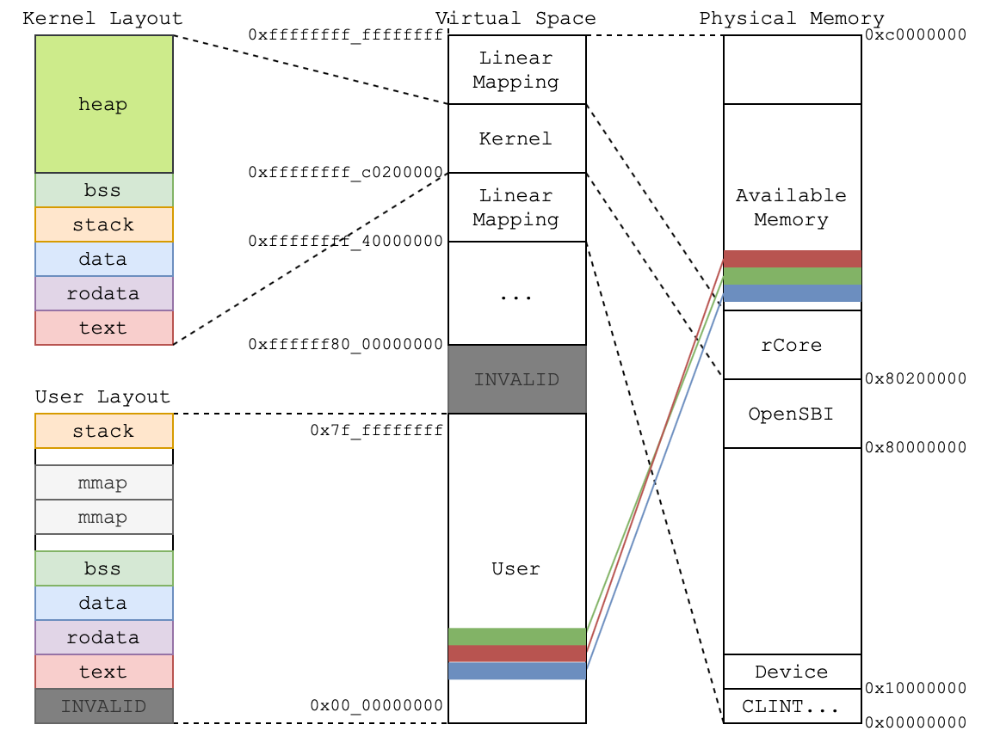
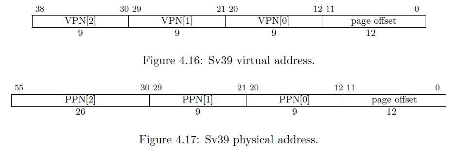
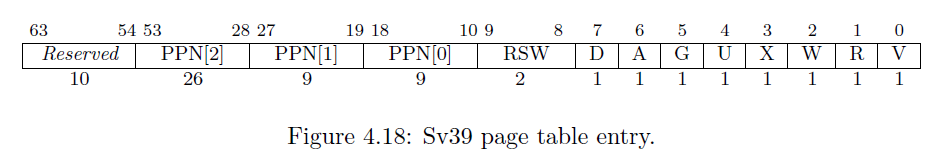
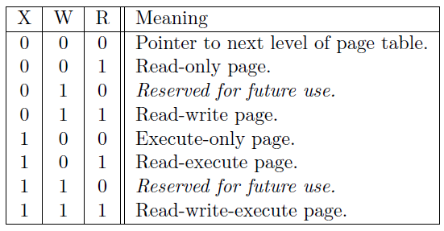
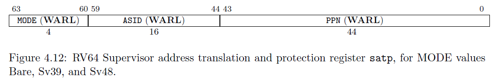

## 从虚拟内存到物理内存

### 虚拟地址和物理地址

到目前为止，我们简易的操作系统还只是一个内核在执行，还没有多任务的概念。在现代的操作系统中，为了让其他的程序能方便的运行在操作系统上，需要完成的一个很重要的抽象是「每个程序看到的地址空间是一样的」，这将会减少了上层程序的大量麻烦，否则程序本身要维护自己需要的物理内存，这也会导致极大程度的不安全。

这个执行上看到的地址空间，就是虚拟内存。而访问虚拟内存的地址就是**虚拟地址（Virtual Address）**，与之对应的是**物理地址（Physical Address）**。这样的设计会导致上层的应用程序可能会访问同一个值相等的虚拟地址，所以操作系统需要做的就是替这些程序维护这个虚拟地址到物理地址的映射。甚者，为了统一和连贯，内核自己本身访问内存也将会通过虚拟地址。

我们可以说这个映射的**维护**是操作系统在做，但是大量频繁的访存不可能全部通过调用操作系统的接口来获取真实的物理地址。所以，这里硬件也会参与，帮我们快速**查询**操作系统维护的映射，而这个机制就是页表。

如上图所示，这里的图表示了非教学版 rCore 的虚拟地址和物理地址的映射关系。可以看到内核的数据放在了一段高虚拟地址空间，然后会映射到 0x80200000 开始的一段低物理地址空间；而所有的用户程序，将通过操作系统维护的页表映射到不同的物理空间。当然，这只是非教学版 rCore 的设计，在本教程中 kernel layout 和 user layout 会和图有些出入，具体细节可以翻看 linker script。

### Sv39

页表的设计和接口会有很多种，这里我们选择 RISC-V 本身硬件支持的 Sv39 格式作为页表的实现。

在 Sv39 中，定义物理地址有 56 位，而虚拟地址有 64 位。虽然虚拟地址有 64 位，只有低 39 位有效。不过这不是说高 25 位可以随意取值，规定 63-39 位的值必须等于第 38 位的值，否则会认为该虚拟地址不合法，在访问时会产生异常。

Sv39 同样是基于页的，在物理内存那一节曾经提到**物理页（Frame）**与**物理页号（PPN，Physical Page Number）**。在这里物理页号为 44 位，每个物理页大小为 4KB。同理，我们对于虚拟内存定义**虚拟页（Page）**以及**虚拟页号（VPN, Virtual Page Number)** 。在这里虚拟页号为 27 位，每个虚拟页大小也为 4KB。物理地址和虚拟地址的最后 12 位都表示页内偏移，即表示该地址在所在物理页（虚拟页）上的什么位置。

虚拟地址到物理地址的映射以页为单位，也就是说把虚拟地址所在的虚拟页映射到一个物理页，然后再在这个物理页上根据页内偏移找到物理地址，从而完成映射。我们要实现虚拟页到物理页的映射，由于虚拟页与虚拟页号一一对应，物理页帧与物理页号一一对应，本质上我们要实现虚拟页号到物理页号的映射，而这就是页表所做的事情。

### 页表项

一个**页表项（PTE，Page Table Entry）**是用来描述一个虚拟页号如何映射到物理页号的。如果一个虚拟页号通过某种手段找到了一个页表项，并通过读取上面的物理页号完成映射，我们称这个虚拟页号通过该页表项完成映射的。

我们可以看到 Sv39 里面的一个页表项大小为 64 位（即 8 字节）。其中第 53-10 共 44 位为一个物理页号，表示这个虚拟页号映射到的物理页号。后面的第 9-0 位则描述页的相关状态信息。

- `V` 表示这个页表项是否合法。如果为 0 表示不合法，此时页表项其他位的值都会被忽略。

- `R,W,X` 分别表示是否可读（Readable）、可写（Writable）和可执行（Executable）。

  - 以 `W` 这一位为例，如果为零表示不可写，那么如果一条 `store` 的指令，它通过这个页表项完成了虚拟页号到物理页号的映射，找到了物理地址。但是仍然会报出异常，是因为这个页表项规定如果物理地址是通过它映射得到的，执行的行为和页表描述的状态并不一致。

  - 同时，根据 `R,W,X` 取值的不同，我们还有一些特别表示和约定：

    

  - 也就是说，如果 `R,W,X` 均为 0，文档上说这表示这个页表项指向下一级页表，我们先暂时记住就好。

- `U` 为 1 表示用户态可以通过该页表项进行映射。事实上用户态也只能够通过 `U` 为 1 的页表项进行虚实地址映射。

  - 然而，我们所处在的 S 态也并不是理所当然的可以通过这些 `U` 为 1 的页表项进行映射。我们需要将 S 态的状态寄存器 `sstatus` 上的 `SUM` 位手动设置为 1 才可以做到这一点。否则通过 `U` 为 1 的页表项进行映射也会报出异常。

- `A` 表示 Accessed，如果为 1 则表示自从上次 `A` 被清零后，有虚拟地址通过这个页表项进行读写。

- `D` 表示 Dirty，如果为 1 表示自从上次 `D` 被清零后，有虚拟地址通过这个页表项进行写入。

- `RSW` 两位留给 S 态的程序来进行拓展功能实现。

### 多级页表

一个虚拟页号要通过某种手段找到页表项，那么要怎么才能找到呢？

想一种最为简单粗暴的方法，在物理内存中开一个大数组作为页表，把所有虚拟页号对应的页表项都存下来。在找的时候根据虚拟页号来索引页表项。即，假设大数组开头的物理地址为 a，虚拟页号为 $$\text{VPN}$$，则该虚拟页号对应的页表项的物理地址为 $$a+\text{VPN}\times8$$（每个页表项 8 字节）。

但是这样会花掉我们大量的内存空间。我们目前只有可怜的 128MB 内存，即使我们有足够的内存也不应该这样去浪费。这是由于有很多虚拟地址我们根本没有用到，因此他们对应的虚拟页号不需要映射，我们开了很多无用的内存。

事实上，在 Sv39 中我们采用三级页表，即将 27 位的虚拟页号分为三个等长的部分，第 26-18 位为三级索引 $$\text{VPN}_2$$，第 17-9 位为二级索引 $$\text{VPN}_1$$，第 8-0 位为一级索引 $$\text{VPN}_0$$。

我们也将页表分为三级页表，二级页表，一级页表。每个页表都用 9 位索引的，因此有 $$2^{9}=512$$ 个页表项，而每个页表项都是 8 字节，因此每个页表大小都为 $$512\times 8=4\text{KB}$$。正好是一个物理页的大小。我们可以把一个页表放到一个物理页中，并用一个物理页号来描述它。事实上，三级页表的每个页表项中的物理页号描述一个二级页表；二级页表的每个页表项中的物理页号描述一个一级页表；一级页表中的页表项则和我们刚才提到的页表项一样，物理页号描述一个要映射到的物理页。

具体来说，假设我们有虚拟地址 $$(\text{VPN}_2, \text{VPN}_1, \text{VPN}_0, \text{offset})$$：

- 我们首先会记录装载「当前所用的三级页表的物理页」的页号到 `satp` 寄存器中；
- 把 $$\text{VPN}_2$$ 作为偏移在三级页表的物理页中找到第二级页表的物理页号；
- 把 $$\text{VPN}_1$$ 作为偏移在二级页表的物理页中找到第一级页表的物理页号；
- 把 $$\text{VPN}_0$$ 作为偏移在一级页表的物理页中找到要访问位置的物理页号；
- 物理页号对应的物理页基址加上 $$\text{offset}$$ 就是虚拟地址对应的物理地址。

上述流程也可以用下图表示：

我们通过这种复杂的手段，终于从虚拟页号找到了一级页表项，从而得出了物理页号。刚才我们提到若页表项满足 `R,W,X` 都为 0，表明这个页表项指向下一级页表。在这里三级和二级页表项的 `R,W,X` 为 0 应该成立，因为它们指向了下一级页表。

然而三级和二级页表项不一定要指向下一级页表。我们知道每个一级页表项控制一个虚拟页号，即控制 4KB 虚拟内存；每个二级页表项则控制 9 位虚拟页号，总计控制 $$4\text{KB}\times 2^9=2\text{MB}$$ 虚拟内存；每个三级页表项控制 18 位虚拟页号，总计控制 $$2\text{MB}\times 2^9=1\text{GB}$$ 虚拟内存。我们可以将二级页表项的 `R,W,X` 设置为不是全 0 的，那么它将与一级页表项类似，只不过可以映射一个 2MB 的**大页（Huge Page）**。同理，也可以将三级页表项看作一个叶子，来映射一个 1GB 的大页。

### 页表基址

页表的基址（起始地址）一般会保存在一个特殊的寄存器中。在 RISC-V 中，这个特殊的寄存器就是页表寄存器 satp。

我们使用寄存器 `satp` 来控制 CPU 进行页表映射。

- `MODE` 控制 CPU 使用哪种页表实现，我们只需将 `MODE` 设置为 8 即表示 CPU 使用 Sv39 。
- `ASID` 表示地址空间标识符，这里还没有涉及到进程的概念，我们不需要管这个地方。
- `PPN` 存的是三级页表所在的物理页号。这样，给定一个虚拟页号，CPU 就可以从三级页表开始一步步的将其映射到一个物理页号。

于是，OS 可以在内存中为不同的应用分别建立不同虚实映射的页表，并通过修改寄存器 `satp` 的值指向不同的页表，从而可以修改 CPU 虚实地址映射关系及内存保护的行为。

### 快表（TLB）

我们知道，物理内存的访问速度要比 CPU 的运行速度慢很多。如果我们按照页表机制循规蹈矩的一步步走，将一个虚拟地址转化为物理地址需要访问 3 次物理内存，得到物理地址后还需要再访问一次物理内存，才能完成访存。这无疑很大程度上降低了效率。

事实上，实践表明虚拟地址的访问具有时间局部性和空间局部性。因此，在 CPU 内部，我们使用**快表（TLB, Translation Lookaside Buffer）**来作为虚拟页号到物理页号的映射的缓存。这部分知识在计算机组成原理课程中有所体现，当我们要做一个映射时，会有很大可能这个映射在近期被完成过，所以我们可以先到 TLB 里面去查一下，如果有的话我们就可以直接完成映射，而不用访问那么多次内存了。

但是，我们如果修改了 `satp` 寄存器，说明我们切换到了一个与先前映射方式完全不同的页表。此时快表里面存储的映射已经失效了，这种情况下我们要使用 `sfence.vma` 指令刷新整个 TLB。

同样，我们手动修改一个页表项之后，也修改了映射，但 TLB 并不会自动刷新，我们也需要使用 `sfence.vma` 指令刷新 TLB。如果不加参数的，`sfence.vma` 会刷新整个 TLB。你可以在后面加上一个虚拟地址，这样 `sfence.vma` 只会刷新这个虚拟地址的映射。
