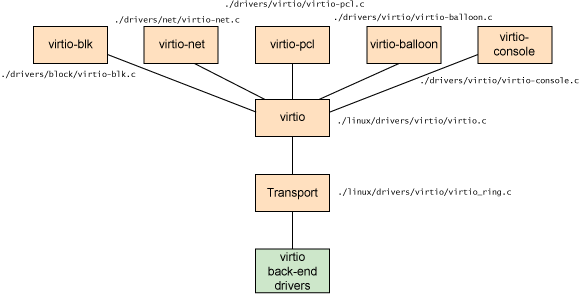

## virtio

### 挂载到 QEMU

为了让 QEMU 挂载上我们虚拟的存储设备，我们这里选了 QEMU 支持的 virtio 协议，需要在 QEMU 运行的时候加入选项：

os/Makefile
```Makefile
# 运行 QEMU
qemu: build
	@qemu-system-riscv64 \
    		-machine virt \
    		-nographic \
    		-bios default \
    		-device loader,file=$(BIN_FILE),addr=0x80200000 \
    		-drive file=$(TEST_IMG),format=raw,id=sfs \      # 模拟存储设备
    		-device virtio-blk-device,drive=sfs              # 以 virtio Block Device 的形式挂载到 virtio 总线上
```

其中的 `TEST_IMG` 是特定文件系统格式的磁盘镜像，我们在本小节还不会提及到这个概念，这里可以直接用目录下的测试镜像。

### 什么是 virtio

virtio 起源于 [virtio: Towards a De-Facto Standard For Virtual I/O Devices](https://www.ozlabs.org/~rusty/virtio-spec/virtio-paper.pdf) 这篇论文，主要针对于半虚拟化技术中对通用设备的抽象。

> **[info] 完全虚拟化和半虚拟化**
>
> 在完全虚拟化中，被虚拟的操作系统运行在位于物理机器上的 Hypervisor 之上。被虚拟的操作系统并不知道它已被虚拟化，并且不需要任何更改就可以在该配置下工作。相反，在半虚拟化中，被虚拟的操作系统不仅知道它运行在 Hypervisor 之上，还包含让被虚拟的操作系统更高效地过渡到 Hypervisor 的代码。
>
> 在完全虚拟化模式中，Hypervisor 必须模拟设备硬件，它是在会话的最低级别进行模拟的（例如，网络驱动程序）。尽管在该抽象中模拟很干净，但它同时也是最低效、最复杂的。在半虚拟化模式中，被虚拟的操作系统和 Hypervisor 能够共同合作，让模拟更加高效。半虚拟化方法的缺点是操作系统知道它被虚拟化，并且需要修改才能工作。

具体来说，virtio 的架构如图所示：

<div align=center>  </div>

以 virtio 为中心的总线下又挂载了 virtio-blk（块设备）总线、virtio-net（网络设备）总线、virtio-pci（PCI 设备）总线等，本身就构成一个设备树。

### virtio 节点探测

在上一节中，我们实现了对 "virtio,mmio" 的节点的判断，下面我们进一步来区分上面提到的那些 virtio 设备：

os/src/drivers/bus/virtio_mmio.rs
```rust
/// 从设备树的某个节点探测 virtio 协议具体类型
pub fn virtio_probe(node: &Node) {
    // reg 属性中包含了描述设备的 Header 的位置
    let reg = match node.prop_raw("reg") {
        Some(reg) => reg,
        _ => return,
    };
    let pa = PhysicalAddress(reg.as_slice().read_be_u64(0).unwrap() as usize);
    let va = VirtualAddress::from(pa);
    let header = unsafe { &mut *(va.0 as *mut VirtIOHeader) };
    // 目前只支持某个特定版本的 virtio 协议
    if !header.verify() {
        return;
    }
    // 判断设备类型
    match header.device_type() {
        DeviceType::Block => virtio_blk::add_driver(header),
        device => println!("unrecognized virtio device: {:?}", device),
    }
}
```

从设备树节点的 reg 信息中可以读出设备进一步信息的放置位置，输出一下，这些地址在 0x10000000 - 0x10010000 左右，这段虽然算是内存区间，但是还记得的吗？我们的物理内存只分布在 0x80000000 到 0x88000000 的空间中，那这段空间哪里来的呢？这就是所谓的**内存映射读写 MMIO（Memory Mapped I/O）**，也就是总线把对设备操作信息传递也映射成了内存的一部分，CPU 操作设备和访问内存没有任何的区别，大家可以联系一下计算机组成原理中对串口的访问，这里是一个道理。

所以，为了访问这段地址，我们也需要把它加到页表里面，分别对应在 `os/src/asm/entry.asm` 中的 `boot_page_table` 以及 `os/src/memory/mapping/memory_set.rs` 的新建内核线程中加入了这段地址，使得我们的内核线程可以访问他们。

### virtio_drivers 库

我们在这里不会自己来实现驱动的每一个细节，同样的，我们使用 rCore 中的 virtio_drivers 库，这个库会帮我们通过 MMIO 的方式对设备进行交互，同时我们也需要给这个库提供一些诸如申请物理内存、物理地址虚拟转换等接口。

os/src/drivers/bus/virtio_mmio.rs
```rust
lazy_static! {
    /// 用于放置给设备 DMA 所用的物理页（[`FrameTracker`]）
    pub static ref TRACKERS: RwLock<BTreeMap<PhysicalAddress, FrameTracker>> =
        RwLock::new(BTreeMap::new());
}

/// 为 DMA 操作申请连续 pages 个物理页（为 [`virtio_drivers`] 库提供）
///
/// 为什么要求连续的物理内存？设备的 DMA 操作只涉及到内存和对应设备
/// 这个过程不会涉及到 CPU 的 MMU 机制，我们只能给设备传递物理地址
/// 而陷于我们之前每次只能分配一个物理页的设计，这里我们假设我们连续分配的地址是连续的
#[no_mangle]
extern "C" fn virtio_dma_alloc(pages: usize) -> PhysicalAddress {
    let mut pa: PhysicalAddress = Default::default();
    let mut last: PhysicalAddress = Default::default();
    for i in 0..pages {
        let tracker: FrameTracker = FRAME_ALLOCATOR.lock().alloc().unwrap();
        if i == 0 {
            pa = tracker.address();
        } else {
            assert_eq!(last + PAGE_SIZE, tracker.address());
        }
        last = tracker.address();
        TRACKERS.write().insert(last, tracker);
    }
    return pa;
}

/// 为 DMA 操作释放对应的之前申请的连续的物理页（为 [`virtio_drivers`] 库提供）
#[no_mangle]
extern "C" fn virtio_dma_dealloc(pa: PhysicalAddress, pages: usize) -> i32 {
    for i in 0..pages {
        TRACKERS.write().remove(&(pa + i * PAGE_SIZE));
    }
    0
}

/// 将物理地址转为虚拟地址（为 [`virtio_drivers`] 库提供）
///
/// 需要注意，我们在 0xffffffff80200000 到 0xffffffff88000000 是都有对应的物理地址映射的
/// 因为在内核重映射的时候，我们已经把全部的段放进去了
/// 所以物理地址直接加上 Offset 得到的虚拟地址是可以通过任何内核进程的页表来访问的
#[no_mangle]
extern "C" fn virtio_phys_to_virt(pa: PhysicalAddress) -> VirtualAddress {
    VirtualAddress::from(pa)
}

/// 将虚拟地址转为物理地址（为 [`virtio_drivers`] 库提供）
///
/// 需要注意，实现这个函数的目的是告诉 DMA 具体的请求，请求在实现中会放在栈上面
/// 而在我们的实现中，栈是以 Framed 的形式分配的，并不是高地址的线性映射 Linear
/// 为了得到正确的物理地址并告诉 DMA 设备，我们只能查页表
#[no_mangle]
extern "C" fn virtio_virt_to_phys(va: VirtualAddress) -> PhysicalAddress {
    Mapping::lookup(va).unwrap()
}
```

至于为什么要实现这些操作，是因为本身设备是通过**直接内存访问DMA（Direct Memory Access）**技术来实现数据传输的，CPU 只需要给出要传输哪些内容，放在哪段物理内存上面，把请求告诉设备，设备后面的操作就会利用 DMA 而不经过 CPU 直接传输，在传输结束之后，会通过**中断请求 IRQ（Interrupt ReQuest）**技术沿着设备树把"我做完了"这个信息告诉 CPU，CPU 会作为一个中断进一步处理。而为了实现 DMA，我们需要一些请求和内存空间，比如让磁盘把数据传到某个内存段，我们需要告诉设备内存的物理地址（之所以不是虚拟地址是因为 DMA 不会经过 CPU 的 MMU 技术），而且这个物理地址最好是连续的。同时，我们在栈上申请一个请求的结构，这个结构的物理地址也要告诉设备，所以也需要一些虚实地址转换的接口。

现在，我们的 `FRAME_ALLOCATOR` 还只能分配一个帧出来，我们连续调用，暂时先假设他是连续的。同时注意到，为了实现虚实物理转换，我们需要查找页表，很不幸的是 RISC-V 并没有给我提供一个很方便的根据当前页表找到物理地址的指令，所以这里我们在 `os/src/memory/mapping/mapping.rs` 中实现了一个类似的功能。

### 思考

为什么物理地址到虚拟地址转换直接线性映射，而虚拟地址到物理地址却要查表？


> 我们拿到地址的究极目的是访问地址上的内容，需要注意到在 0x80000000 到 0x88000000 的区间的物理页有可能对应着两个虚拟页，我们在启动或是新建内核线程的时候都包含诸如 0xffffffff80000000 到 0x80000000 这样的线性映射，这意味着，在内核线程里面，只要一个物理地址加上偏移得到的虚拟地址肯定是可以访问对应的物理地址的。所以，把物理地址转为虚拟地址加个偏移既可。
>
> 也需要注意到，内核线程虽然代码和数据都是线性映射的，但是内核栈是以 Frame 为单位分配的（除了 boot 线程是直接放在 .bss 中），而以 Frame 为单位分配意味着，虚拟地址可能从 0 开始，这个时候要转为物理地址，显然不是减去偏移量的线性映射，而必须查当前的表。
>
> 这个时候，你可能问了：为什么 RISC-V 处理器可以通过虚拟地址来访问，但是我还要手写查表来做这件事呢？这是因为 RISC-V 还真没有直接用 MMU 得到地址的指令，我们只能手写。
