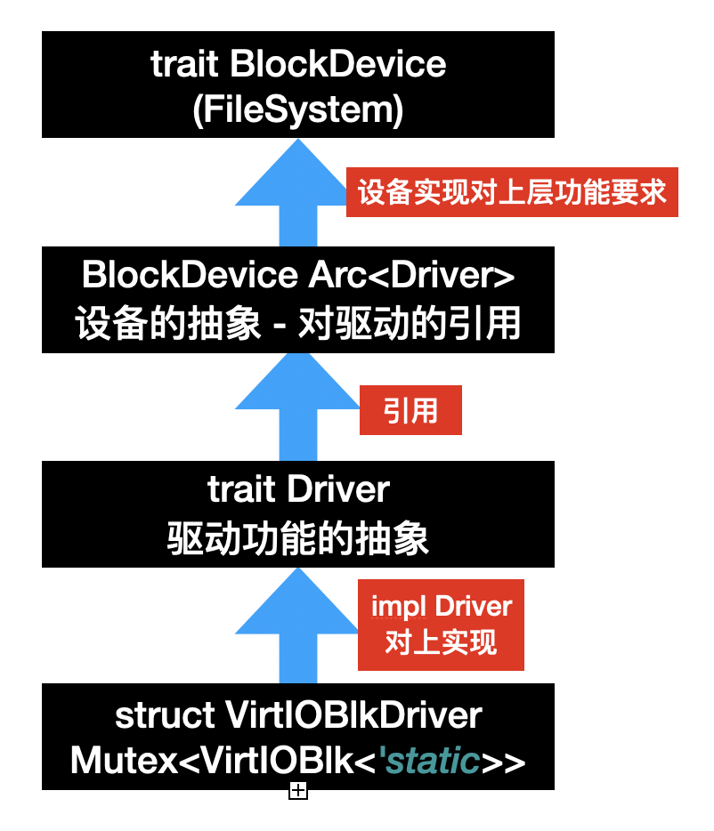

## 驱动和块设备驱动

### 什么是块设备

注意到我们在介绍 virtio 时提到了 virtio-blk 设备，这种设备提供了以整块为粒度的读和写操作，一般对应到真实的物理设备是那种硬盘。而之所以是以块为单位是为了加快读写的速度，毕竟硬盘等设备还需要寻道等等操作，一次性读取很大的一块将会节约很多时间。

### 抽象驱动

在写块设备驱动之前，我们先抽象驱动的概念，也方便后面网络设备等的介入。

os/src/drivers/driver.rs
```rust
/// 驱动类型
///
/// 目前只有块设备，可能还有网络、GPU 设备等
#[derive(Debug, Eq, PartialEq)]
pub enum DeviceType {
    Block,
}

/// 驱动的接口
pub trait Driver: Send + Sync {
    /// 设备类型
    fn device_type(&self) -> DeviceType;

    /// 读取某个块到 buf 中（块设备接口）
    fn read_block(&self, _block_id: usize, _buf: &mut [u8]) -> bool {
        unimplemented!("not a block driver")
    }

    /// 将 buf 中的数据写入块中（块设备接口）
    fn write_block(&self, _block_id: usize, _buf: &[u8]) -> bool {
        unimplemented!("not a block driver")
    }
}

lazy_static! {
    /// 所有驱动
    pub static ref DRIVERS: RwLock<Vec<Arc<dyn Driver>>> = RwLock::new(Vec::new());
}
```

这里暂时只有块设备这个种类，不过这样写还是为了方便未来的扩展。

### 抽象块设备驱动

有了驱动的概念，我们进一步抽象块设备的驱动：

```rust
/// 块设备驱动接口
pub struct BlockDriver(pub Arc<dyn Driver>);

/// 为 [`BlockDriver`] 实现 [`rcore-fs`] 中 [`BlockDevice`] trait
///
/// 使得文件系统可以通过调用块设备的该接口来读写
impl BlockDevice for BlockDriver {
    /// 每个块的大小（取 2 的对数）
    ///
    /// 这里取 512B 是因为 virtio 驱动对设备的操作粒度为 512B
    const BLOCK_SIZE_LOG2: u8 = 9;

    /// 读取某个块到 buf 中
    fn read_at(&self, block_id: usize, buf: &mut [u8]) -> dev::Result<()> {
        match self.0.read_block(block_id, buf) {
            true => Ok(()),
            false => Err(dev::DevError),
        }
    }

    /// 将 buf 中的数据写入块中
    fn write_at(&self, block_id: usize, buf: &[u8]) -> dev::Result<()> {
        match self.0.write_block(block_id, buf) {
            true => Ok(()),
            false => Err(dev::DevError),
        }
    }

    /// 执行和设备的同步
    ///
    /// 因为我们这里全部为阻塞 I/O 所以不存在同步的问题
    fn sync(&self) -> dev::Result<()> {
        Ok(())
    }
}
```

这里所谓的 `BlockDriver` 其实就是一个 `Driver` 的引用。而且利用 rcore-fs 中提供的 `BlockDevice` trait 实现了为文件系统的接口，实际上是对上传文件系统的连接。

### virtio-blk 块设备驱动

最后，我们来实现 virtio-blk 的驱动（也是调库）：

```rust
/// virtio 协议的块设备驱动
struct VirtIOBlkDriver(Mutex<VirtIOBlk<'static>>);

/// 为 [`VirtIOBlkDriver`] 实现 [`Driver`] trait
///
/// 调用了 [`virtio_drivers`] 库，其中规定的块大小为 512B
impl Driver for VirtIOBlkDriver {
    /// 设备类型
    fn device_type(&self) -> DeviceType {
        DeviceType::Block
    }

    /// 读取某个块到 buf 中
    fn read_block(&self, block_id: usize, buf: &mut [u8]) -> bool {
        self.0.lock().read_block(block_id, buf).is_ok()
    }

    /// 将 buf 中的数据写入块中
    fn write_block(&self, block_id: usize, buf: &[u8]) -> bool {
        self.0.lock().write_block(block_id, buf).is_ok()
    }
}

/// 将从设备树中读取出的设备信息放到 [`static@DRIVERS`] 中
pub fn add_driver(header: &'static mut VirtIOHeader) {
    let virtio_blk = VirtIOBlk::new(header).expect("failed to init blk driver");
    let driver = Arc::new(VirtIOBlkDriver(Mutex::new(virtio_blk)));
    DRIVERS.write().push(driver.clone());
}
```

需要注意的是，现在的逻辑怎么看都不像是之前提到的异步 DMA 再 IRQ 中断的技术，而更像是阻塞的读取。实际上的确是阻塞的读取，目前 virtio-drivers 库中的代码虽然调用了 DMA，但是返回时还是阻塞的逻辑，我们这里为了简化也没有设计 IRQ 的响应机制。

<!-- TODO 写 IRQ 响应 -->

### 小结

至此，我们完成了全部的驱动逻辑，目前的设计模式可能比较和平常使用不一样，我们总结一下如下所示：

<div align=center>  </div>

其中 `Driver` 作为一个核心 trait 为上提供实现，上层也就是 `Driver` 的使用侧，而下层则是 `Driver` 的实现侧。而下一个小节，我们将利用这些驱动来实现文件系统。