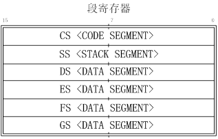

                                             
#实验零：操作系统实验准备

##1.实验目的

- 了解操作系统开发实验环境

- 熟悉命令行方式的编译、调试工程

- 掌握基于硬件模拟器的调试技术

- 熟悉C语言编程和指针的概念

- 了解X86汇编语言

##2.准备知识

###2.1了解OS实验
-------------

写一个操作系统难吗？别被现在上百万行的Linux和Windows操作系统吓倒。当年Thompson乘他老婆带着小孩度假留他一人在家时，写了UNIX；当年Linus还是一个21岁大学生时完成了Linux雏形。站在这些巨人的肩膀上，我们能否也尝试一下做“巨人”的滋味呢？

MIT的Frans Kaashoek等在2006年参考PDP-11上的UNIX Version 6写了一个可在X86上跑的操作系统xv6（基于MIT License），用于学生学习操作系统。我们可以站在他们的肩膀上，基于xv6的设计，尝试着一步一步完成一个从“空空如也”到“五脏俱全”的“麻雀”操作系统—ucore，此“麻雀”包含虚存管理、进程管理、处理器调度、同步互斥、进程间通信、文件系统等主要内核功能，总的内核代码量（C+asm）不会超过5K行。充分体现了“小而全”的指导思想。

ucore的运行环境可以是真实的X86计算机，不过考虑到调试和开发的方便，我们可采用X86硬件模拟器，比如QEMU、BOCHS、VirtualBox、VMware Player等。ucore的开发环境主要是GCC中的gcc、gas、ld和MAKE等工具，也可采用集成了这些工具的IDE开发环境Eclipse-CDT等。在分析源代码上，可以采用Scitools提供的understand软件（跨平台），windows环境上的source insight软件，或者基于emacs+ctags，vim+ctags等，都可以比较方便在在一堆文件中查找变量、函数定义、调用/访问关系等。软件开发的版本管理可以采用GIT、SVN等。比较文件和目录的不同可发现不同实验中的差异性和进行文件合并操作，可使用meld、kdiff3、UltraCompare等软件。调试（deubg）实验有助于发现设计中的错误，可采用gdb（配合qemu）等调试工具软件。并可整个实验的运行环境和开发环境既可以在Linux或Windows中使用。推荐使用Linux环境。

那我们准备如何一步一步来实现ucore呢？根据一个操作系统的设计实现过程，我们可以有如下的实验步骤：

1. 启动操作系统的bootloader，用于了解操作系统启动前的状态和要做的准备工作，了解运行操作系统的硬件支持，操作系统如何加载到内存中，理解两类中断--“外设中断”，“陷阱中断”等；

2. 物理内存管理子系统，用于理解x86分段/分页模式，了解操作系统如何管理物理内存；

3. 虚拟内存管理子系统，通过页表机制和换入换出（swap）机制，以及中断-“故障中断”、缺页故障处理等，实现基于页的内存替换算法；

4. 内核线程子系统，用于了解如何创建相对与用户进程更加简单的内核态线程，如果对内核线程进行动态管理等；

5. 用户进程管理子系统，用于了解用户态进程创建、执行、切换和结束的动态管理过程，了解在用户态通过系统调用得到内核态的内核服务的过程；

6. 处理器调度子系统，用于理解操作系统的调度过程和调度算法；

7. 同步互斥与进程间通信子系统，了解进程间如何进行信息交换和共享，并了解同步互斥的具体实现以及对系统性能的影响，研究死锁产生的原因，以及如何避免死锁；

8. 文件系统，了解文件系统的具体实现，与进程管理等的关系，了解缓存对操作系统IO访问的性能改进，了解虚拟文件系统（VFS）、buffer cache和disk driver之间的关系。

其中每个开发步骤都是建立在上一个步骤之上的，就像搭积木，从一个一个小木块，最终搭出来一个小房子。在搭房子的过程中，完成从理解操作系统原理到实践操作系统设计与实现的探索过程。这个房子最终的建筑架构和建设进度如下图所示：

图1 ucore系统结构图

 

如果完成上诉实验后还想做更大的挑战，那么可以参加ucore的研发项目，我们可以完成ucore的网络协议栈，增加图形系统，在ARM嵌入式系统上运行，支持虚拟化功能等。这些项目已经有同学参与，欢迎有兴趣的同学加入！

###2.2设置实验环境
---------------

我们参考了MIT的xv6、Harvard的OS161和Linux等设计了ucore OS实验，所有OS实验需在Linux下运行。对于经验不足的同学，推荐参考“通过虚拟机使用Linux实验环境”一节用虚拟机方式进行试验。

#### 2.2.1开发OS实验的简单步骤

在校内OS
FTP服务器上或在github网站（[https://github.com/chyyuu/ucore\_lab](https://github.com/chyyuu/ucore_pub)）可下载我们提供的lab1~lab8实验软件和文档中，大致经过如下过程就可以完成使用。

1. 下载&解压软件包 例如执行：tar jxf lab1.tar.bz2

2. 进入各个OS实验工程目录 例如： cd lab1

3. 根据实验要求阅读源码并修改代码（用各种代码分析工具和文本编辑器）

4. 并编译源码 例如执行：make

5. 如编译不过则返回步骤3

6. 如编译通过则测试是否基本正确，例如执行：make grade

7. 如果实现基本正确（即看到步骤6的输出存在不是OK的情况）则返回步骤3

8. 如果实现基本正确（即看到步骤6的输出都是OK）则生成实验提交软件包，例如执行：make handin

9. 把生成的使用提交软件包和实验报告上传/email给助教和老师。

 

另外，可以通过”make qemu”让OS实验工程在qemu上运行；可以通过”make
debug”或“make debug-nox “命令实现通过gdb远程调试 OS实验工程。

#### 2.2.2通过虚拟机使用Linux实验环境（推荐：最容易的实验环境安装方法）

这是最简单的一种通过虚拟机方式使用Linux并完成OS各个实验的方法，不需要安装Linux操作系统和各种实验所需开发软件。首先安装VirtualBox
虚拟机软件（有windows版本和其他OS版本，可到
[http://www.virtualbox.org/wiki/Downloads](http://www.virtualbox.org/wiki/Downloads)
下载），然后在校内OS
FTP服务器上下载一个老师已经安装好各种所需编辑/开发/调试/运行软件的Linux实验环境的文件(即一个虚拟磁盘镜像文件,
lab4student2011.7z)。用7zip软件(有windows版本和其他OS版本，可到[http://www.7-zip.org/download.html](http://www.7-zip.org/download.html)
下载)解压lab4student2011.7z后为ubuntu12.04.vdi，大小大约为3GB，在VirtualBox中加载这个虚拟磁盘文件，就可以启动并运行Linux实验环境了。

启动到提示输入用户名时，请输入

student

当提示输入口令时，只需简单敲一个空格键和回车键即可。然后就进入到开发环境中了。实验内容位于labs目录下。

 

#### 2.2.3安装使用Linux实验环境（适合希望自己安装Linux系统的同学）

这里我们主要以Ubuntu Linux 12.04（32
bit）作为整个实验的系统软件环境。首先我们需要安装Ubuntu Linux 12.04。

##### 2.2.3.1WUBI方式安装（最容易的Linux安装方法）

WUBI是一个专门针对Windows用户的UBUNTU
Linux安装工具，你需要做的只是点击几下鼠标而已。不需要改变分区设置，不需要启动文件，不需要LiveCD。WUBI让你如同Windows操作系统里的其他软件一样安装卸载Ubuntu，如果你从来没有安装过UBUNTU
Linux，Wubi很适合你第一次安装UBUNTU Linux。具体方法如下：

1. 去OS course
ftp或官方网站[http://releases.ubuntu.com/12.04/ubuntu-12.04-desktop-i386.iso](http://releases.ubuntu.com/8.10/ubuntu-8.10-desktop-i386.iso)下载了一个ubuntu-12.04-desktop-i386的ISO文件。
      
2. 通过winrar等工具将下载来的ISO文件中的wubi.exe解压出来，放在任意一个分区的根目录下。这里推荐预留了一个至少大小为８G的NTFS分区，单击wubi.exe安装文件，这时会弹出对话框。
   
3. 设置好分区将要安装的分区，语言，分配的系统大小，用户名和密码（务必记住）之后，点击“安装”，这时如果你的机器已经联网了，会自动从镜像网站上下载ISO文件。这里采用绕过wubi下载镜像ISO的方法安装ubuntu 12.04，会节省大量时间。避免下载ISO文件的这一步非常关键。在进行这一步之前请将网线断开，然后将提前下载来的ubuntu-12.04-desktop-i386.iso文件拷贝至wubi所创建的ubuntu目录下的install文件夹中，重新运行wubi.exe。这次再也不会提示下载ISO文件了。几秒钟后，wubi就会提示你重新启动系统。注意，此时ubuntu并没有安装在硬盘上，必须重新启动才开始进行ubuntu
12.04的安装。
       
4. 点击”完成”按钮，选择重启计算机。计算机重启后，在启动选项中选择ubuntu，出现”press 
'ESC' to … ” 时，不用理会，这时我们熟悉的ubuntu
滚动条出现在屏幕上。此时，才正式开始安装ubuntu
12.04至硬盘分区某一目录下。接下来我们什么也不用做，只需等待。当提示正式安装完成后，重新启动计算机系统，可以发现在启动选项中有"ubuntu"和“windows”。你可以根据你的情况进行选择。

##### 2.2.3.2使用Linux

在实验过程中，我们需要了解基于命令行方式的编译、调试、运行操作系统的实验方法。为此，需要了解基本的Linux命令行使用。

###### 命令模式的基本结构和概念

Ubuntu是图形界面友好和易操作的linux发行版，但有时只需执行几条简单的指令就可以完成繁琐的鼠标点击才能完成的操作。linux的命令行操作模式功能可以实现你需要的所有操作。简单的说，命令行就是基于字符命令的用户界面，也被称为文本操作模式。绝大多数情况下，
用户通过输入一行或多行命令直接与计算机互动，来实现对计算机的操作。

###### 如何进入命令模式

假设使用默认的图形界面为GNOME的任意版本Ubuntu Linux。点击GNOME菜单->附件->终端，就可以启动名为gnome-terminal程序，从而可以在此软件界面中进行命令行操作。

打开gnome-terminal程序后你首先可能会注意到类似下面的界面：

    chy@chyhome-PC:~$

你所看到的这些被称为命令终端提示符，它表示计算机已就绪启动了shell程序，正在等待着用户输入操作指令。以上述输出的界面为例，“**chy"**是当前所登录的用户名，“**chyhome-PC”**是这台计算机的主机名，“**:~”**表示当前目录。此时输入任何指令按回车之后该指令将会提交到计算机运行，比如你可以输入命令：ls
再按下回车：

    ls [ENTER]

**注意：**[ENTER]是指输入完ls后按下回车键，而不是叫你输入这个单词，ls这个命令将会列出你当前所在目录里的所有文件和子目录列表。

下面介绍bash shell程序的基本使用方法，它是ubuntu缺省的shell程序。

###### 常用指令

**查询文件列表：ls**

    chy@chyhome-PC:~$ ls
    file1.txt  file2.txt file3.txt tools

ls命令默认状态下将按首字母升序列出当前文件夹下面的所有内容，可以结合以下这些参数运行以查询更多的信息：

 -      **ls /** 将列出根目录'/'下的文件清单。如果给定一个参数，则命令行会把该参数当作命令行的工作目录。换句话说，命令行不再以当前目录为工作目录。

 -      **ls -l   **将给你列出一个更详细的文件清单.

 -      **ls -a  **将列出包括隐藏文件(以.开头的文件)在内的所有文件.

 -      **ls -h**  将以KB/MB/GB的形式给出文件大小,而不是以纯粹的Bytes.

**查询当前所在目录：pwd**

        chy@chyhome-PC:~$ pwd
        /home2/chy

**进入其他目录：cd**

        chy@chyhome-PC:~$ pwd
        /home2/chy
        chy@chyhome-PC:~$ cd /root/
        chy@chyhome-PC:~$ pwd
        /root

上面例子中，当前目录原来是/home2/chy,执行cd
/root/之后再运行pwd可以发现，当前目录已经改为/root了。

 
**在屏幕上输出字符：echo**

        chy@chyhome-PC:~$ echo "Hello World"
        Hello World

这是一个很有用的命令，它可以在屏幕上输入你指定的参数(""号中的内容)，当然这里举的这个例子中它没有多大的实际意义，但随着你对LINUX指令的不断深入，就会发现它的价值所在。

**显示文件内容：cat**

        chy@chyhome-PC:~$ cat file1.txt
        Roses are red.
        Violets are blue,
        and you have the bird-flue!

也可以使用less或more来显示比较大的文本文件内容。

**复制文件： cp**

        chy@chyhome-PC:~$ cp file1.txt file1_copy.txt
        chy@chyhome-PC:~$cat file1_copy.txt
        Roses are red.
        Violets are blue,
        and you have the bird-flue!

 

**移动文件： mv**

        chy@chyhome-PC:~$ ls
        file1.txt
        file2.txt
        chy@chyhome-PC:~$ mv file1.txt new_file.txt
        chy@chyhome-PC:~$ ls
        file2.txt
        new_file.txt

**注意：**在命令操作时系统基本上不会给你什么提示，当然，绝大多数的命令可以通过加上一个参数
－v来要求系统给出执行命令的反馈信息；

        chy@chyhome-PC:~$ mv -v file1.txt new_file.txt
        `file1.txt' -> `new_file.txt'

**建立一个空文本文件： touch**

        chy@chyhome-PC:~$ ls
        file1.txt
        chy@chyhome-PC:~$ touch tempfile.txt
        chy@chyhome-PC:~$ ls
        file1.txt
         tempfile.txt

** 建立一个目录：mkdir**

        chy@chyhome-PC:~$ ls
        file1.txt
        tempfile.txt
        chy@chyhome-PC:~$ mkdir test\_dir
        chy@chyhome-PC:~$ ls
        file1.txt
        tempfile.txt
        test\_dir

** 删除文件/目录：rm**

        chy@chyhome-PC:~$ ls -p
        file1.txt
        tempfile.txt
        test_dir/
        chy@chyhome-PC:~$ rm -i tempfile.txt
        rm: remove regular empty file `test.txt'? y
        chy@chyhome-PC:~$ ls -p
        file1.txt
        test\_dir/
        chy@chyhome-PC:~$ rm test_dir
        rm: cannot remove `test_dir': Is a directory
        chy@chyhome-PC:~$ rm -R test_dir
        chy@chyhome-PC:~$ ls -p
        file1.txt

在上面的操作：首先我们通过ls命令查询可知当前目下有两个文件和一个文件夹；

-      你可以用参数
- p来让系统显示某一项的类型，比如是文件/文件夹/快捷链接等等；

-      接下来我们用rm
- i尝试删除文件，-i参数是让系统在执行删除操作前输出一条确认提示；i(interactive)也就是交互性的意思；

-    
当我们尝试用上面的命令去删除一个文件夹时会得到错误的提示，因为删除文件夹必须使用-R(recursive,循环）参数

**特别提示：**在使用命令操作时，系统假设你很明确自己在做什么，它不会给你太多的提示，比如你执行rm
-Rf
/，它将会删除你硬盘上所有的东西，并且不会给你任何提示，所以，尽量在使用命令时加上-i的参数，以让系统在执行前进行一次确认，防止你干一些蠢事。如
果你觉得每次都要输入-i太麻烦，你可以执行以下的命令，让－i成为默认参数：

        alias rm='rm -i'

 
**查询当前进程：ps**

        chy@chyhome-PC:~$ ps
        PID TTY          TIME CMD
        21071 pts/1    00:00:00 bash
        22378 pts/1    00:00:00 ps

这条命令会例出你所启动的所有进程；

-     ps -a 可以例出系统当前运行的所有进程，包括由其他用户启动的进程。

-     ps auxww是一条相当人性化的命令，它会例出除一些很特殊进程以外的所有进程，并会以一个高可读的形式显示结果，每一个进程都会有较为详细的解释。

 

基本命令的介绍就到此为止，你可以访问网络得到更加详细的Linux命令介绍。

 

###### 输入/输出控制流程

input用来读取你通过键盘（或其他标准输入设备）输入的信息，output用于在屏幕（或其他标准输出设备）上输出你指定的输出内容.另外还有一些标准的出错提示也是通过这个命令来实现的。通常在遇到操作错误时，系统会自动调用这个命令来输出标准错误提示；

我们能重定向命令中产生的输入和输出流的位置 。

**重定向**

如果你想把命令产生的输出流指向一个文件而不是（默认的）终端，你可以使用如下的语句：

        chy@chyhome-PC:~$ ls >file4.txt
        chy@chyhome-PC:~$ cat file4.txt
        file1.txt  file2.txt file3.txt

以上例子将创建文件file4.txt如果file4.txt不存在的话。**注意：**如果file4.txt已经存在，那么上面的命令将复盖文件的内容。如果你想将内容添加到已存在的文件内容的最后，那你可以用下面这个语句：

        command >> filename

示例:

        chy@chyhome-PC:~$ ls >> file4.txt
        chy@chyhome-PC:~$ cat file4.txt
        file1.txt  file2.txt file3.txt
        file1.txt  file2.txt file3.txt file4.txt

 

在这个例子中，你会发现原有的文件中添加了新的内容。接下来我们会见到另一种重定向方式：我们将把一个文件的内容作为将要执行的命令的输入。以下是这个语句：

**command < filename**

示例:

       chy@chyhome-PC:~$ cat > file5.txt
       a3.txt
       a2.txt
       file2.txt
       file1.txt
       <Ctrl-D>
       chy@chyhome-PC:~$ sort < file5.txt
       a2.txt
       a3.txt
       file1.txt
       file2.txt

**管道**

Linux的强大之处在于它能把几个简单的命令联合成为复杂的功能，通过键盘上的管道符号'|'
完成。现在，我们来排序上面的"grep"命令：

                   grep -i command \< myfile | sort \> result.text

\
 搜索 myfile 中的命令，将输出分类并写入分类文件到 result.text 。
有时候用ls列出很多命令的时候很不方便 这时“｜”就充分利用到了 ls -l | less
慢慢看吧.

 

(4)后台进程

CLI
不是系统的串行接口。您可以在执行其他命令时给出系统命令。要启动一个进程到后台，追加一个“&”到命令后面。

                   sleep 60 &

                   ls

睡眠命令在后台运行，您依然可以与计算机交互。除了不同步启动命令以外，最好把
'&' 理解成 ';'。

如果您有一个命令将占用很多时间，您想把它放入后台运行，也很简单。只要在命令运行时按下*ctrl-z**，*它就会停止。然后键入
bg使其转入后台。fg  命令可使其转回前台。

                   sleep 60

                   \<ctrl-z\>

                   bg

                   fg

最后，您可以使用 *ctrl-c**来杀死一个前台进程。*

**环境变量**

特殊变量。PATH, PS1, ...

###### 2.2.3.2.3.3不显示中文

可通过执行如下命令避免显示乱码中文。在一个shell中，执行：

export LANG=””

 

这样在这个shell中，output信息缺省时英文。

#### 2.2.3.3获得软件包

##### 2.2.3.3.1命令行获取软件包

Ubuntu 下可以使用 apt-get 命令，apt-get 是一条 Linux 命令行命令，适用于
deb
包管理式的操作系统，主要用于自动从互联网软件库中搜索、安装、升级以及卸载软件或者操作系统。一般需要
root 执行权限，所以一般跟随 sudo 命令，如：

                   sudo apt-get install gcc-3.4 [ENTER]

常见的以及常用的 apt 命令有：

              apt-get install \<package\>

                     下载 \<package\>
以及所依赖的软件包，同时进行软件包的安装或者升级。

              apt-get remove \<package\>

                     移除 \<package\> 以及所有依赖的软件包。

              apt-cache search \<pattern\>

                     搜索满足 \<pattern\> 的软件包。

              apt-cache show/showpkg \<package\>

                     显示软件包 \<package\> 的完整描述。

例如：

                   chy@laptop:\~ \$apt-cache gcc-4.3

                   gcc-4.3 - The GNU C compiler

                   gcc-4.3-base - The GNU Compiler Collection (base
package)

                   gcc-4.3-doc - Documentation for the GNU compilers
(gcc, gobjc, g++)

                   gcc-4.3-multilib - The GNU C compiler (multilib
files)

                   gcc-4.3-source - Source of the GNU Compiler
Collection

                   gcc-4.3-locales - The GNU C compiler (native language
support files)

                   chy@laptop:\~ \$

##### 2.2.3.3.2图形界面软件包获取

新立得软件包管理器，是 Ubuntu
下面管理软件包得图形界面程序，相当于命令行中得 apt 命令。进入方法可以是

       菜单栏 \> 系统管理 \> 新立得软件包管理器
(System\>Administration\>Synaptic Package Manager)

使用更新管理器可以通过标记选择适当的软件包进行更新操作。

##### 2.2.3.3.3配置升级源

Ubuntu 的软件包获取依赖升级源，可以通过修改 “/etc/apt/sources.list”
文件来修改升级源（需要 root 权限）；或者修改新立得软件包管理器中 “设置 \>
软件库”。

#### 2.2.3.4查找帮助文件

Ubuntu 下提供 man 命令以完成帮助手册得查询。man 是 manual 的缩写，通过
man 命令可以对 Linux
下常用命令、安装软件、以及C语言常用函数等进行查询，获得相关帮助。\
 例如：

chy@laptop:\~  \$man printf

PRINTF(1)                 BSD General Commands Manual               
PRINTF(1)

 

NAME

     printf -- formatted output

 

SYNOPSIS

     printf format [arguments ...]

 

DESCRIPTION

     The printf utility formats and prints its arguments, after the
first, under control of the format. The format is a character string
which contains three types of objects: plain characters, which are
simply copied to standard output, character escape sequences which are
converted and copied to the standard output, and format specifications,
each of which causes ...

         ...

     The characters and their meanings are as follows:

           \\e      Write an \<escape\> character.

           \\a      Write a \<bell\> character.

         ...

 

通常可能会用到的帮助文件例如：

       gcc-doc cpp-doc glibc-doc

上述帮助文件可以通过 apt-get 命令或者软件包管理器获得。获得以后可以通过
man 命令进行命令或者参数查询。

 

#### 2.2.3.5实验中可能使用的软件

##### 2.2.3.5.1编辑器

(1)   Ubuntu 下自带的编辑器可以作为代码编辑的工具。例如 gedit 是 gnome
桌面环境下兼容UTF-8的文本编辑器。它十分的简单易用，有良好的语法高亮，对中文支持很好。通常可以通过双击或者命令行打开目标文件进行编辑。

(2)   Vim
编辑器：Vim是一款极方便的文本编辑软件，是UNIX下的同类型软件VI的改进版本。Vim经常被看作是“专门为程序员打造的文本编辑器”，功能强大且方便使用，便于进行程序开发。

Ubuntu 下默认安装的 vi
版本较低，功能较弱，建议在系统内安装或者升级到最新版本的 Vim。

1.关于Vim的常用命令以及使用，可以通过网络进行查找。

2.配置文件：Vim 的使用需要配置文件进行设置，例如：

                            set nocompatible

                            set encoding=utf-8

                            set fileencodings=utf-8,chinese

                            set tabstop=4

                            set cindent shiftwidth=4

                            set backspace=indent,eol,start

                            autocmd Filetype c set
omnifunc=ccomplete\#Complete

                            autocmd Filetype cpp set
omnifunc=cppcomplete\#Complete

                            set incsearch

                            set number

                            set display=lastline

                            set ignorecase

                            syntax on

                            set nobackup

                            set ruler

                            set showcmd

                            set smartindent

                            set hlsearch

                            set cmdheight=1

                            set laststatus=2

                            set shortmess=atI

                            set formatoptions=tcrqn

                            set autoindent 

可以将上述配置文件保存到：

                     \~/.vimrc

注意：.vimrc 默认情况下隐藏不可见，可以在命令行中通过 “ls -a”
命令进行查看。如果 '\~'
目录下不存在该文件，可以手动创建。修改该文件以后，重启 Vim
可以使配置生效。

##### 2.2.3.5.2 exuberant-ctags：

exuberant-ctags
可以为程序语言对象生成索引，其结果能够被一个文本编辑器或者其他工具简捷迅速的定位。支持的编辑器有
Vim、Emacs 等。

实验中，可以使用命令：

       ctags -h=.h.c.S -R

等类似命令对工程文件建立索引。

默认的生成文件为 tags (可以通过 -f 来指定)，在相同路径下使用 Vim
可以使用改索引文件，例如:

       使用 “ctrl + ]” 可以跳转到相应的声明或者定义处，使用 “ctrl + t”
返回（查询堆栈）等。

提示：习惯GUI方式的同学，可采用图形界面的understand、source
insight等软件。

##### 2.2.3.5.3 diff & patch

diff 为 Linux 命令，用于比较文本或者文件夹差异，可以通过 man
来查询其功能以及参数的使用。使用 patch
命令可以对文件或者文件夹应用修改。

例如实验中可能会在 projb 中应用前一个实验proja
中对文件进行的修改，可以使用如下命令：

       diff -r -u -P proja\_original proja\_mine \> diff.patch

         cd projb

         patch -p1 -u \< ../diff.patch

注意：proja\_original 指 proja 的源文件，即未经修改的源码包，proja\_mine
是修改后的代码包。第一条命令是递归的比较文件夹差异，并将结果重定向输出到
diff.patch 文件中；第三条命令是将 proja 的修改应用到 projb
文件夹中的代码中。

提示：习惯GUI方式的同学，可采用图形界面的meld、kdiff3、UltraCompare等软件。

2.3了解编程开发调试的基本工具
-----------------------------

    在Ubuntu Linux中的C语言编程主要基于GNU
C的语法，通过gcc来编译并生成最终执行文件。GNU汇编（assembler）采用的是AT&T汇编格式，Microsoft
汇编采用Intel格式。

### 2.3.1 gcc的基本用法

如果你还没装gcc编译环境或自己不确定装没装，不妨先执行 ：

                   sudo apt-get install build-essential

#### 2.3.1.1编译简单的 C 程序

C 语言经典的入门例子是 **Hello World**，下面是一示例代码：   

                   \#include \<stdio.h\>

                   int

                   main(void)

                   {

                       printf("Hello, world!\\n");

                       return 0;

                   }

 

我们假定该代码存为文件‘hello.c’。要用 **gcc** 编译该文件，使用下面的命令：

                   \$ gcc -Wall hello.c -o hello

该命令将文件‘hello.c’中的代码编译为机器码并存储在可执行文件
‘hello’中。机器码的文件名是通过 **-o**
选项指定的。该选项通常作为命令行中的最后一个参数。如果被省略，输出文件默认为
‘a.out’。

**注意到**如果当前目录中与可执行文件重名的文件已经存在，它将被复盖。

选项 **-Wall**
开启编译器几乎所有常用的警告──**强烈建议你始终使用该选项**。编译器有很多其他的警告选项，但
**-Wall** 是最常用的。默认情况下GCC 不会产生任何警告信息。当编写 C 或
C++ 程序时编译器警告非常有助于检测程序存在的问题。

本例中，编译器使用了 *-Wall*
选项而没产生任何警告，因为示例程序是完全合法的。

要运行该程序，输入可执行文件的路径如下：

                   \$ ./hello

                   Hello, world!

这将可执行文件载入内存，并使 CPU 开始执行其包含的指令。 路径 **./**
指代当前目录，因此 **./hello** 载入并执行当前目录下的可执行文件 ‘hello’。

 

#### 2.3.1.2 AT&T汇编基本语法

Ucore中用到的是AT&T格式的汇编，与Intel格式的汇编有一些不同。二者语法上主要有以下几个不同：

       \* 寄存器命名原则

　　　　     AT&T: %eax 　　                                 Intel: eax

       \* 源/目的操作数顺序

                     AT&T: movl %eax, %ebx                       Intel:
mov ebx, eax

       \* 常数/立即数的格式　

                     AT&T: movl \$\_value, %ebx                   Intel:
mov eax, \_value

          把value的地址放入eax寄存器

                     AT&T: movl \$0xd00d, %ebx                 Intel:
mov ebx, 0xd00d

       \* 操作数长度标识

                     AT&T: movw %ax, %bx                        Intel:
mov bx, ax

       \* 寻址方式

                     AT&T: immed32(basepointer, indexpointer,
indexscale)

                     Intel: [basepointer + indexpointer × indexscale +
imm32)

      
如果操作系统工作于保护模式下，用的是32位线性地址，所以在计算地址时不用考虑segment:offset的问题。上式中的地址应为：

                     imm32 + basepointer + indexpointer × indexscale

下面是一些例子：

           o 直接寻址

              AT&T: \_boo　;
\_boo是一个全局的C变量。注意加上\$是表示地址引用，不加是表示值引用。对于局部变量，可以通过堆栈指针引用。

                  Intel: [\_boo]

           o 寄存器间接寻址

                  AT&T: (%eax)

                  Intel: [eax]

           o 变址寻址

AT&T: \_variable(%eax)

                  Intel: [eax + \_variable]

                  AT&T: \_array( ,%eax, 4)

                  Intel: [eax × 4 + \_array]

                  AT&T: \_array(%ebx, %eax,8)

                            Intel: [ebx + eax × 8 + \_array]

#### 2.3.1.3 GCC内联汇编

基本的GCC内联汇编很简单，一般是按照下面的格式：

                     asm("statements");\
 例如：

                     asm("nop"); asm("cli");

 

"asm" 和 "\_\_asm\_\_"
的含义是完全一样的。如果有多行汇编，则每一行都要加上 "\\n\\t"。其中的
“\\n” 是换行符，"\\t” 是 tab 符，在每条命令的 结束加这两个符号，是为了让
gcc
把内联汇编代码翻译成一般的汇编代码时能够保证换行和留有一定的空格。例如：

                            asm( "pushl %eax\\n\\t"\
                                        "movl \$0,%eax\\n\\t"\
                                        "popl %eax"\
                                      );

实际上gcc在处理汇编时，是要把asm(...)的内容"打印"到汇编文件中，所以格式控制字符是必要的。再例如：

                            asm("movl %eax, %ebx");\
                             asm("xorl %ebx, %edx");\
                             asm("movl \$0, \_boo);

在上面的例子中，由于我们在内联汇编中改变了 edx 和 ebx 的值，但是由于 gcc
的特殊的处理方法，即先形成汇编文件，再交给 GAS 去汇编，所以 GAS
并不知道我们已经改变了 edx和 ebx 的值，如果程序的上下文需要 edx 或 ebx
作暂存，这样就会引起严重的后果。对于变量
\_boo也存在一样的问题。为了解决这个问题，就要用到扩展 GCC 内联汇编语法。

#### 2.3.1.4扩展GCC内联汇编

使用扩展GCC内联汇编的例子如下：

                            \#define read\_cr0() ({ \\\
                                      unsigned int \_\_dummy; \\\
                                      \_\_asm\_\_( \\\
                                                         "movl
%%cr0,%0\\n\\t" \\\
                                                         :"=r"
(\_\_dummy)); \\\
                                      \_\_dummy; \\\
                             })

 

它代表什么含义呢？这需要从其基本格式讲起。扩展GCC内联汇编的基本格式是：              

                            \_\_asm\_\_ \_\_volatile\_\_ ("\<asm
routine\>" : output : input : modify);

\
        其中，\_\_asm\_\_ 表示汇编代码的开始，其后可以跟
\_\_volatile\_\_（这是可选项），其含义是避免 “asm”
指令被删除、移动或组合，在执行代码时，如果不希望汇编语句被 gcc
优化而改变位置，就需要在 asm 符号后添加 volatile 关键词：asm
volatile(...)；或者更详细地说明为：\_\_asm\_\_
\_\_volatile\_\_(...)；然后就是小括弧，括弧中的内容是具体的内联汇编指令代码。
"\<asm routine\>" 为汇编指令部分，例如，"movl
%%cr0,%0\\n\\t"。数字前加前缀
“％“，如％1，％2等表示使用寄存器的样板操作数。可以使用的操作数总数取决于具体CPU中通用寄存器的数
量，如Intel可以有8个。指令中有几个操作数，就说明有几个变量需要与寄存器结合，由gcc在编译时根据后面输出部分和输入部分的约束条件进行相应的
处理。由于这些样板操作数的前缀使用了”％“，因此，在用到具体的寄存器时就在前面加两个“％”，如%%cr0。输出部分（output），用以规定对输出变量（目标操作数）如何与寄存器结合的约束（constraint）,输出部分可以有多个约束，互相以逗号分开。每个约束以“＝”开头，接着用一个字母来表示操作数的类型，然后是关于变量结合的约束。例如，上例中：

                     :"=r" (\_\_dummy)

“＝r”表示相应的目标操作数（指令部分的%0）可以使用任何一个通用寄存器，并且变量\_\_dummy
存放在这个寄存器中，但如果是：                

                            :“＝m”(\_\_dummy)

“＝m”就表示相应的目标操作数是存放在内存单元\_\_dummy中。表示约束条件的字母很多，下表给出几个主要的约束字母及其含义：

 

字母

含义

m, v, o

内存单元

R

任何通用寄存器

Q

寄存器eax, ebx, ecx,edx之一

I, h

直接操作数

E, F

浮点数

G

任意

a, b, c, d

寄存器eax/ax/al, ebx/bx/bl, ecx/cx/cl或edx/dx/dl

S, D

寄存器esi或edi

I

常数（0～31）

\

输入部分（Input）：输入部分与输出部分相似，但没有“＝”。如果输入部分一个操作数所要求使用的寄存器，与前面输出部分某个约束所要求的是同一个寄存器，那就把对应操作数的编号（如“1”，“2”等）放在约束条件中，在后面的例子中，我们会看到这种情况。修改部分（modify）:这部分常常以“memory”为约束条件，以表示操作完成后内存中的内容已有改变，如果原来某个寄存器的内容来自内存，那么现在内存中这个单元的内容已经改变。
注意，指令部分为必选项，而输入部分、输出部分及修改部分为可选项，当输入部分存在，而输出部分不存在时，分号“：“要保留，当“memory”存在时，三个分号都要保留，例如

\#define \_\_cli() \_\_asm\_\_ \_\_volatile\_\_("cli": : :"memory")

\
 下面是一个例子(为方便起见，我使用全局变量）：

                            int count=1;\
                             int value=1;\
                             int buf[10];\
                             void main()\
                             {\
                                      asm(\
                                                  "cld nt"\
                                                  "rep nt"\
                                                  "stosl"\
                                                :\
                                                : "c" (count), "a"
(value) , "D" (buf[0])\
                                                : "%ecx","%edi"

                                               );\
                             }

\
 得到的主要汇编代码为：

                            movl count,%ecx\
                             movl value,%eax\
                             movl buf,%edi\
                             \#APP\
                             cld\
                             rep\
                             stosl\
                             \#NO\_APP

\

cld,rep,stos就不用多解释了。这几条语句的功能是向buf中写上count个value值。冒号后的语句指明输入，输出和被改变的寄存器。通过冒号以后的语句，编译器就知道你的指令需要和改变哪些寄存器，从而可以优化寄存器的分配。其中符号"c"(count)指示要把count的值放入ecx寄存器。类似的还有：

                       a eax\
                             b ebx\
                             c ecx\
                             d edx\
                             S esi\
                             D edi

                            I 常数值，(0 - 31)\
                             q,r 动态分配的寄存器\
                             g eax,ebx,ecx,edx或内存变量\
                             A 把eax和edx合成一个64位的寄存器(use long
longs)

 

我们也可以让gcc自己选择合适的寄存器。如下面的例子：

                            asm("leal (%1,%1,4),%0"\
                                      : "=r" (x)\
                                      : "0" (x)

                            );

 

这段代码实现5 × x的快速乘法。得到的主要汇编代码为：

                            movl x,%eax\
                             \#APP\
                             leal (%eax,%eax,4),%eax\
                             \#NO\_APP\
                             movl %eax,x

\
 几点说明：

1.      使用q指示编译器从eax, ebx, ecx, edx分配寄存器。

使用r指示编译器从eax, ebx, ecx, edx, esi, edi分配寄存器。

2.     
我们不必把编译器分配的寄存器放入改变的寄存器列表，因为寄存器已经记住了它们。

3.      "="是标示输出寄存器，必须这样用。

4.     
数字%n的用法：数字表示的寄存器是按照出现和从左到右的顺序映射到用"r"或"q"请求的寄存器．如果我们要重用"r"或"q"请求的寄存器的话，就可以使用它们。

5.      如果强制使用固定的寄存器的话，如不用%1，而用ebx，则：

asm("leal (%%ebx,%%ebx,4),%0"

             : "=r" (x)

          : "0" (x)

);

注意要使用两个%,因为一个%的语法已经被%n用掉了。

### 2.3.2 make和Makefile

    GNU
make(简称make)是一种代码维护工具，在大中型项目中，它将根据程序各个模块的更新情况，自动的维护和生成目标代码。

make命令执行时，需要一个 makefile
（或Makefile）文件，以告诉make命令需要怎么样的去编译和链接程序。首先，我们用一个示例来说明makefile的书写规则。以便给大家一个感兴认识。这个示例来源于gnu的make使用手册，在这个示例中，我们的工程有8个c文件，和3个头文件，我们要写一个makefile来告诉make命令如何编译和链接这几个文件。我们的规则是：

l  如果这个工程没有编译过，那么我们的所有c文件都要编译并被链接。

l 
如果这个工程的某几个c文件被修改，那么我们只编译被修改的c文件，并链接目标程序。

l 
如果这个工程的头文件被改变了，那么我们需要编译引用了这几个头文件的c文件，并链接目标程序。

   
只要我们的makefile写得够好，所有的这一切，我们只用一个make命令就可以完成，make命令会自动智能地根据当前的文件修改的情况来确定哪些文件需要重编译，从而自己编译所需要的文件和链接目标程序。

##### 2.3.2.1.1makefile的规则

在讲述这个makefile之前，还是让我们先来粗略地看一看makefile的规则。

target ... : prerequisites ...

        command

        ...

        ...

 

target也就是一个目标文件，可以是object
file，也可以是执行文件。还可以是一个标签（label）。prerequisites就是，要生成那个target所需要的文件或是目标。command也就是make需要执行的命令（任意的shell命令）。
这是一个文件的依赖关系，也就是说，target这一个或多个的目标文件依赖于prerequisites中的文件，其生成规则定义在
command中。说白一点就是说，prerequisites中如果有一个以上的文件比target文件要新的话，command所定义的命令就会被执行。这就是makefile的规则。也就是makefile中最核心的内容。

 

### 2.3.3 gdb使用

gdb 是功能强大的调试程序，可完成如下的调试任务：

l设置断点

l监视程序变量的值

l程序的单步(step in/step over)执行

l显示/修改变量的值

l显示/修改寄存器

l查看程序的堆栈情况

l远程调试

l调试线程

       在可以使用 gdb 调试程序之前，必须使用 -g 或
–ggdb编译选项编译源文件。运行 gdb 调试程序时通常使用如下的命令：

                            gdb progname

       在 gdb 提示符处键入help，将列出命令的分类，主要的分类有：

laliases：命令别名

lbreakpoints：断点定义；

ldata：数据查看；

lfiles：指定并查看文件；

linternals：维护命令；

lrunning：程序执行；

lstack：调用栈查看；

lstatus：状态查看；

ltracepoints：跟踪程序执行。

键入 help
后跟命令的分类名，可获得该类命令的详细清单。gdb的常用命令如下表所示。

 表 gdb 的常用命令

break FILENAME:NUM              

在特定源文件特定行上设置断点

clear  FILENAME:NUM

删除设置在特定源文件特定行上的断点

run

运行调试程序

step

单步执行调试程序，不会直接执行函数

next

单步执行调试程序，会直接执行函数

backtrace

显示所有的调用栈帧。该命令可用来显示函数的调用顺序

where

 

continue

继续执行正在调试的程序

display EXPR

每次程序停止后显示表达式的值,表达式由程序定义的变量组成

file FILENAME

装载指定的可执行文件进行调试

help CMDNAME

显示指定调试命令的帮助信息

info break

显示当前断点列表，包括到达断点处的次数等

info files

显示被调试文件的详细信息

info func

显示被调试程序的所有函数名称

info prog

显示被调试程序的执行状态

info local

显示被调试程序当前函数中的局部变量信息

info var

显示被调试程序的所有全局和静态变量名称

kill

终止正在被调试的程序

list

显示被调试程序的源代码

quit

退出 gdb

 

下面以一个有错误的例子程序来介绍gdb的使用：

                            /\*bugging.c\*/

                            \#include \<stdio.h\>

                            \#include \<stdlib.h\>      

 

                            static char buff [256];

                            static char\* string;

                            int main ()

                            {

                                printf ("Please input a string: ");

                                gets (string);

                                printf ("\\nYour string is: %s\\n",
string);

                            }

 

上面这个程序非常简单，其目的是接受用户的输入，然后将用户的输入打印出来。该程序使用了一个未经过初始化的字符串地址
string，因此，编译并运行之后，将出现 Segment Fault 错误：

                     \$ gcc -o bugging -g  bugging.c

                            \$ ./bugging

                            Please input a string: asdf

                            Segmentation fault (core dumped)

 

为了查找该程序中出现的问题，我们利用 gdb，并按如下的步骤进行：

1)运行 “gdb bugging” ，加载 bugging 可执行文件；

      \$gdb bugging

2)执行装入的 bugging 命令；

      (gdb) run

3)使用 where 命令查看程序出错的地方；

      (gdb) where

4)利用 list 命令查看调用 gets 函数附近的代码；

      (gdb) list

5)在 gdb 中，我们在第 11 行处设置断点，看看是否是在第11行出错；

(gdb) break 11

6)程序重新运行到第 11 行处停止，这时程序正常，然后执行单步命令next；

      (gdb) next

7)程序确实出错，能够导致 gets 函数出错的因素就是变量
string。重新执行测试程，用 print 命令查看 string 的值；

(gdb) run

         (gdb) print string

         (gdb) \$1=0x0

8)问题在于string指向的是一个无效指针，修改程序，在10行和11行之间增加一条语句
“string=buff; ”，重新编译程序，然后继续运行，将看到正确的程序运行结果。

 

用gdb查看源代码可以用list命令，但是这个不够灵活。可以使用"layout
src"命令，或者按Ctrl-X再按A，就会出现一个窗口可以查看源代码。也可以用使用-tui参数，这样进入gdb里面后就能直接打开代码查看窗口。其他代码窗口相关命令：

info win    显示窗口的大小

layout next 切换到下一个布局模式

layout prev 切换到上一个布局模式

layout src   只显示源代码

layout asm   只显示汇编代码

layout split 显示源代码和汇编代码

layout regs   增加寄存器内容显示

focus cmd/src/asm/regs/next/prev 切换当前窗口

refresh     刷新所有窗口

tui reg next 显示下一组寄存器

tui reg system 显示系统寄存器

update      更新源代码窗口和当前执行点

winheight name +/- line 调整name窗口的高度

tabset nchar 设置tab为nchar个字符

 

 

### 2.3.4进一步的相关内容

（请同学网上搜寻相关资料学习）

gcc tools相关文档

版本管理软件（CVS、SVN、GIT等）的使用

…

 

2.4基于硬件模拟器实现源码级调试
-------------------------------

### 2.4.1安装硬件模拟器QEMU

#### 2.4.1.1Linux运行环境

QEMU用于模拟一台x86计算机，让ucore能够运行在QEMU上。为了能够正确的编译和安装
qemu，尽量使用最新版本的qemu（[http://wiki.qemu.org/Download](http://wiki.qemu.org/Download)），或者os
ftp服务器上提供的qemu源码：qemu-1.1.0.tar.gz）。目前 qemu 能够支持最新的
gcc-4.x 编译器。例如：在 Ubuntu 12.04 系统中，默认得版本是 gcc-4.6.x
(可以通过 gcc -v 或者 gcc --version 进行查看)。

可直接使用ubuntu中提供的qemu，只需执行如下命令即可。

sudo apt-get install qemu-system

 

也可采用下面描述的方法对qemu进行源码级安装。

 

#### 2.4.1.2Linux环境下的源码级安装过程

##### 2.4.1.2.1获得并应用修改

编译qemu还会用到的库文件有 **libsdl1.2-dev** 等。安装命令如下：

sudo apt-get install libsdl1.2-dev          //安装库文件
**libsdl1.2-dev**

获得 qemu
的安装包以后，对其进行解压缩(如果格式无法识别，请下载相应的解压缩软件)。

例如 qemu.tar.gz/qemu.tar.bz2 文件，在命令行中可以使用：

                       tar zxvf qemu.tar.gz

           或者  tar jxvf qemu.tar.bz2

 

对 qemu 应用修改：如果实验中使用的 qemu 需要打patch，应用过程如下所示：

                            chy@laptop:\~ \$ls

                            qemu.patch      qemu

                            chy@laptop:\~ \$cd qemu

                            chy@laptop:\~ \$patch -p1 -u \<
../qemu.patch

 

##### 2.4.1.2.2配置、编译和安装

编译以及安装 qemu 前需要使用 \<qemu\>(表示qemu解压缩路径)下面的
configure 脚本生成相应的配置文件等。而 configure
脚本有较多的参数可供选择，可以通过如下命令进行查看：

                     configure  --help

实验中可能会用到的命令例如：

configure --target-list="i386-softmmu"  //配置qemu，可模拟X86-32硬件环境

make                             //编译qemu

sudo make install                   //安装qemu

注意：版本小于0.10.0的qemu 仅支持 gcc-3.x
版本编译器。但0.10.x以上版本的qemu已经支持用gcc-4.x编译器了。

 

qemu执行程序将缺省安装到 /usr/local/bin 目录下。

 

 

如果使用的是默认的安装路径，那么在 “/usr/local/bin” 下面即可看到安装结果：

qemu-system-i386 qemu-img qemu-nbd ……

 

建立符号链接文件qemu

sudo ln –s /usr/local/bin/qemu-system-i386  /usr/local/bin/qemu

 

### 2.4.2使用硬件模拟器QEMU

#### 2.4.2.1运行参数

如果 qemu 使用的是默认 /usr/local/bin 安装路径，则在命令行中可以直接使用
qemu 命令运行程序。qemu 运行可以有多参数，格式如：

qemu [options] [disk\_image]

其中 disk\_image 即硬盘镜像文件。

部分参数说明：

          \`-hda file'       \`-hdb file'       \`-hdc file'      
\`-hdd file'

                      使用 file  作为硬盘0、1、2、3镜像。

        \`-fda file' \`-fdb file'

                      使用 file  作为软盘镜像，可以使用 /dev/fd0 作为
file 来使用主机软盘。

              \`-cdrom file'

                            使用 file  作为光盘镜像，可以使用 /dev/cdrom
作为 file 来使用主机 cd-rom。

              \`-boot [a|c|d]'

                           
从软盘(a)、光盘(c)、硬盘启动(d)，默认硬盘启动。

              \`-snapshot'

                            写入临时文件而不写回磁盘镜像，可以使用 C-a s
来强制写回。

              \`-m megs'

                            设置虚拟内存为 msg M字节，默认为 128M 字节。

              \`-smp n'

                            设置为有 n 个 CPU 的 SMP 系统。以 PC
为目标机，最多支持 255 个 CPU。

              \`-nographic'

                            禁止使用图形输出。

              其他：

                     可用的主机设备 dev 例如：

                     vc

                            虚拟终端。

                     null

                            空设备

                     /dev/XXX

                            使用主机的 tty。

                     file: filename

                            将输出写入到文件 filename 中。

                     stdio

                            标准输入/输出。

                     pipe：pipename

                            命令管道 pipename。

                     等。

              使用 dev 设备的命令如：

                     \`-serial dev'

                            重定向虚拟串口到主机设备 dev 中。

                     \`-parallel dev'

                            重定向虚拟并口到主机设备 dev 中。

                     \`-monitor dev'

                            重定向 monitor 到主机设备 dev 中。

              其他参数：

                     \`-s'

                            等待 gdb 连接到端口 1234。

                     \`-p port'

                            改变 gdb 连接端口到 port。

                     \`-S'

                            在启动时不启动 CPU， 需要在 monitor 中输入
'c'，才能让qemu继续模拟工作。

                     \`-d'

                            输出日志到 qemu.log 文件。

        
其他参数说明可以参考：[http://bellard.org/qemu/qemu-doc.html\#SEC15](http://bellard.org/qemu/qemu-doc.html#SEC15)
。其他qemu的安装和使用的说明可以参考[http://bellard.org/qemu/user-doc.html](http://bellard.org/qemu/user-doc.html)。

 

       或者在命令行收入 qemu (没有参数) 显示帮助。

       在实验中，例如 lab1，可能用到的命令如：

       qemu -hda ucore.img -parallel stdio     
//让ucore在qemu模拟的x86硬件环境中执行

              或

       qemu -S -s -hda ucore.img -monitor stdio 
//用于与gdb配合进行源码调试

#### 2.4.2.2常用调试命令

(1)qemu 中monitor的常用命令：

help

查看 qemu 帮助，显示所有支持的命令。

q|quit|exit

退出 qemu。

stop

停止 qemu。

c|cont|continue

连续执行。

x /fmt addr

xp /fmt addr

显示内存内容，其中 'x' 为虚地址，'xp' 为实地址。

参数 /fmt  i 表示反汇编，缺省参数为前一次参数。

p|print'

计算表达式值并显示，例如 \$reg 表示寄存器结果。

memsave addr size file

pmemsave addr size file

将内存保存到文件，memsave 为虚地址，pmemsave 为实地址。

breakpoint 相关：

设置、查看以及删除 breakpoint，pc执行到 breakpoint，qemu
停止。（暂时没有此功能）

watchpoint 相关：

设置、查看以及删除 watchpoint, 当 watchpoint
地址内容被修改，停止。（暂时没有此功能）

s|step

单步一条指令，能够跳过断点执行。

r|registers

显示全部寄存器内容。

info 相关操作

查询 qemu 支持的关于系统状态信息的操作。

 

其他具体的命令格式以及说明，参见 qemu help 命令帮助。

注意：qemu 默认有 ‘singlestep arg’ 命令（arg 为
参数），该命令为设置单步标志命令。例如：'singlestep off'
运行结果为禁止单步，'singlestep on' 结果为允许单步。在允许单步条件下，使用
cont 命令进行单步操作。如：

                   (qemu) xp /3i \$pc

                   0xfffffff0: ljmp       \$0xf000, \$0xe05b

                   0xfffffff5: xor         %bh, (%bx, %si)

                   0xfffffff7: das

                   (qemu) singlestep on

                   (qemu) cont

                                               0x000fe05b: xor %ax, %ax

 

step命令为单步命令，即qemu执行一步，能够跳过 breakpoint
断点执行。如果此时使用cont命令，则qemu 运行改为连续执行。

 

log命令能够保存qemu模拟过程产生的信息（与qemu运行参数 \`-d'
相同），具体参数可以参考命令帮助。产生的日志信息保存在 “/tmp/qemu.log”
中，例如使用 'log in\_asm'命令以后，运行过程产生的的qemu.log 文件为：

         1 ----------------

         2 IN:

         3 0xfffffff0:  ljmp   \$0xf000,\$0xe05b

         4

         5 ----------------

         6 IN:

         7 0x000fe05b:  xor    %ax,%ax

         8 0x000fe05d:  out    %al,\$0xd

         9 0x000fe05f:  out    %al,\$0xda

   10 0x000fe061:  mov    \$0xc0,%al

   11 0x000fe063:  out    %al,\$0xd6

   12 0x000fe065:  mov    \$0x0,%al

   13 0x000fe067:  out    %al,\$0xd4

 

### 2.4.3 基于qemu内建模式调试ucore

调试举例：调试 lab1，跟踪bootmain函数：

(1)   运行 qemu -S -hda ucore.img -monitor stdio

(2)   查看 bootblock.asm 得到 bootmain 函数地址为 0x7d60，并插入断点。

(3)   使用命令 c 连续执行到断点。

(4)   使用 xp 命令进行反汇编。

(5)   使用 s 命令进行单步执行。

运行结果如下：

chy@laptop: \~/lab1\$ qemu -S -hda ucore.img -monitor stdio

(qemu) b 0x7d60

insert breakpoint 0x7d60 success!

(qemu) c

         working …

(qemu)

         break:

                   0x00007d60:  push   %ebp                 

(qemu) xp /10i \$pc

         0x00007d60:  push   %ebp

         0x00007d61:  mov    %esp,%ebp

         0x00007d63:  push   %esi

         0x00007d64:  push   %ebx

         0x00007d65:  sub   \$0x4,%esp

         0x00007d68:  mov    0x7da8,%esi

         0x00007d6e:  mov    \$0x0,%ebx

         0x00007d73:  movsbl (%esi,%ebx,1),%eax

         0x00007d77:  mov    %eax,(%esp,1)

         0x00007d7a:  call   0x7c6c

(qemu) step

                   0x00007d61:  mov    %esp,%ebp

(qemu) step

                   0x00007d63:  push   %esi

 

### 2.4.4 结合gdb和qemu源码级调试 ucore

#### 2.4.4.1编译可调试的目标文件

为了使得编译出来的代码是能够被gdb这样的调试器调试，我们需要在使用gcc编译源文件的时候添加参数：-g
–gdb
。这样编译出来的目标文件中才会包含可以用于调试器进行调试的相关符号信息。

#### 2.4.4.2ucore 代码编译

(1)编译过程：在解压缩后的 ucore 源码包中使用 make 命令即可。例如 lab1中：

chy@laptop: \~/lab1\$  make

生成目标文件为 ucore.img。

(2)保存修改：

使用 diff 命令对修改后的 ucore 代码和 ucore
源码进行比较，比较之前建议使用 make clean
命令清除不必要文件。(如果有ctags 文件，需要手工清除。)

(3)应用修改：参见 patch 命令说明。

 

#### 2.4.4.3使用远程调试

为了与qemu配合进行源代码级别的调试，需要先让qemu进入等待gdb调试器的接入并且还不能让qemu中的CPU执行，因此启动qemu的时候，我们需要使用参数-S
–s这两个参数来做到这一点。在使用了前面提到的参数启动qemu之后，qemu中的CPU并不会马上开始执行，这时我们启动gdb，然后在gdb命令行界面下，使用下面的命令连接到qemu：

(gdb)  target remote 127.0.0.1:1234

然后输入c（也就是continue）命令之后，qemu会继续执行下去，但是gdb由于不知道任何符号信息，并且也没有下断点，是不能进行源码级的调试的。为了让gdb获知符号信息，需要指定调试目标文件，gdb中使用file命令：

(gdb)  file obj/kernel/kernel.elf

之后gdb就会载入这个文件中的符号信息了。

 

通过gdb可以对ucore代码进行调试，以lab1中调试memset函数为例：

(1)   运行 qemu -S -s -hda ucore.img -monitor stdio

(2)   运行 gdb并与qemu进行连接

(3)   设置断点并执行

(4)   qemu 单步调试。

运行过程以及结果如下：

窗口一

chy@laptop: \~/lab1\$ qemu -S -hda ./bin/ucore.img  -s

 

 

 

 

 

 

 

 

 

 

 

 

 

 

 

 

 

 

窗口二

 

chy@laptop: \~/lab1\$ gdb ./bin/kernel

(gdb) target remote:1234

Remote debugging using :1234

0x0000fff0 in ?? ()

(gdb) file obj/kernel/kernel.elf

(gdb) break memset

Breakpoint 1 at 0x100d9f: file libs/string.c, line 54.

(gdb) run

Starting program: /home/chenyu/oscourse/develop/ucore/lab1/bin/kernel

 

Breakpoint 1, memset (s=0x1020fc, c=0 '\\000', n=12) at libs/string.c:54

54               return \_\_memset(s, c, n);

(gdb)

 

 

 

#### 2.4.4.4使用gdb配置文件

在上面可以看到，为了进行源码级调试，需要输入较多的东西，很麻烦。为了方便，可以将这些命令存在脚本中，并让gdb在启动的时候自动载入。

我们可以创建文件gdbinit，并输入下面的内容：

target remote 127.0.0.1:1234

file obj/kernel/kernel.elf

 

为了让gdb在启动时执行这些命令，使用下面的命令启动gdb：

\$ gdb –x gdbinit

 

如果觉得这个命令太长，可以将这个命令存入一个文件中，当作脚本来执行。

另外，如果直接使用上面的命令，那么得到的界面是一个纯命令行的界面，不够直观，就像下图这样：

 

\

如果想获得上面右图那样的效果，只需要再加上参数-tui就行了，比如：

gdb -tui –x gdbinit

 

 

#### 2.4.4.5加载调试目标

在上面小节，我们提到为了能够让gdb识别变量的符号，我们必须给gdb载入符号表等信息。在进行gdb本地应用程序调试的时候，因为在指定了执行文件时就已经加载了文件中包含的调试信息，因此不用再使用gdb命令专门加载了。但是在使用qemu进行远程调试的时候，我们必须手动加载符号表，也就是在gdb中用file命令。

这样加载调试信息都是按照elf文件中制定的虚拟地址进行加载的，这在静态连接的代码中没有任何问题。但是在调试含有动态链接库的代码时，动态链接库的ELF执行文件头中指定的加载虚拟地址都是0，这个地址实际上是不正确的。从操作系统角度来看，用户态的动态链接库的加载地址都是由操作系统动态分配的，没有一个固定值。然后操作系统再把动态链接库加载到这个地址，并由用户态的库链接器（linker）把动态链接库中的地址信息重新设置，自此动态链接库才可正常运行。

由于分配地址的动态性，gdb并不知道这个分配的地址是多少，因此当我们在对这样动态链接的代码进行调试的时候，需要手动要求gdb将调试信息加载到指定地址。

下面，我们要求gdb将linker加载到0x6fee6180这个地址上：

(gdb) add-symbol-file android\_test/system/bin/linker 0x6fee6180

 

这样的命令默认是将代码段(.data)段的调试信息加载到0x6fee6180上，当然，你也可以通过“-s”这个参数来指定，比如：

(gdb) add-symbol-file android\_test/system/bin/linker –s .text
0x6fee6180

 

这样，在执行到linker中代码时gdb就能够显示出正确的代码和调试信息出来。

这个方法在操作系统中调试动态链接器时特别有用。

#### 2.4.4.6设定调试目标架构

在调试的时候，我们也许需要调试不是i386保护模式的代码，比如8086实模式的代码，我们需要设定当前使用的架构：

(gdb) set arch i8086

这个方法在调试不同架构或者说不同模式的代码时还是有点用处的。

 

2.5了解处理器硬件
-----------------

要想深入理解ucore，就需要了解支撑ucore运行的硬件环境，即了解处理器体系结构（了解硬件对ucore带来影响）和机器指令集（读懂ucore的汇编）。ucore目前支持的硬件环境是基于Intel
80386以上的计算机系统。更多的硬件相关内容（比如保护模式等）将随着实现ucore的过程逐渐展开介绍。

### 2.5.1Intel 80386运行模式

80386有四种运行模式：实模式、保护模式、SMM模式和虚拟8086模式。这里对涉及ucore的**实模式、保护模式**做一个简要介绍。

实模式：80386加电启动后处于实模式运行状态，在这种状态下软件可访问的物理内存空间不能超过1MB，且无法发挥Intel
80386以上级别的32位CPU的4GB内存管理能力。实模式将整个物理内存看成分段的区域，程序代码和数据位于不同区域，操作系统和用户程序并没有区别对待，而且每一个指针都是指向实际的物理地址。这样用户程序的一个指针如果指向了操作系统区域或其他用户程序区域，并修改了内容，那么其后果就很可能是灾难性的。

实模式：实模式是为了和8086处理器兼容而设置的。在实模式下，80386处理器就相当于一个快速的8086处理器。80386处理器被复位或加电的时候以实模式启动。这时候处理器中的各寄存器以实模式的初始化值工作。80386处理器在实模式下的存储器寻址方式和8086是一样的，由段寄存器的内容乘以16当做基地址，加上段内的偏移地址形成最终的物理地址，这时候它的32位地址线只使用了低20位，即可访问1MB的物理地址空间。在实模式下，80386处理器不能对内存进行页机制管理，所以指令寻址的地址就是内存中实际的物理地址。在实模式下，所有的段都是可以读、写和执行的。实模式下80386不支持优先级，所有的指令相当于工作在特权级（即优先级0），所以它可以执行所有特权指令，包括读写控制寄存器CR0等。实模式下不支持硬件上的多任务切换。实模式下的中断处理方式和8086处理器相同，也用中断向量表来定位中断服务程序地址。中断向量表的结构也和8086处理器一样，每4个字节组成一个中断向量，其中包括两个字节的段地址和两个字节的偏移地址。

保护模式：实际上，80386就是通过在实模式下初始化控制寄存器，GDTR，LDTR，IDTR与TR等管理寄存器以及页表，然后再通过加载CR0使其中的保护模式使能位置位而进入保护模式的。当80386工作在保护模式下的时候，其所有的32根地址线都可供寻址，物理寻址空间高达4GB。在保护模式下，支持内存分页机制，提供了对虚拟内存的良好支持。保护模式下80386支持多任务，还支持优先级机制，不同的程序可以运行在不同的优先级上。优先级一共分0～3
4个级别，操作系统运行在最高的优先级0上，应用程序则运行在比较低的级别上；配合良好的检查机制后，既可以在任务间实现数据的安全共享也可以很好地隔离各个任务。

### 2.5.2Intel 80386内存架构

80386是32位的处理器，即可以寻址的物理内存地址空间为2\^32=4G字节。在理解操作系统的过程中，需要用到三个地址空间的概念。地址是访问地址空间的索引。**物理内存地址空间**是处理器提交到总线上用于访问计算机系统中的内存和外设的最终地址。一个计算机系统中只有一个物理地址空间。**线性地址空间**是每个运行的应用程序看到的地址空间，在操作系统的虚存管理之下，每个运行的应用程序都认为自己独享整个计算机系统的地址空间，这样可让多个运行的应用程序之间相互隔离。处理器负责把线性地址转换成物理地址。一个计算机系统中可以有多个线性地址空间（比如一个运行的程序就可以有一个私有的线性地址空间）。线性地址空间的大小与物理地址空间的大小没有必然的连续。**逻辑地址空间**是应用程序直接使用的地址空间。这是由于80386中无法禁用段机制，使得逻辑地址一直存在。比如如下C代码片段：

int boo=1;

int \*foo=&a;

 

这里的boo是一个整型变量，foo变量是一个指向boo地址的整型指针变量，foo中储存的内容就是boo的逻辑地址。逻辑地址由一个16位的段寄存器和一个32位的偏移量构成。Foo中放的就是32位的偏移量，而对应的段信息位于段寄存器中。

上述三种地址的关系如下：

l 
分段机制启动、分页机制未启动：逻辑地址-\>***段机制处理***-\>线性地址=物理地址

l 
分段机制和分页机制都启动：逻辑地址-\>***段机制处理***-\>线性地址-\>***页机制处理***-\>物理地址

### 2.5.3Intel 80386寄存器

80386的寄存器可以分为8组：通用寄存器，段寄存器，指令指针寄存器，标志寄存器，系统地址寄存器，控制寄存器，调试寄存器，测试寄存器，它们的宽度都是32位。一般程序员看到的寄存器包括通用寄存器，段寄存器，指令指针寄存器，标志寄存器。

General
Register(通用寄存器)：EAX/EBX/ECX/EDX/ESI/EDI/ESP/EBP这些寄存器的低16位就是8086的
AX/BX/CX/DX/SI/DI/SP/BP，对于AX,BX,CX,DX这四个寄存器来讲,可以单独存取它们的高8位和低8位
(AH,AL,BH,BL,CH,CL,DH,DL)。它们的含义如下:

    EAX：累加器

    EBX：基址寄存器

    ECX：计数器

    EDX：数据寄存器

    ESI：源地址指针寄存器

    EDI：目的地址指针寄存器

    EBP：基址指针寄存器

    ESP：堆栈指针寄存器

 

Segment Register(段寄存器，也称 Segment
Selector，段选择符，段选择子)：除了8086的4个段外(CS,DS,ES,SS)，80386还增加了两个段FS，GS,这些段寄存器都是16位的，它们的含义如下：

    CS：代码段(Code Segment)

    DS：数据段(Data Segment)

    ES：附加数据段(Extra Segment)

    SS：堆栈段(Stack Segment)

    FS：附加段

    GS 附加段

Instruction
Pointer(指令指针寄存器)：EIP的低16位就是8086的IP，它存储的是下一条要执行指令的内存地址，在分段地址转换中，表示指令的段内偏移地址。

Flag
Register(标志寄存器)：EFLAGS,和8086的16位标志寄存器相比，增加了4个控制位，这20位控制/标志位的位置如下图所示：

 

相关的控制/标志位含义是：

    CF(Carry Flag)：进位标志位；

    PF(Parity Flag)：奇偶标志位；

    AF(Assistant Flag)：辅助进位标志位；

    ZF(Zero Flag)：零标志位；

    SF(Singal Flag)：符号标志位；

IF(Interrupt Flag)：中断允许标志位,由CLI，STI两条指令来控制；设置 IF
使CPU可识别外部（可屏蔽）中断请求。复位 IF 则禁止中断。 IF
对不可屏蔽外部中断和故障中断的识别没有任何作用。

    DF(Direction Flag)：向量标志位，由CLD，STD两条指令来控制；

    OF(Overflow Flag)：溢出标志位；

IOPL(I/O Privilege
Level)：I/O特权级字段，它的宽度为2位,它指定了I/O指令的特权级。如果当前的特权级别在数值上小于或等于IOPL，那么I/O指令可执行。否则，将发生一个保护性故障中断。

NT(Nested
Task)：控制中断返回指令IRET，它宽度为1位。若NT=0，则用堆栈中保存的值恢复EFLAGS，CS和EIP从而实现中断返回；若NT=1，则通过任务切换实现中断返回。

 

2.6了解ucore编程方法和通用数据结构
----------------------------------

### 2.6.1面向对象编程方法

uCore设计中采用了一定的面向对象编程方法。虽然C
语言对面向对象编程并没有原生支持，但没有原生支持并不等于我们不能用 C
语言写面向对象程序。需要注意，我们并不需要用 C语言模拟出一个常见 C++
编译器已经实现的对象模型。如果是这样，还不如直接采用C++编程。

uCore的面向对象编程方法，目前主要是采用了类似C++的接口（interface）概念，即是让实现细节不同的某类内核子系统（比如物理内存分配器、调度器，文件系统等）有共同的操作方式，这样虽然内存子系统的实现千差万别，但它的访问接口是不变的。这样不同的内核子系统之间就可以灵活组合在一起，实现风格各异，功能不同的操作系统。接口在
C 语言中，表现为一组函数指针的集合。放在 C++
中，即为虚表。接口设计的难点是如果找出各种内核子系统的共性访问/操作模式，从而可以根据访问模式提取出函数指针列表。

比如对于uCore内核中的物理内存管理子系统，首先通过分析内核中其他子系统可能对物理内存管理子系统，明确物理内存管理子系统的访问/操作模式，然后我们定义了pmm\_manager数据结构（位于lab2/kern/mm/pmm.h）如下：

*// pmm\_manager is a physical memory management class. A special pmm manager - XXX\_pmm\_manager\

// only needs to implement the methods in pmm\_manager class, then XXX\_pmm\_manager can be used\
 // by ucore to manage the total physical memory space.\
***struct** pmm\_manager **{**\
   *// XXX\_pmm\_manager's name*\
   **const** **char** **\***name**;** *\
*  *// initialize internal description&management data structure\
*** ***// (free block list, number of free block) of XXX\_pmm\_manager \
  ***void** **(\*init)(void);***\
*  *// setup description&management data structcure according to\
*  *// the initial free physical memory space \
*  **void** **(\***init\_memmap**)(struct** Page **\***base**,** size\_t n**);***\
*  *// allocate \>=n pages, depend on the allocation algorithm \
*  **struct** Page **\*(\***alloc\_pages**)(**size\_t n**);*** \
  
// free \>=n pages with "base" addr of Page descriptor structures(memlayout.h)\
*  **void** **(\***free\_pages**)(struct** Page **\***base**,** size\_t n**);**  *\
*  *// return the number of free pages \
*  size\_t **(\***nr\_free\_pages**)(void);**                    *\
*   *// check the correctness of XXX\_pmm\_manager\
  * **void** **(\***check**)(void);**                              *\
***};**

这样基于此数据结构，我们可以实现不同连续内存分配算法的物理内存管理子系统，而这些物理内存管理子系统需要编写算法，把算法实现在此结构中定义的init（初始化）、init\_memmap（分析空闲物理内存并初始化管理）、alloc\_pages（分配物理页）、free\_pages（释放物理页）函数指针所对应的函数中。而其他内存子系统需要与物理内存管理子系统交互时，只需调用特定物理内存管理子系统所采用的pmm\_manager数据结构变量中的函数指针即可

 

### 2.6.2通用数据结构

#### 2.6.2.1双向循环链表

在“数据结构”课程中，如果创建某种数据结构的双循环链表，通常采用的办法是在这个数据结构的类型定义中有专门的成员变量
data, 并且加入两个指向该类型的指针next和prev。例如：

typedef struct foo {

    ElemType data;

    struct foo \*prev;

    struct foo \*next;

} foo\_t;

 

 

双向循环链表的特点是尾节点的后继指向首节点，且从任意一个节点出发，沿两个方向的任何一个，都能找到链表中的任意一个节点的data数据。由双向循环列表形成的数据链如下所示：

 

这种双向循环链表数据结构的一个潜在问题是，虽然链表的基本操作是一致的，但由于每种特定数据结构的类型不一致，需要为每种特定数据结构类型定义针对这个数据结构的特定链表插入、删除等各种操作，会导致代码冗余。

在uCore内核（从lab2开始）中使用了大量的双向循环链表结构来组织数据，包括空闲内存块列表、内存页链表、进程列表、设备链表、文件系统列表等的数据组织（在[labX/libs/list.h]实现），但其具体实现借鉴了Linux内核的双向循环链表实现，与“数据结构”课中的链表数据结构不太一样。下面将介绍这一数据结构的设计与操作函数。

uCore的双向链表结构定义为：

**struct** list\_entry **{**\
     **struct** list\_entry **\***prev**,** **\***next**;**\
 **};**

需要注意uCore内核的链表节点list\_entry没有包含传统的data数据域，，而是在具体的数据结构中包含链表节点。以lab2中的空闲内存块列表为例，空闲块链表的头指针定义（位于lab2/kern/mm/memlayout.h中）为：

*/\* free\_area\_t - maintains a doubly linked list to record free (unused) pages \*/*\
 **typedef** **struct** **{**\
     list\_entry\_t free\_list**;**         *// the list header\
*    **unsigned** **int** nr\_free**;**           *// \# of free pages in this free list\
***}** free\_area\_t**;**

 

而每一个空闲块链表节点定义（位于lab2/kern/mm/memlayout）为：

  

*/\* \*\
  \* struct Page - Page descriptor structures. Each Page describes one\

 \* physical page. In kern/mm/pmm.h, you can find lots of useful functions\
  \* that convert Page to other data types, such as phyical address.\
  \* \*/*\
 **struct** Page **{**\
     atomic\_t ref**;**          *// page frame's reference counter\
*     ……*\
*    list\_entry\_t page\_link**;**         *// free list link\
***};**

      
这样以free\_area\_t结构的数据为双向循环链表的链表头指针，以Page结构的数据为双向循环链表的链表节点，就可以形成一个完整的双向循环链表，如下图所示：

图 空闲块双向循环链表

从上图中我们可以看到，这种通用的双向循环链表结构避免了为每个特定数据结构类型定义针对这个数据结构的特定链表的麻烦，而可以让所有的特定数据结构共享通用的链表操作函数。在实现对空闲块链表的管理过程（参见lab2/kern/mm/default\_pmm.c）中，就大量使用了通用的链表插入，链表删除等操作函数。有关这些链表操作函数的定义如下。

 

**1.****初始化**

uCore只定义了链表节点，并没有专门定义链表头，那么一个双向循环链表是如何建立起来的呢？让我们来看看list\_init这个内联函数（inline
funciton）：

**static** inline **void**\
 list\_init**(**list\_entry\_t **\***elm**)** **{**\
     elm**-\>**prev **=** elm**-\>**next **=** elm**;**\
 **}**

   
参看文件default\_pmm.c的函数default\_init，当我们调用list\_init(&(free\_area.free\_list))时，就声明一个名为free\_area.free\_list的链表头时，它的next、prev指针都初始化为指向自己，这样，我们就有了一个表示空闲内存块链的空链表。而且我们可以用头指针的next是否指向自己来判断此链表是否为空，而这就是内联函数list\_empty的实现。

 

**2.****插入**

对链表的插入有两种操作，即在表头插入（list\_add\_after）或在表尾插入（list\_add\_before）。因为双向循环链表的链表头的next、prev分别指向链表中的第一个和最后一个节点，所以，list\_add\_after和list\_add\_before的实现区别并不大，实际上uCore分别用\_\_list\_add(elm,
listelm, listelm-\>next)和\_\_list\_add(elm, listelm-\>prev,
listelm)来实现在表头插入和在表尾插入。而\_\_list\_add的实现如下：

**static** inline **void**\

\_\_list\_add**(**list\_entry\_t **\***elm**,** list\_entry\_t **\***prev**,** list\_entry\_t **\***next**)** **{**\
     prev**-\>**next **=** next**-\>**prev **=** elm**;**\
     elm**-\>**next **=** next**;**\
     elm**-\>**prev **=** prev**;**\
 **}**

从上述实现可以看出在表头插入是插入在listelm之后，即插在链表的最前位置。而在表尾插入是插入在listelm-\>prev之后，即插在链表的最后位置。注：list\_add等于list\_add\_after。

 

**3.****删除**

当需要删除空闲块链表中的Page结构的链表节点时，可调用内联函数list\_del，而list\_del进一步调用了\_\_list\_del来完成具体的删除操作。其实现为：

**static** inline **void**\
 list\_del**(**list\_entry\_t **\***listelm**)** **{**\
     \_\_list\_del**(**listelm**-\>**prev**,** listelm**-\>**next**);**\
 **}**

**static** inline **void**\

\_\_list\_del**(**list\_entry\_t **\***prev**,** list\_entry\_t **\***next**)** **{**\
     prev**-\>**next **=** next**;**\
     next**-\>**prev **=** prev**;**\
 **}**

 

如果要确保被删除的节点listelm不再指向链表中的其他节点，这可以通过调用list\_init函数来把listelm的prev、next指针分别自身，即将节点置为空链状态。这可以通过list\_del\_init函数来完成。

 

 

**3.****访问链表节点所在的宿主数据结构**

 

通过上面的描述可知，list\_entry\_t通用双向循环链表中仅保存了某特定数据结构中链表节点成员变量的地址，那么如何通过这个链表节点成员变量访问到它的所有者（即某特定数据结构的变量）呢？Linux为此提供了针对数据结构XXX的le2XXX(le,
member)的宏，其中le，即list
entry的简称，是指向数据结构XXX中list\_entry\_t成员变量的指针，也就是存储在双向循环链表中的节点地址值，
member则是XXX数据类型中包含的链表节点的成员变量。例如，我们要遍历访问空闲块链表中所有节点所在的基于Page数据结构的变量，则可以采用如下编程方式（基于lab2/kern/mm/default\_pmm.c）：

//free\_area是空闲块管理结构，free\_area.free\_list是空闲块链表头\
 free\_area\_t free\_area**;** \

list\_entry\_t **\***le **=** **&**free\_area**.**free\_list**; **//le是空闲块链表头指针\

**while****((**le**=**list\_next**(**le**))** **!=** **&**free\_area**.**free\_list**)** **{**//从第一个节点开始遍历\

      **struct** Page **\***p **=** le2page**(**le**,** page\_link**);**
//获取节点所在基于Page数据结构的变量\
        ……\
 }

 

le2page宏（定义位于lab2/kern/mm/memlayout.h）的使用相当简单：

*// convert list entry to page\
***\#define** le2page**(**le**,** member**)**                 \\\
     to\_struct**((**le**),** **struct** Page**,** member**)**

而相比之下，它的实现用到的to\_struct宏和offsetof宏（定义位于lab2/libs/defs.h）则有一些难懂：

*/\* Return the offset of 'member' relative to the beginning of a struct type \*/*\

**\#define** offsetof**(**type**,** member**)**                                      \\\
     **((**size\_t**)(&((**type **\*)**0**)-\>**member**))**\
 \
 */\* \*\
  \* to\_struct - get the struct from a ptr\
  \* @ptr:    a struct pointer of member\
  \* @type:   the type of the struct this is embedded in\
  \* @member: the name of the member within the struct\
  \* \*/*\

**\#define** to\_struct**(**ptr**,** type**,** member**)**                               \\\

    **((**type **\*)((char** **\*)(**ptr**)** **-** offsetof**(**type**,** member**)))**

这里采用了一个利用gcc编译器技术的技巧，即先求得数据结构的成员变量在本宿主数据结构中的偏移量，然后根据成员变量的地址反过来得出属主数据结构的变量的地址。

我们首先来看offsetof宏，size\_t最终定义与CPU体系结构相关，本实验都采用Intel
X86-32 CPU，顾szie\_t等价于 unsigned int。 ((type
\*)0)-\>member的设计含义是什么？其实这是为了求得数据结构的成员变量在本宿主数据结构中的偏移量。为了达到这个目标，首先将0地址强制"转换"为type数据结构（比如struct
Page）的指针，再访问到type数据结构中的member成员（比如page\_link）的地址，即是type数据结构中member成员相对于数据结构变量的偏移量。在offsetof宏中，这个member成员的地址（即“**&((**type **\*)**0**)-\>**member**)****”**）实际上就是type数据结构中member成员相对于数据结构变量的偏移量。对于给定一个结构，offsetof(type,member)是一个常量，to\_struct宏正是利用这个不变的偏移量来求得链表数据项的变量地址。接下来再分析一下to\_struct宏，可以发现
to\_struct宏中用到的ptr变量是链表节点的地址，把它减去offsetof宏所获得的数据结构内偏移量，即就得到了包含链表节点的属主数据结构的变量的地址。
