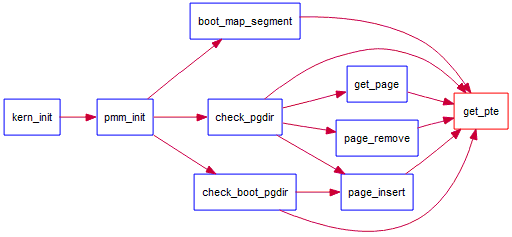
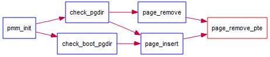
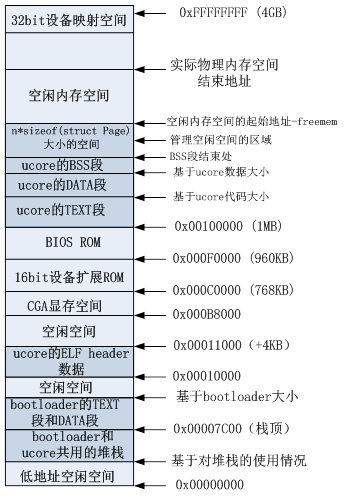
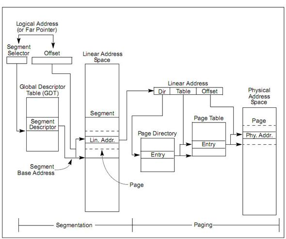
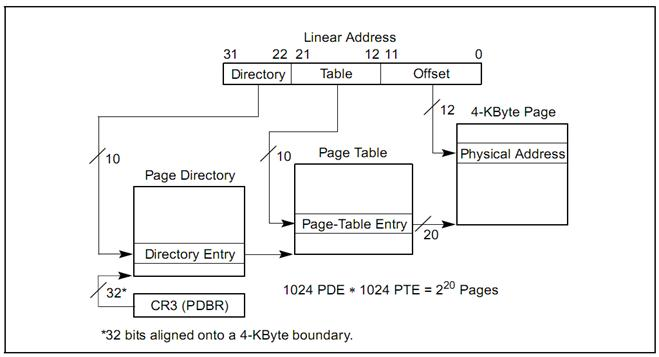
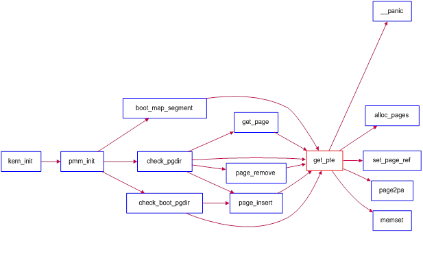
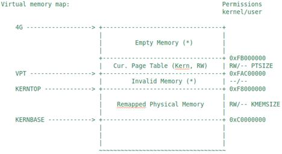

**实****验二****：物理****内存管****理**

**1   ****实验目****的**

•         理解基于段页式内存地址的转换机制

•         理解页表的建立和使用方法

•         理解物理内存的管理方法

**2   ****实验内****容**

实验一过后大家做出来了一个可以启动的系统，实验二主要涉及操作系统的物理内存管理。操作系统为了使用内存，还需高效地管理内存资源。在实验二中大家会了解并且自己动手完成一个简单的物理内存管理系统。

本次实验包含三个部分。首先了解如何发现系统中的物理内存；然后了解如何建立对物理内存的初步管理，即了解连续物理内存管理；最后了解页表相关的操作，即如何建立页表来实现虚拟内存到物理内存之间的映射，对段页式内存管理机制有一个比较全面的了解。本实验里面实现的内存管理还是非常基本的，并没有涉及到对实际机器的优化，比如
针对 cache 的优化等。实际操作系统（如Linux等）中的内存管理是相当复杂的。
如果大家有余力，尝试完成扩展练习。

**2.1****练习**

**练习****0****：填写已有实验**

本实验依赖实验1。请把你做的实验1的代码填入本实验中代码中有“LAB1”的注释相应部分。提示：可采用merge工具，比如kdiff3，eclipse中的diff/merge工具，understand中的diff/merge工具等。

**练习****1****：实现****first-fit****连续物理内存分配算法（需要编程）**

在实现first fit
内存分配算法的回收函数时，要考虑地址连续的空闲块之间的合并操作。提示:在建立空闲页块链表时，需要按照空闲页块起始地址来排序，形成一个有序的链表。可能会修改default\_pmm.c中的default\_init，default\_init\_memmap，default\_alloc\_pages，
default\_free\_pages等相关函数。请仔细查看和理解default\_pmm.c中的注释。

**练习****2****：实现寻找虚拟地址对应的页表项（需要编程）**

通过设置页表和对应的页表项，可建立虚拟内存地址和物理内存地址的对应关系。其中的get\_pte函数是设置页表项环节中的一个重要步骤。此函数找到一个虚地址对应的二级页表项的内核虚地址，如果此二级页表项不存在，则分配一个包含此项的二级页表。本练习需要补全get\_pte函数
in
kern/mm/pmm.c，实现其功能。请仔细查看和理解get\_pte函数中的注释。get\_pte函数的调用关系图如下所示：

  -- ------------------------------
     
  -- ------------------------------

 

 

 

 

 

 

 

 

 

 

 

 

 

 

 

 

 

 

 

\

图1  get\_pte函数的调用关系图

**练习****3****：释放某虚地址所在的页并取消对应二级页表项的映射（需要编程）**

当释放一个包含某虚地址的物理内存页时，需要让对应此物理内存页的管理数据结构Page做相关的清除处理，使得此物理内存页成为空闲；另外还需把表示虚地址与物理地址对应关系的二级页表项清除。请仔细查看和理解page\_remove\_pte函数中的注释。为此，需要补全在
kern/mm/pmm.c中的page\_remove\_pte函数。page\_remove\_pte函数的调用关系图如下所示：

  -- ------------------------------
     
  -- ------------------------------

 

 

 

 

 

 

\

图2  page\_remove\_pte函数的调用关系图

**扩展练习****Challenge****：任意大小的内存单元****slub****分配算法（需要编程）**

如果觉得上诉练习难度不够，可考虑完成此扩展练习。实现两层架构的高效内存单元分配，第一层是基于页大小的内存分配，第二层是在第一层基础上实现基于任意大小的内存分配。比如，如果连续分配8个16字节的内存块，当分配完毕后，实际只消耗了一个空闲物理页。要求时空都高效，可参考slub算法来实现，可简化实现，能够体现其主体思想即可。要求有设计文档。slub相关网页在[http://www.ibm.com/developerworks/cn/linux/l-cn-slub/](http://www.ibm.com/developerworks/cn/linux/l-cn-slub/)
。完成challenge的同学可单独提交challenge。完成得好的同学可获得最终考试成绩的加分。

**2.2****项目组成**

表1： 实验二文件列表

     |-- boot

|   |-- asm.h

|   |-- bootasm.S

|   \`-- bootmain.c

|-- kern

|   |-- init

|   |   |-- entry.S

|   |   \`-- init.c

|   |-- mm

|   |   |-- default\_pmm.c

|   |   |-- default\_pmm.h

|   |   |-- memlayout.h

|   |   |-- mmu.h

|   |   |-- pmm.c

|   |   \`-- pmm.h

|   |-- sync

|   |   \`-- sync.h

|   \`-- trap

|       |-- trap.c

|       |-- trapentry.S

|       |-- trap.h

|       \`-- vectors.S

|-- libs

|   |-- atomic.h

|   |-- list.h

\`-- tools

    |-- kernel.ld

 

 

相对与实验一，实验二主要增加和修改的文件如上表红色部分所示。主要改动如下：

•         boot/bootasm.S：增加了对计算机系统中物理内存布局的探测功能；

•        
kern/init/entry.S：根据临时段表重新暂时建立好新的段空间，为进行分页做好准备。

•        
kern/mm/default\_pmm.[ch]：提供基本的基于链表方法的物理内存管理（分配单位为页，即4096字节）；

•        
kern/mm/pmm.[ch]：pmm.h定义物理内存管理类框架struct pmm\_manager，基于此通用框架可以实现不同的物理内存管理策略和算法(default\_pmm.[ch]
实现了一个基于此框架的简单物理内存管理策略)； pmm.c包含了对此物理内存管理类框架的访问，以及与建立、修改、访问页表相关的各种函数实现。

•        
kern/sync/sync.h：为确保内存管理修改相关数据时不被中断打断，提供两个功能，一个是保存eflag寄存器中的中断屏蔽位信息并屏蔽中断的功能，另一个是根据保存的中断屏蔽位信息来使能中断的功能；（可不用细看）

•        
libs/list.h：定义了通用双向链表结构以及相关的查找、插入等基本操作，这是建立基于链表方法的物理内存管理（以及其他内核功能）的基础。其他有类似双向链表需求的内核功能模块可直接使用list.h中定义的函数。

•        
libs/atomic.h：定义了对一个变量进行读写的原子操作，确保相关操作不被中断打断。（可不用细看）

•        
tools/kernel.ld：ld形成执行文件的地址所用到的链接脚本。修改了ucore的起始入口和代码段的起始地址。相关细节可参看附录C。

 

**编译方法**

 

编译并运行代码的命令如下：

make

make qemu

则可以得到如下显示界面（仅供参考）

chenyu\$ make qemu

(THU.CST) os is loading ...

 

Special kernel symbols:

  entry  0xc010002c (phys)

  etext  0xc010537f (phys)

  edata  0xc01169b8 (phys)

  end    0xc01178dc (phys)

Kernel executable memory footprint: 95KB

memory managment: default\_pmm\_manager

e820map:

  memory: 0009f400, [00000000, 0009f3ff], type = 1.

  memory: 00000c00, [0009f400, 0009ffff], type = 2.

  memory: 00010000, [000f0000, 000fffff], type = 2.

  memory: 07efd000, [00100000, 07ffcfff], type = 1.

  memory: 00003000, [07ffd000, 07ffffff], type = 2.

  memory: 00040000, [fffc0000, ffffffff], type = 2.

check\_alloc\_page() succeeded!

check\_pgdir() succeeded!

check\_boot\_pgdir() succeeded!

-------------------- BEGIN --------------------

PDE(0e0) c0000000-f8000000 38000000 urw

  |-- PTE(38000) c0000000-f8000000 38000000 -rw

PDE(001) fac00000-fb000000 00400000 -rw

  |-- PTE(000e0) faf00000-fafe0000 000e0000 urw

  |-- PTE(00001) fafeb000-fafec000 00001000 -rw

--------------------- END ---------------------

++ setup timer interrupts

100 ticks

100 ticks

……

 

通过上图，我们可以看到ucore在显示其entry（入口地址）、etext（代码段截止处地址）、edata（数据段截止处地址）、和end（ucore截止处地址）的值后，探测出计算机系统中的物理内存的布局（e820map下的显示内容）。接下来ucore会以页为最小分配单位实现一个简单的内存分配管理，完成二级页表的建立，进入分页模式，执行各种我们设置的检查，最后显示ucore建立好的二级页表内容，并在分页模式下响应时钟中断。

** **

**3   ****物理内存管理**

** **

**3.1****实验执行流程概述**

本次实验主要完成ucore内核对物理内存的管理工作。参考ucore总控函数kern\_init的代码，可以清楚地看到在调用完成物理内存初始化的pmm\_init函数之前和之后，是已有lab1实验的工作，好像没啥修改。其实不然，ucore有两个方面的扩展。首先，bootloader的工作有增加，在bootloader中，完成了对物理内存资源的探测工作（可进一步参阅附录A和附录B），让ucore
kernel在后续执行中能够基于bootloader探测出的物理内存情况进行物理内存管理初始化工作。其次，bootloader不像lab1那样，直接调用kern\_init函数，而是先调用位于lab2/kern/init/entry.S中的kern\_entry函数。kern\_entry函数的主要任务是为执行kern\_init建立一个良好的C语言运行环境（设置堆栈），而且临时建立了一个段映射关系，为之后建立分页机制的过程做一个准备（细节在3.5小节有进一步阐述）。完成这些工作后，才调用kern\_init函数。

kern\_init函数在完成一些输出并对lab1实验结果的检查后，将进入物理内存管理初始化的工作，即调用pmm\_init函数完成物理内存的管理，这也是我们lab2的内容。接着是执行中断和异常相关的初始化工作，即调用pic\_init函数和idt\_init函数等，这些工作与lab1的中断异常初始化工作的内容是相同的。

为了完成物理内存管理，这里首先需要探测可用的物理内存资源；了解到物理内存位于什么地方，有多大之后，就以固定页面大小来划分整个物理内存空间，并准备以此为最小内存分配单位来管理整个物理内存，管理在内核运行过程中每页内存，设定其可用状态（free的，used的，还是reserved的），这其实就对应了我们在课本上讲到的连续内存分配概念和原理的具体实现；接着ucore
kernel就要建立页表，
启动分页机制，让CPU的MMU把预先建立好的页表中的页表项读入到TLB中，根据页表项描述的虚拟页（Page）与物理页帧（Page
Frame）的对应关系完成CPU对内存的读、写和执行操作。这一部分其实就对应了我们在课本上讲到内存映射、页表、多级页表等概念和原理的具体实现。

在代码分析上，建议根据执行流程来直接看源代码，并可采用GDB源码调试的手段来动态地分析ucore的执行过程。内存管理相关的总体控制函数是pmm\_init函数，它完成的主要工作包括：

1.        初始化物理内存页管理器框架pmm\_manager；

2.        建立空闲的page链表，这样就可以分配以页（4KB）为单位的空闲内存了；

3.        检查物理内存页分配算法；

4.       
为确保切换到分页机制后，代码能够正常执行，先建立一个临时二级页表；

5.        建立一一映射关系的二级页表；

6.        使能分页机制；

7.        从新设置全局段描述符表；

8.        取消临时二级页表；

9.        检查页表建立是否正确；

10.    通过自映射机制完成页表的打印输出（这部分是扩展知识）

 

另外，主要注意的相关代码内容包括：

l  boot/bootasm.S中探测内存部分（从probe\_memory到finish\_probe的代码）；

l 
管理每个物理页的Page数据结构（在mm/memlayout.h中），这个数据结构也是实现连续物理内存分配算法的关键数据结构，可通过此数据结构来完成空闲块的链接和信息存储，而基于这个数据结构的管理物理页数组起始地址就是全局变量pages，具体初始化此数组的函数位于page\_init函数中；

l 
用于实现连续物理内存分配算法的物理内存页管理器框架pmm\_manager，这个数据结构定义了实现内存分配算法的关键函数指针，而同学需要完成这些函数的具体实现；

l 
设定二级页表和建立页表项以完成虚实地址映射关系，这与硬件相关，且用到不少内联函数，源代码相对难懂一些。具体完成页表和页表项建立的重要函数是boot\_map\_segment函数，而get\_pte函数是完成虚实映射关键的关键。

** **

**3.2****探测系统物理内存布局**

当 ucore
被启动之后，最重要的事情就是知道还有多少内存可用，一般来说，获取内存大小的方法由
BIOS 中断调用和直接探测两种。但BIOS
中断调用方法是一般只能在实模式下完成，而直接探测方法必须在保护模式下完成。通过
BIOS 中断获取内存布局有三种方式，都是基于INT  15h中断，分别为88h e801h  
e820h。但是 并非在所有情况下这三种方式都能工作。在 Linux kernel
里，采用的方法是依次尝试这三
种方法。而在本实验中，我们通过e820h中断获取内存信息。因为e820h中断必须在实模式下使用，所以我们在
bootloader 进入保护模式之前调用这个 BIOS 中断，并且把 e820 映
射结构保存在物理地址0x8000处。具体实现详见boot/bootasm.S。有关探测系统物理内存方法和具体实现的
信息参见[附录A和附录B。](http://wiki.osdev.org/How_Do_I_Determine_The_Amount_Of_RAM)

 

**3.3****以页为单位管理物理内存**

在获得可用物理内存范围后，系统需要建立相应的数据结构来管理以物理页（按4KB对齐，且大小为4KB的物理内存单元）为最小单位的整个物理内存，以配合后续涉及的分页管理机制。每个物理页可以用一个
Page数据结构来表示。由于一个物理页需要占用一个Page结构的空间，Page结构在设计时须尽可能小，以减少对内存的占用。Page的定义在mm/memlayout.h中。以页为单位的物理内存分配管理的实现在kern/default\_pmm.[ch]。

为了与以后的分页机制配合，我们首先需要建立对整个计算机的每一个物理页的属性用结构Page来表示，它包含了映射此物理页的虚拟页个数，描述物理页属性的flags和双向链接各个Page结构的page\_link双向链表。

 

struct Page {

            atomic\_t ref;         // page frame's reference counter

            uint32\_t flags;  // array of flags that describe the status
of the page frame

            list\_entry\_t page\_link; // free list link

};

 

所有空闲的物理页可用一个双向链表管理起来，便于分配和释放，为此定义了一个free\_area\_t数据结构，包含了一个list\_entry结构的双向链表指针和记录当前空闲页的个数的无符号整型变量nr\_free。其中的链表指针指向了空闲的物理页。

 

/\* free\_area\_t - maintains a doubly linked list to record free
(unused) pages \*/

typedef struct {

            list\_entry\_t free\_list;                               //
the list header

            unsigned int nr\_free;                               // \#
of free pages in this free list

} free\_area\_t;

 

有了这两个数据结构，ucore就可以管理起来整个以页为单位的物理内存空间。接下来需要解决两个问题：

•        
管理页级物理内存空间所需的Page结构的内存空间从哪里开始，占多大空间？

•         空闲内存空间的起始地址在哪里？

对于这两个问题，我们首先根据bootloader给出的内存布局信息找出最大的物理内存地址maxpa（定义在page\_init函数中的局部变量），由于x86的起始物理内存地址为0，所以可以得知需要管理的物理页个数为

npage = maxpa / PGSIZE

这样，我们就可以预估出管理页级物理内存空间所需的Page结构的内存空间所需的内存大小为：

  sizeof(struct Page) \* npage)

由于bootloader加载ucore的结束地址（用全局指针变量end记录）以上的空间没有被使用，所以我们可以把end按页大小为边界去整后，作为管理页级物理内存空间所需的Page结构的内存空间，记为：

pages = (struct Page \*)ROUNDUP((void \*)end, PGSIZE);

为了简化起见，从地址0到地址pages+ sizeof(struct Page) \*
npage)结束的物理内存空间设定为已占用物理内存空间（起始0\~640KB的空间是空闲的），地址pages+
sizeof(struct Page) \*
npage)以上的空间为空闲物理内存空间，这时的空闲空间起始地址为

uintptr\_t freemem = PADDR((uintptr\_t)pages + sizeof(struct Page) \*
npage);

为此我们需要把这两部分空间给标识出来。首先，对于所有物理空间，通过如下语句即可实现占用标记：

for (i = 0; i \< npage; i ++) {

            SetPageReserved(pages + i);

}

然后，根据探测到的空闲物理空间，通过如下语句即可实现空闲标记：

//获得空闲空间的起始地址begin和结束地址end

……

init\_memmap(pa2page(begin), (end - begin) / PGSIZE);

                         

其实SetPageReserved只需把物理地址对应的Page结构中的flags标志设置为PG\_reserved
，表示这些页已经被使用了。而init\_memmap函数则是把空闲物理页对应的Page结构中的flags和引用计数ref清零，并加到free\_area.free\_list指向的双向列表中，为将来的空闲页管理做好初始化准备工作。

关于内存分配的操作系统原理方面的知识有很多，但在本实验中只实现了最简单的内存页分配算法。相应的实现在default\_pmm.c中的default\_alloc\_pages函数和default\_free\_pages函数，相关实现很简单，这里就不具体分析了，直接看源码，应该很好理解。

其实实验二在内存分配和释放方面最主要的作用是建立了一个物理内存页管理器框架，这实际上是一个函数指针列表，定义如下：

struct pmm\_manager {

            const char \*name; //物理内存页管理器的名字

            void (\*init)(void); //初始化内存管理器

            void (\*init\_memmap)(struct Page \*base, size\_t n);
//初始化管理空闲内存页的数据结构

            struct Page \*(\*alloc\_pages)(size\_t n);
//分配n个物理内存页

            void (\*free\_pages)(struct Page \*base, size\_t n);
//释放n个物理内存页

            size\_t (\*nr\_free\_pages)(void); //返回当前剩余的空闲页数

            void (\*check)(void);
//用于检测分配/释放实现是否正确的辅助函数

};

重点是实现init\_memmap/ alloc\_pages/
free\_pages这三个函数。当完成物理内存页管理初始化工作后，计算机系统的内存布局如下图所示：

图3  计算机系统的内存布局

**3.4****物理内存页分配算法实现**

如果要在ucore中实现连续物理内存分配算法，则需要考虑的事情比较多，相对课本上的物理内存分配算法描述要复杂不少。下面介绍一下如果要实现一个FirstFit内存分配算法的大致流程。

lab2的第一部分是完成first\_fit的分配算法。原理FirstFit内存分配算法上很简单，但要在ucore中实现，需要充分了解和利用ucore已有的数据结构和相关操作、关键的一些全局变量等。

 

**关键数据结构和变量**

first\_fit分配算法需要维护一个查找有序（地址按从小到大排列）空闲块（以页为最小单位的连续地址空间）的数据结构，而双向链表是一个很好的选择。

libs/list.h定义了可挂接任意元素的通用双向链表结构和对应的操作，所以需要了解如何使用这个文件提供的各种函数，从而可以完成对双向链表的初始化/插入/删除等。

kern/mm/memlayout.h中定义了一个 free\_area\_t 数据结构，包含成员结构

  list\_entry\_t free\_list;         // the list header  
空闲块双向链表的头

  unsigned int nr\_free;           // \# of free pages in this free
list  空闲块的总数（以页为单位）

 

显然，我们可以通过此数据结构来完成对空闲块的管理。而default\_pmm.c中定义的free\_area变量就是干这个事情的。

 

kern/mm/pmm.h中定义了一个通用的分配算法的函数列表，用pmm\_manager
表示。其中init函数就是用来初始化free\_area变量的,
first\_fit分配算法可直接重用default\_ini函数t的实现。init\_memmap函数需要根据现有的内存情况构建空闲块列表的初始状态。何时应该执行这个函数呢？

通过分析代码，可以知道：

kern\_init --\> pmm\_init--\>page\_init--\>init\_memmap--\>
pmm\_manager-\>init\_memmap

 

所以，default\_init\_memmap需要根据page\_init函数中传递过来的参数（某个连续地址的空闲块的起始页，页个数）来建立一个空闲块的双向链表。这里有一个假定page\_init函数是按地址从小到大的顺序传来的空闲块的。链表头是free\_area.free\_list，链表项是Page数据结构的base-\>page\_link。这样我们就依靠Page数据结构中的成员变量page\_link形成了一的空闲块列表。接下来是Page数据结构中其他与空闲内存页相关的成员变量信息：

l  Page数据结构中的成员变量property
是一个整型，在这里我们可以把它用来记录某空闲块的大小（即页个数）。

l 
Page数据结构中的成员变量flags可以有各种特殊的需求，比如SetPageProperty(page)，即把page-\>flags的PG\_property位设置为1，表示成员变量property有效；ClearPageProperty(page)，即把page-\>flags的PG\_property位设置为0，表示成员变量property无效。

l  Page数据结构中的成员变量ref
是一个整型，我们可以用它来记录这个空闲块是否被用了，如果0，free；如果1，malloced

 

**设计实现**

default\_init\_memmap函数讲根据每个物理页帧的情况来建立空闲页链表，且空闲页块应该是根据地址高低形成一个有序链表。根据上述变量的定义，default\_init\_memmap可大致实现如下：

default\_init\_memmap(struct Page \*base, size\_t n) {

    struct Page \*p = base;

    for (; p != base + n; p ++) {

        p-\>flags = p-\>property = 0;

        set\_page\_ref(p, 0);

    }

    base-\>property = n;

    SetPageProperty(base);

    nr\_free += n;

    list\_add(&free\_list, &(base-\>page\_link));

}

 

如果要分配一个页，那要考虑哪些呢？这里就需要考虑实现default\_alloc\_pages函数，注意参数n表示要分配n个页。另外，需要注意实现时尽量多考虑一些边界情况，这样确保软件的鲁棒性。比如

    if (n \> nr\_free) {

        return NULL;

    }

这样可以确保分配不会超出范围。也可加一些
assert函数，在有错误出现时，能够迅速发现。比如 n应该大于0，我们就可以加上

   assert(n \> 0);

这样在n\<=0的情况下，ucore会迅速报错。firstfit需要从空闲链表头开始查找最小的地址，通过list\_next找到下一个空闲块元素，通过le2page宏可以更加链表元素获得对应的Page指针p。通过p-\>property可以了解此空闲块的大小。如果\>=n，这就找到了！如果\<n，则list\_next，继续查找。直到list\_next==
&free\_list，这表示找完了一遍了。找到后，就要从新组织空闲块，然后把找到的page返回。所以default\_alloc\_pages可大致实现如下：

static struct Page \*

default\_alloc\_pages(size\_t n) {

    if (n \> nr\_free) {

        return NULL;

    }

    struct Page \*page = NULL;

    list\_entry\_t \*le = &free\_list;

    while ((le = list\_next(le)) != &free\_list) {

        struct Page \*p = le2page(le, page\_link);

        if (p-\>property \>= n) {

            page = p;

            break;

        }

    }

    if (page != NULL) {

        list\_del(&(page-\>page\_link));

        if (page-\>property \> n) {

            struct Page \*p = page + n;

            p-\>property = page-\>property - n;

            list\_add(&free\_list, &(p-\>page\_link));

        }

        nr\_free -= n;

        ClearPageProperty(page);

    }

    return page;

}

 

default\_free\_pages函数的实现其实是default\_alloc\_pages的逆过程，不过需要考虑空闲块的合并问题。这里就不再细讲了。注意，上诉代码只是参考设计，不是完整的正确设计。更详细的说明位于lab2/kernel/mm/default\_pmm.c的注释中。希望同学能够顺利完成本实验的第一部分。

 

**3.5****实现分页机制**

###  3.5.1 段页式管理基本概念

如图4在保护模式中，x86
体系结构将内存地址分成三种：逻辑地址（也称虚地址）、线性地址和物理地址。逻辑地址即是程序指令中使用的地址，物理地址是实际访问内存的地址。逻
辑地址通过段式管理的地址映射可以得到线性地址，线性地址通过页式管理的地址映射得到物理地址。

  -- ------------------------------
     
  -- ------------------------------

\
 图 4  段页式管理总体框架图

 

段式管理前一个实验已经讨论过。在 ucore
中段式管理只起到了一个过渡作用，它将逻辑地址不加转换直接映射成线性地址，所以我们在下面的讨论中可以对这两个地址不加区分（目前的
OS 实现也是不加区分的）。对段式管理有兴趣的同学可以参照《Intel®  64 and
IA-32Architectures Software Developer ’s Manual – Volume 3A》3.2 节。

如图5所示，页式管理将线性地址分成三部分（图中的
Linear Address 的 Directory 部分、 Table 部分和 Offset 部分）。ucore
的页式管理通过一个二级的页表实现。一级页表的起始物理地址存放在 cr3
寄存器中，这个地址必须是一个页对齐的地址，也就是低 12 位必须为
0。目前，ucore 用boot\_cr3（mm/pmm.c）记录这个值。

 

 

图 5 分页机制管理

 

###  3.5.2建立段页式管理中需要考虑的关键问题

为了实现分页机制，需要建立好虚拟内存和物理内存的页映射关系，即正确建立二级页表。此过程涉及硬件细节，不同的地址映射关系组合，相对比较复杂。总体而言，我们需要思考如下问题：

l 
如何在建立页表的过程中维护全局段描述符表（GDT）和页表的关系，确保ucore能够在各个时间段上都能正常寻址？

l  对于哪些物理内存空间需要建立页映射关系？

l  具体的页映射关系是什么？

l  页目录表的起始地址设置在哪里？

l  页表的起始地址设置在哪里，需要多大空间？

l  如何设置页目录表项的内容？

l  如何设置页表项的内容？

###  3.5.3建立虚拟页和物理页帧的地址映射关系

    **从链接脚本分析****ucore****执行时的地址**

首先观察一下tools/kernel.ld文件在lab1和lab2中的区别。在lab1中：

ENTRY(kern\_init)

 

SECTIONS {

                /\* Load the kernel at this address: "." means the
current address \*/

                . = 0x100000;

 

                .text : {

                                \*(.text .stub .text.\*
.gnu.linkonce.t.\*)

                }

 

这意味着在lab1中通过ld工具形成的ucore的起始虚拟地址从0x100000开始，注意：这个地址是虚拟地址。但由于lab1中建立的段地址映射关系为对等关系，所以ucore的物理地址也是0x100000。而入口函数为kern\_init函数。在lab2中：

ENTRY(kern\_entry)

 

SECTIONS {

                /\* Load the kernel at this address: "." means the
current address \*/

                . = 0xC0100000;

 

                .text : {

                                \*(.text .stub .text.\*
.gnu.linkonce.t.\*)

                }

  
这意味着lab2中通过ld工具形成的ucore的起始虚拟地址从0xC0100000开始，注意：这个地址也是虚拟地址。入口函数为kern\_entry函数。这与lab1有很大差别。但其实在lab1和lab2中，bootloader把ucore都放在了起始物理地址为0x100000的物理内存空间。这实际上说明了ucore在lab1和lab2中采用的地址映射不同：

lab1：  virtual addr = linear addr = phy addr

lab2：  virtual addr = linear addr = phy addr + 0xC0000000

lab1只采用了段映射机制，但在lab2中，启动好分页管理机制后，形成的是段页式映射机制，从而使得虚拟地址空间和物理地址空间之间存在如下的映射关系：

   Virtual Address=LinearAddress=0xC0000000+Physical Address

  
另外，ucore的入口地址也改为了kern\_entry函数，这个函数位于init/entry.S中，分析代码可以看出，entry.S重新建立了段映射关系，从以前的

   Virtual Address= Linear Address

改为

   Virtual Address=Linear Address-0xC0000000

由于gcc编译出的虚拟起始地址从0xC0100000开始，ucore被bootloader放置在从物理地址0x100000处开始的物理内存中。所以当kern\_entry函数完成新的段映射关系后，且ucore在没有建立好页映射机制前，CPU按照ucore中的虚拟地址执行，能够被分段机制映射到正确的物理地址上，确保ucore运行正确。

由于物理内存页管理器管理了从0到实际可用物理内存大小的物理内存空间，所以对于这些物理内存空间都需要建立好页映射关系。由于目前ucore只运行在内核空间，所以可以建立一个一一映射关系。假定内核虚拟地址空间的起始地址为0xC0000000，则虚拟内存和物理内存的具体页映射关系为：

Virtual Address=Physical Address+0xC0000000

 

**建立二级页表**

由于我们已经具有了一个物理内存页管理器default\_pmm\_manager，我们就可以用它来获得所需的空闲物理页。在二级页表结构中，页目录表占4KB空间，ucore就可通过default\_pmm\_manager的default\_alloc\_pages函数获得一个空闲物理页，这个页的起始物理地址就是页目录表的起始地址。同理，ucore也通过这种方式获得各个页表所需的空间。页表的空间大小取决与页表要管理的物理页数n，一个页表项（32位，即4字节）可管理一个物理页，页表需要占n/256个物理页空间。这样页目录表和页表所占的总大小为4096+1024\*n字节。

为把0\~KERNSIZE（明确ucore设定实际物理内存不能超过KERNSIZE值，即0x38000000字节，896MB，3670016个物理页）的物理地址一一映射到页目录表项和页表项的内容，其大致流程如下：

1.        先通过default\_pmm\_manager获得一个空闲物理页，用于页目录表；

2.       
调用boot\_map\_segment函数建立一一映射关系，具体处理过程以页为单位进行设置，即

Virtual Address=Physical Address+0xC0000000

Ø 
设一个逻辑地址la（按页对齐，故低12位为零）对应的物理地址pa（按页对齐，故低12位为零），如果在页目录表项（la的高10位为索引值）中的存在位（PTE\_P）为0，表示缺少对应的页表空间，则可通过default\_pmm\_manager获得一个空闲物理页给页表，页表起始物理地址是按4096字节对齐的，这样填写页目录表项的内容为

***页目录表项内容******=******页表起始物理地址******| PTE\_U | PTE\_W |
PTE\_P***

    进一步对于页表中对应页表项（la的中10位为索引值）的内容为

                   ***页表项内容******=  pa | PTE\_P | PTE\_W***

        其中：

l  PTE\_U：位3，表示用户态的软件可以读取对应地址的物理内存页内容

l  PTE\_W：位2，表示物理内存页内容可写

l  PTE\_P：位1，表示物理内存页存在

 

ucore
的内存管理经常需要查找页表：给定一个虚拟地址，找出这个虚拟地址在二级页表中对应的项。通过更改此项的值可以方便地将虚拟地址映射到另外的页上。可完成此功能的这个函数是get\_pte函数。它的原型为

pte\_t  \*get\_pte (pde\_t \*pgdir,  uintptr\_t la, bool  create)

下面的调用关系图可以比较好地看出get\_pte在实现上诉流程中的位置：

 

图6  get\_pte调用关系图

 

这里涉及到三个类型pte t、pde t和uintptr
t。通过参见mm/mmlayout.h和libs/types.h，可知它们其实都是unsigned 
int类型。在此做区分，是为了分清概念。

pde\_t全称为 page directory
entry，也就是一级页表的表项（注意：pgdir实际不是表
项，而是一级页表本身。实际上应该新定义一个类型pgd\_t来表示一级页表本身）。pte
t全 称为 page table entry，表示二级页表的表项。uintptr
t表示为线性地址，由于段式管理只 做直接映射，所以它也是逻辑地址。

pgdir给出页表起始地址。通过查找这个页表，我们需要给出二级页表中对应项的地址。
虽然目前我们只有boot\_pgdir一个页表，但是引入进程的概念之后每个进程都会有自己的页
表。

有可能根本就没有对应的二级页表的情况，所以二级页表不必要一开始就分配，而是等到需要的时候再添加对应的二级页表。如果在查找二级页表项时，发现对应的二级页表不存在，则需要根据create参数的值来处理是否创建新的二级页表。如果create参数为0，则get\_pte返回NULL；如果create参数不为0，则get\_pte需要申请一个新的物理页（通过alloc\_page来实现，可在mm/pmm.h中找到它的定义），再在一级页表中添加页目录表项指向表示二级页表的新物理页。注意，新申请的页必须全部设定为零，因为这个页所代表的虚拟地址都没有被映射。

当建立从一级页表到二级页表的映射时，需要注意设置控制位。这里应该设置同时设置
上PTE\_U、PTE\_W和PTE\_P（定义可在mm/mmu.h）。如果原来就有二级页表，或者新建立了页表，则只需返回对应项的地址即可。

虚拟地址只有映射上了物理页才可以正常的读写。在完成映射物理页的过程中，除了要象上面那样在页表的对应表项上填上相应的物理地址外，还要设置正确的控制位。有关
x86 中页表控制位的详细信息，请参照《Intel® 64 and IA-32 Architectures
Software Developer ’s Manual – Volume 3A》4.11 节。

只有当一级二级页表的项都设置了用户写权限后，用户才能对对应的物理地址进行读写。
所以我们可以在一级页表先给用户写权限，再在二级页表上面根据需要限制用户的权限，对物理页进行保护。由于一个物理页可能被映射到不同的虚拟地址上去（譬如一块内存在不同进程
间共享），当这个页需要在一个地址上解除映射时，操作系统不能直接把这个页回收，而是要先看看它还有没有映射到别的虚拟地址上。这是通过查找该物理页的ref变量实现的。page\_insert函数将物理页映射在了页表上。可参看page\_insert函数的实现来了解ucore内核是如何维护这个变量的。当不需要再访问这块虚拟地址时，可以把这块物理页回收并在将来用在其他地方。取消映射由page\_remove来做，这其实是page
insert的逆操作。

建立好一一映射的二级页表结构后，接下来就要使能分页机制了，这主要是通过enable\_paging函数实现的，这个函数主要做了两件事：

1.              通过lcr3指令把页目录表的起始地址存入CR3寄存器中；

2.              通过lcr0指令把cr0中的CR0\_PG标志位设置上。

执行完enable\_paging函数后，计算机系统进入了分页模式！但到这一步还不够，还记得ucore在最开始通过kern\_entry函数设置了临时的新段映射机制吗？这个临时的新段映射机制不是最简单的对等映射，导致虚拟地址和线性地址不相等。而刚才建立的页映射关系是建立在简单的段对等映射，即虚拟地址=线性地址的假设基础之上的。所以我们需要进一步调整段映射关系，即重新设置新的GDT，建立对等段映射。

这里需要注意：在进入分页模式到重新设置新GDT的过程是一个过渡过程。在这个过渡过程中，已经建立了页表机制，所以通过现在的段机制和页机制实现的地址映射关系为：

 

Virtual Address=Linear Address + 0xC0000000 = Physical Address
+0xC0000000+0xC0000000

 

在这个特殊的阶段，如果不把段映射关系改为Virtual Address = Linear
Address，则通过段页式两次地址转换后，无法得到正确的物理地址。为此我们需要进一步调用gdt\_init函数，根据新的gdt全局段描述符表内容（gdt定义位于pmm.c中），恢复以前的段映射关系，即使得Virtual
Address = Linear
Address。这样在执行完gdt\_init后，通过的段机制和页机制实现的地址映射关系为：

Virtual Address=Linear Address = Physical Address +0xC0000000

这里存在的一个问题是，在调用enable\_page函数使能分页机制后到执行完毕gdt\_init函数重新建立好段页式映射机制的过程中，内核使用的还是旧的段表映射，也就是说，enable
paging 之后，内核使用的是页表的低地址 entry。
如何保证此时内核依然能够正常工作呢？其实只需让低地址目录表项的内容等于以KERNBASE开始的高地址目录表项的内容即可。目前内核大小不超过
4M （实际上是3M，因为内核从 0x100000
开始编址），这样就只需要让页表在0\~4MB的线性地址与KERNBASE \~
KERNBASE+4MB的线性地址获得相同的映射即可，都映射到 0\~4MB
的物理地址空间，具体实现在pmm.c中pmm\_init函数的语句：

boot\_pgdir[0] = boot\_pgdir[PDX(KERNBASE)];

            实际上这种映射也限制了内核的大小。当内核大小超过预期的3MB
就可能导致打开分页之后内核
crash，在后面的试验中，也的确出现了这种情况。解决方法同样简单，就是拷贝更多的高地址项到低地址。

当执行完毕gdt\_init函数后，新的段页式映射已经建立好了，上面的0\~4MB的线性地址与0\~4MB的物理地址一一映射关系已经没有用了。所以可以通过如下语句解除这个老的映射关系。

boot\_pgdir[0] = 0;

 

在page\_init函数建立完实现物理内存一一映射和页目录表自映射的页目录表和页表后，一旦使能分页机制，则ucore看到的内核虚拟地址空间如下图所示：

图7  使能分页机制后的虚拟地址空间图

 

###  3.5.4不同运行阶段的地址映射关系

在大多数课本中，描述了基于段的映射关系，基于页的映射关系以及基于段页式的映射关系和CPU访存时对应的地址转换过程。但很少涉及操作系统如何一步一步建立这个映射关系的。其实，在lab1和lab2中都会涉及如何建立映射关系的操作。在lab1中，我们已经碰到到了简单的段映射，即对等映射关系，保证了物理地址和虚拟地址相等，也就是通过建立全局段描述符表，让每个段的基址为0，从而确定了对等映射关系。

在lab2中，由于在段地址映射的基础上进一步引入了页地址映射，形成了组合式的段页式地址映射。这种方式虽然更加灵活了，但实现的复杂性也增加了。在lab2中，ucore从计算机加电，启动段式管理机制，启动段页式管理机制，在段页式管理机制下运行这整个过程中，虚地址到物理地址的映射产生了多次变化，接下来我们会逐一进行说明。

1.       
首先是bootloader地址映射阶段，bootloader完成了与lab1一样的工作，即建立了基于段的对等映射（请查看lab2/boot/bootasm.S中的finish\_probe地址处）；

2.       
接着进入了ucore启动页机制前的地址映射阶段，ucore建立了一个一一段映射关系，其中虚拟地址
= 物理地址 +
0xC0000000（请查看lab2/kern/init/entry.S中的kern\_entry函数）；

3.       
再接下来是建立并使能页表的临时段页式地址映射阶段，页表要表示的是线性地址与物理地址的对应关系为：线性地址
= 物理地址 +
0xC0000000；然后这里有一个小技巧，让在0\~4MB的线性地址区域空间的 线性地址
（0\~4MB）对应的物理地址 = 线性地址 （0xC0000000\~0xC0000000 +
4MB）对应的物理地址，这是通过lab2/kern/mm/pmm.c中第321行的代码实现的：

boot\_pgdir**[**0**]** **=** boot\_pgdir**[**PDX**(**KERNBASE**)];**

 

注意此时CPU在寻址时还是只采用了分段机制。最后后并使能分页映射机制（请查看lab2/kern/mm/pmm.c中的enable\_paging函数），一旦执行完enable\_paging函数中的加载cr0指令（即让CPU使能分页机制），则接下来的访问是基于段页式的映射关系了。对于（0xC0000000\~0xC0000000
+ 4MB）这块虚拟地址空间，最终会映射到哪些物理地址空间中呢？

由于段映射关系没有改变，使得经过段映射机制，虚拟地址范围（0xC0000000\~0xC0000000
+ 4MB）对应的线性地址 =
（0\~4MB）。而根据页表建立过程的描述，我们可知道线性地址空间（0\~4MB）与线性地址空间
（0xC0000000\~0xC0000000 +
4MB）对应同样的物理地址，而线性地址空间（0xC0000000\~0xC0000000 +
4MB）对应的物理地址空间为（0，4MB）。这样对于（0xC0000000\~0xC0000000 +
4MB）这块虚拟地址空间，段页式的地址映射关系为 虚拟地址 = 线性地址 +
0xC0000000 =物理地址 + 0xC0000000。

注意，这只是针对（0xC0000000\~0xC0000000 +
4MB）这块虚拟地址空间。如果是（0xD0000000\~0xD0000000 +
4MB）这块虚拟地址空间，则段页式的地址映射关系为虚拟地址 = 线性地址 +
0xC0000000 =物理地址 + 0xC0000000 +
0xC0000000。这不是我们需要的映射关系，所以0xC0000000 +
4MB以上的虚拟地址访问会出页错误异常。

4.       
最后一步完成收尾工作的正常段页式地址映射阶段，即首先调整段映射关系，这是通过加载新的全局段描述符表（pmm\_init函数调用gdt\_init函数来完成）实现，这时的段映射关系为：虚拟地址
=
线性地址。然后通过执行语句“boot\_pgdir**[**0**]** **=** 0**;**”把boot\_pgdir[0]的第一个页目录表项（0\~4MB）清零来取消临时的页映射关系。至此，新的段页式的地址映射关系为虚拟地址
= 线性地址 =物理地址 +
0xC0000000。这也形成了ucore操作系统的内核虚拟地址空间的段页式映射关系，即虚拟地址空间（KERNBASE,
KERNBASE + KMEMSIZE）= 线性地址空间（KERNBASE, KERNBASE + KMEMSIZE） =
物理地址空间（0，KMEMSIZE）。

 

**3.6****自映射机制**

   这是扩展知识。
上一小节讲述了通过boot\_map\_segment函数建立了基于一一映射关系的页目录表项和页表项，这里的映射关系为：

virtual addr (KERNBASE\~KERNBASE+KMEMSIZE) = physical\_addr
(0\~KMEMSIZE)

   
这样只要给出一个虚地址和一个物理地址，就可以设置相应PDE和PTE，就可完成正确的映射关系。

如果我们这时需要按虚拟地址的地址顺序显示整个页目录表和页表的内容，则要查找页目录表的页目录表项内容，根据页目录表项内容找到页表的物理地址，再转换成对应的虚地址，然后访问页表的虚地址，搜索整个页表的每个页目录项。这样过程比较繁琐。

我们需要有一个简洁的方法来实现这个查找。ucore做了一个很巧妙的地址自映射设计，把页目录表和页表放在一个连续的4MB虚拟地址空间中，并设置页目录表自身的虚地址\<--\>物理地址映射关系。这样在已知页目录表起始虚地址的情况下，通过连续扫描这特定的4MB虚拟地址空间，就很容易访问每个页目录表项和页表项内容。

具体而言，ucore是这样设计的，首先设置了一个常量（memlayout.h）：

VPT=0xFAC00000， 这个地址的二进制表示为：

1111 1010 1100 0000 0000 0000 0000 0000

高10位为1111 1010
11，即10进制的1003，中间10位为0，低12位也为0。在pmm.c中有两个全局初始化变量

pte\_t \* const vpt = (pte\_t \*)VPT;

pde\_t \* const vpd = (pde\_t \*)PGADDR(PDX(VPT), PDX(VPT), 0);

并在pmm\_init函数执行了如下语句：

boot\_pgdir[PDX(VPT)] = PADDR(boot\_pgdir) | PTE\_P | PTE\_W;

这些变量和语句有何特殊含义呢？其实vpd变量的值就是页目录表的起始虚地址0xFAFEB000，且它的高10位和中10位是相等的，都是10进制的1003。当执行了上述语句，就确保了vpd变量的值就是页目录表的起始虚地址，且vpt是页目录表中第一个目录表项指向的页表的起始虚地址。此时描述内核虚拟空间的页目录表的虚地址为0xFAFEB000，大小为4KB。页表的理论连续虚拟地址空间0xFAC00000\~0xFB000000，大小为4MB。因为这个连续地址空间的大小为4MB，可有1M个PTE，即可映射4GB的地址空间。

但ucore实际上不会用完这么多项，在memlayout.h中定义了常量

\#define KMEMSIZE            0x38000000

表示ucore只支持896MB的物理内存空间，这个896MB只是一个设定，可以根据情况改变。则最大的内核虚地址为常量

\#define KERNTOP             (KERNBASE + KMEMSIZE)=0xF8000000

所以最大内核虚地址KERNTOP的页目录项虚地址为

vpd+0xF8000000/0x400000=0xFAFEB000+0x3E0=0xFAFEB3E0

最大内核虚地址KERNTOP的页表项虚地址为：

vpt+0xF8000000/0x1000=0xFAC00000+0xF8000=0xFACF8000

在pmm.c中的函数print\_pgdir就是基于ucore的页表自映射方式完成了对整个页目录表和页表的内容扫描和打印。注意，这里不会出现某个页表的虚地址与页目录表虚地址相同的情况。

print
pgdir函数使得 ucore 具备和 qemu 的info  pg相同的功能，即print pgdir能
够从内存中，将当前页表内有效数据（PTE\_P）印出来。拷贝出的格式如下所示:

PDE(0e0)  c0000000-f8000000  38000000  urw

|-- PTE(38000) c0000000-f8000000  38000000 -rw

PDE(001)  fac00000-fb000000  00400000  -rw

|-- PTE(000e0)  faf00000-fafe0000  000e0000  urw

|-- PTE(00001)  fafeb000-fafec000  00001000  -rw

 

上面中的数字包括括号里的，都是十六进制。

主要的功能是从页表中将具备相同权限的 PDE 和 PTE
项目组织起来。比如上表中：

PDE(0e0)  c0000000-f8000000  38000000  urw

 

•      PDE(0e0)：0e0表示 PDE 表中相邻的 224 项具有相同的权限；

•      c0000000-f8000000：表示 PDE
表中,这相邻的两项所映射的线性地址的范围；

•      38000000：同样表示范围，即f8000000减去c0000000的结果；

•      urw：PDE
表中所给出的权限位，u表示用户可读，即PTE\_U，r表示PTE\_P，w表示用
户可写，即PTE\_W。

PDE(001)  fac00000-fb000000  00400000  -rw

表示仅 1 条连续的 PDE 表项具备相同的属性。相应的，在这条表项中遍历找到 2
组 PTE 表项，输出如下:

|-- PTE(000e0)  faf00000-fafe0000  000e0000  urw

|-- PTE(00001)  fafeb000-fafec000  00001000  -rw

注意：

1.      PTE 中输出的权限是 PTE 表中的数据给出的，并没有和 PDE
表中权限做与运算。

2.     
整个print\_pgdir函数强调两点：第一是相同权限，第二是连续。

3.     
print\_pgdir中用到了vpt和vpd两个变量。可以参
考VPT和PGADDR两个宏。

 

自映射机制还可方便用户态程序访问页表。因为页表是内核维护的，用户程序很难知道自己页表的映射结构。VPT
实际上在内核地址空间的，我们可以用同样的方式实现一个用户地址空间的映射（比如
pgdir[UVPT] = PADDR(pgdir) | PTE\_P | PTE\_U，注意，这里不能给写权限，并且
pgdir 是每个进程的 page table，不是
boot\_pgdir），这样，用户程序就可以用和内核一样的 print\_pgdir
函数遍历自己的页表结构了。

\

\

 

**4****．********实验报告要求**

 

从网站上下载lab2.zip后，解压得到本文档和代码目录
lab2，完成实验中的各个练习。完成代码编写并检查无误后，在对应目录下执行
make handin 任务，即会自动生成
lab2-handin.tar.gz。最后请一定提前或按时提交到网络学堂上。

注意有***“******LAB2******”***的注释，代码中所有需要完成的地方（challenge除外）都有***“******LAB2******”和“******YOUR
CODE******”***的注释，请在提交时特别注意保持注释，并将***“******YOUR
CODE******”***替换为自己的学号，并且将所有标有对应注释的部分填上正确的代码。

\

 

**附录**

**A.   ****探测物理内存分布和大小的方法******

操作系统需要知道了解整个计算机系统中的物理内存如何分布的，哪些被可用，哪些不可用。其基本方法是通过BIOS中断调用来帮助完成的。其中BIOS中断调用必须在实模式下进行，所以在bootloader进入保护模式前完成这部分工作相对比较合适。这些部分由boot/bootasm.S中从probe\_memory处到finish\_probe处的代码部分完成完成。通过BIOS中断获取内存可调用参数为e820h的INT
15h BIOS中断。BIOS通过系统内存映射地址描述符（Address Range
Descriptor）格式来表示系统物理内存布局，其具体表示如下：

Offset  Size    Description     

00h    8字节   base address   
                                                \#系统内存块基地址

08h    8字节   length in bytes
                                                \#系统内存大小

10h    4字节   type of address range       \#内存类型

看下面的(Values for System Memory Map address type)

Values for System Memory Map address type:

01h    memory, available to OS

02h    reserved, not available (e.g. system ROM, memory-mapped device)

03h    ACPI Reclaim Memory (usable by OS after reading ACPI tables)

04h    ACPI NVS Memory (OS is required to save this memory between NVS
sessions)

other  not defined yet -- treat as Reserved

 

 

INT15h BIOS中断的详细调用参数:

eax：e820h：INT 15的中断调用参数；

edx：534D4150h (即4个ASCII字符“SMAP”) ，这只是一个签名而已；

ebx：如果是第一次调用或内存区域扫描完毕，则为0。
如果不是，则存放上次调用之后的计数值；

ecx：保存地址范围描述符的内存大小,应该大于等于20字节；

es:di：指向保存地址范围描述符结构的缓冲区，BIOS把信息写入这个结构的起始地址。

 

 

此中断的返回值为:

cflags的CF位：若INT 15中断执行成功，则不置位，否则置位；

eax：534D4150h ('SMAP') ；

es:di：指向保存地址范围描述符的缓冲区,此时缓冲区内的数据已由BIOS填写完毕

ebx：下一个地址范围描述符的计数地址

ecx           ：返回BIOS往ES:DI处写的地址范围描述符的字节大小

ah：失败时保存出错代码

 

这样，我们通过调用INT 15h
BIOS中断，递增di的值（20的倍数），让BIOS帮我们查找出一个一个的内存布局entry，并放入到一个保存地址范围描述符结构的缓冲区中，供后续的ucore进一步进行物理内存管理。这个缓冲区结构定义在memlayout.h中：

struct e820map {

                int nr\_map;

                struct {

                                long long addr;

                                long long size;

                                long type;

                } map[E820MAX];

};

 

** **

**B.    ****实现物理内存探测**

物理内存探测是在bootasm.S中实现的，相关代码很短，如下所示：

probe\_memory:

//对0x8000处的32位单元清零,即给位于0x8000处的

//struct e820map的结构域nr\_map清零

         movl \$0, 0x8000         

                xorl %ebx, %ebx   

//表示设置调用INT 15h BIOS中断后，BIOS返回的映射地址描述符的起始地址

                movw \$0x8004, %di

start\_probe:

                movl \$0xE820, %eax // INT 15的中断调用参数

//设置地址范围描述符的大小为20字节，其大小等于struct
e820map的结构域map的大小

                movl \$20, %ecx 

//设置edx为534D4150h (即4个ASCII字符“SMAP”)，这是一个约定

                movl \$SMAP, %edx

//调用int 0x15中断，要求BIOS返回一个用地址范围描述符表示的内存段信息

                int \$0x15

//如果eflags的CF位为0，则表示还有内存段需要探测

                jnc cont

//探测有问题，结束探测

                movw \$12345, 0x8000

                jmp finish\_probe

cont:

//设置下一个BIOS返回的映射地址描述符的起始地址

                addw \$20, %di

//递增struct e820map的结构域nr\_map

                incl 0x8000

//如果INT0x15返回的ebx为零，表示探测结束，否则继续探测

                cmpl \$0, %ebx

                jnz start\_probe

finish\_probe:

 

上述代码正常执行完毕后，在0x8000地址处保存了从BIOS中获得的内存分布信息，此信息按照struct
e820map的设置来进行填充。这部分信息将在bootloader启动ucore后，由ucore的page\_init函数来根据struct
e820map的memmap（定义了起始地址为0x8000）来完成对整个机器中的物理内存的总体管理。

 

**C.   ****链接地址****/****虚地址****/****物理地址****/****加载地址以及****edata/end/text****的含义**

**链接脚本简介**

ucore
kernel各个部分由组成kernel的各个.o或.a文件构成，且各个部分在内存中地址位置由ld工具根据kernel.ld链接脚本（linker
script）来设定。ld工具使用命令-T指定链接脚本。链接脚本主要用于规定如何把输入文件（各个.o或.a文件）内的section放入输出文件（lab2/bin/kernel，即ELF格式的ucore内核）内，
并控制输出文件内各部分在程序地址空间内的布局。下面简单分析一下/lab2/tools/kernel.ld，来了解一下ucore内核的地址布局情况。kernel.ld的内容如下所示：

/\* Simple linker script for the ucore kernel.

   See the GNU ld 'info' manual ("info ld") to learn the syntax. \*/

 

OUTPUT\_FORMAT("elf32-i386", "elf32-i386", "elf32-i386")

OUTPUT\_ARCH(i386)

ENTRY(kern\_entry)

 

SECTIONS {

    /\* Load the kernel at this address: "." means the current address
\*/

    . = 0xC0100000;

 

    .text : {

        \*(.text .stub .text.\* .gnu.linkonce.t.\*)

    }

 

    PROVIDE(etext = .); /\* Define the 'etext' symbol to this value \*/

 

    .rodata : {

        \*(.rodata .rodata.\* .gnu.linkonce.r.\*)

    }

 

    /\* Include debugging information in kernel memory \*/

    .stab : {

        PROVIDE(\_\_STAB\_BEGIN\_\_ = .);

        \*(.stab);

        PROVIDE(\_\_STAB\_END\_\_ = .);

        BYTE(0)     /\* Force the linker to allocate space

                   for this section \*/

    }

 

    .stabstr : {

        PROVIDE(\_\_STABSTR\_BEGIN\_\_ = .);

        \*(.stabstr);

        PROVIDE(\_\_STABSTR\_END\_\_ = .);

        BYTE(0)     /\* Force the linker to allocate space

                   for this section \*/

    }

 

    /\* Adjust the address for the data segment to the next page \*/

    . = ALIGN(0x1000);

 

    /\* The data segment \*/

    .data : {

        \*(.data)

    }

 

    PROVIDE(edata = .);

 

    .bss : {

        \*(.bss)

    }

 

    PROVIDE(end = .);

 

    /DISCARD/ : {

        \*(.eh\_frame .note.GNU-stack)

    }

}

其实从链接脚本的内容，可以大致猜出它指定告诉链接器的各种信息：

l  内核加载地址：0xC0100000

l  入口（起始代码）地址： ENTRY(kern\_entry)

l  cpu机器类型：i386

其最主要的信息是告诉链接器各输入文件的各section应该怎么组合：应该从哪个地址开始放，各个section以什么顺序放，分别怎么对齐等等，最终组成输出文件的各section。除此之外，linker
script还可以定义各种符号（如.text、.data、.bss等），形成最终生成的一堆符号的列表（符号表），每个符号包含了符号名字，符号所引用的内存地址，以及其他一些属性信息。符号实际上就是一个地址的符号表示，其本身不占用的程序运行的内存空间。

** **

**链接地址****/****加载地址****/****虚地址****/****物理地址**

ucore 设定了ucore运行中的虚地址空间，具体设置可看
lab2/kern/mm/memlayout.h 中描述的"Virtual memory
map "图，可以了解虚地址和物理地址的对应关系。lab2/tools/kernel.ld描述的是执行代码的链接地址（link\_addr），比如内核起始地址是0xC0100000，这是一个虚地址。所以我们可以认为链接地址等于虚地址。在ucore建立内核页表时，设定了物理地址和虚地址的虚实映射关系是：

phy addr + 0xC0000000 = virtual addr

即虚地址和物理地址之间有一个偏移。但boot loader把ucore
kernel加载到内存时，采用的是加载地址（load
addr），这是由于ucore还没有运行，即还没有启动页表映射，导致这时采用的寻址方式是段寻址方式，用的是boot
loader在初始化阶段设置的段映射关系，其映射关系（可参看bootasm.S的末尾处有关段描述符表的内容）是：

            linear addr = phy addr = virtual addr

查看 bootloader的实现代码 bootmain::bootmain.c

     readseg(ph-\>p\_va & 0xFFFFFF, ph-\>p\_memsz, ph-\>p\_offset);

 
这里的ph-\>p\_va=0xC0XXXXXX，就是ld工具根据kernel.ld设置的链接地址，且链接地址等于虚地址。考虑到ph-\>p\_va
& 0xFFFFFF == 0x0XXXXXX，所以bootloader加载ucore
kernel的加载地址是0x0XXXXXX,  这实际上是ucore内核所在的物理地址。简言之：
OS的链接地址（link addr） 在tools/kernel.ld中设置好了，是一个虚地址（virtual
addr）；而ucore　kernel的加载地址（load addr）在boot
loader中的bootmain函数中指定，是一个物理地址。

         小结一下，ucore内核的链接地址==ucore内核的虚拟地址；boot
loader加载ucore内核用到的加载地址==ucore内核的物理地址。

 

**edata/end/text****的含义**

在基于ELF执行文件格式的代码中，存在一些对代码和数据的表述，基本概念如下：

l  BSS段（bss
segment）：指用来存放程序中未初始化的全局变量的内存区域。BSS是英文Block
Started by Symbol的简称。BSS段属于静态内存分配。

l  数据段（data
segment）：指用来存放程序中已初始化的全局变量的一块内存区域。数据段属于静态内存分配。

l  代码段（code segment/text
segment）：指用来存放程序执行代码的一块内存区域。这部分区域的大小在程序运行前就已经确定，并且内存区域通常属于只读, 某些架构也允许代码段为可写，即允许修改程序。在代码段中，也有可能包含一些只读的常数变量，例如字符串常量等。

在lab2/kern/init/init.c的kern\_init函数中，声明了外部全局变量：

extern char edata[], end[];

 但搜寻所有源码文件\*.[ch]，没有发现有这两个变量的定义。那这两个变量从哪里来的呢？其实在lab2/tools/kernel.ld中，可以看到如下内容：

…   

.text : {

        \*(.text .stub .text.\* .gnu.linkonce.t.\*)

}

…

    .data : {

        \*(.data)

}

…

PROVIDE(edata = .);

…

    .bss : {

        \*(.bss)

}

…

PROVIDE(end = .);

…

这里的“.”表示当前地址，“.text”表示代码段起始地址，“.data”也是一个地址，可以看出，它即代表了代码段的结束地址，也是数据段的起始地址。类推下去，“edata”表示数据段的结束地址，“.bss”表示数据段的结束地址和BSS段的起始地址，而“end”表示BSS段的结束地址。

这样回头看kerne\_init中的外部全局变量，可知edata[]和 end[]这些变量是ld根据kernel.ld链接脚本生成的全局变量，表示相应段的起始地址或结束地址等，它们不在任何一个.S、.c或.h文件中定义。

 

 
