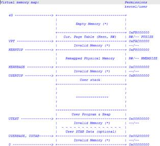

                 
**实验五：用户进程管理**

**1****实验目****的**

l  了解第一个用户进程创建过程

l  了解系统调用框架的实现机制

l 
了解ucore如何实现系统调用sys\_fork/sys\_exec/sys\_exit/sys\_wait来进行进程管理

**2 ****实验内容**

实验4完成了内核线程，但到目前为止，所有的运行都在内核态执行。实验5将创建用户进程，让用户进程在用户态执行，且在需要ucore支持时，可通过系统调用来让ucore提供服务。为此需要构造出第一个用户进程，并通过系统调用sys\_fork/sys\_exec/sys\_exit/sys\_wait来支持运行不同的应用程序，完成对用户进程的执行过程的基本管理。相关原理介绍可看附录B。

**2.1****练习**

**练习****0****：填写已有实验**

本实验依赖实验1/2/3/4。请把你做的实验1/2/3/4的代码填入本实验中代码中有“LAB1”/“LAB2”/“LAB3”/“LAB4”的注释相应部分。注意：为了能够正确执行lab5的测试应用程序，可能需对已完成的实验1/2/3/4的代码进行进一步改进。

**练习****1****加载应用程序并执行（需要编码）**

**do\_execv**函数调用load\_icode（位于kern/process/proc.c中）来加载并解析一个处于内存中的ELF执行文件格式的应用程序，建立相应的用户内存空间来放置应用程序的代码段、数据段等，且要设置好proc\_struct结构中的域trapframe中的内容，确保在执行此进程后，能够从应用程序设定的起始执行地址开始执行。需设置正确的trapframe内容。

**练习****2****父进程复制自己的内存空间给子进程（需要编码）**

创建子进程的函数do\_fork在执行中将拷贝当前进程（即父进程）的用户内存地址空间中的合法内容到新进程中（子进程），完成内存资源的复制。具体是通过copy\_range函数（位于kern/mm/pmm.c中）实现的，请补充copy\_range的实现，确保能够正确执行。

**练习****3****阅读分析源代码，理解进程执行****fork/exec/wait/exit****的实现，以及系统调用的实现（不需要编码）**

执行：make grade
。如果所显示的应用程序检测都输出ok，则基本正确。（**使用的是****qemu-1.0.1**）

**扩展练习****Challenge****：实现****Copy on Write****机制**

这个扩展练习涉及到本实验和上一个实验“虚拟内存管理”。Copy-on-write（简称COW）的基本概念是指如果有多个使用者对一个资源A（比如内存块）进行读操作，则每个使用者只需获得一个指向同一个资源A的指针，就可以该资源了。若某使用者需要对这个资源A进行写操作，系统会对该资源进行拷贝操作，从而使得该“写操作”使用者获得一个该资源A的“私有”拷贝—资源B，可对资源B进行写操作。该“写操作”使用者对资源B的改变对于其他的使用者而言是不可见的，因为其他使用者看到的还是资源A。

在ucore操作系统中，当一个用户父进程创建自己的子进程时，父进程会把其申请的用户空间设置为只读，子进程可共享父进程占用的用户内存空间中的页面（这就是一个共享的资源）。当其中任何一个进程修改此用户内存空间中的某页面时，ucore会通过page
fault异常获知该操作，并完成拷贝内存页面，使得两个进程都有各自的内存页面。这样一个进程所做的修改不会被另外一个进程可见了。请在ucore中实现这样的COW机制。

 

**2.2****项目组成**

.

├── boot

├── kern

│   ├── debug

│   │   ├── kdebug.c

│   │   └── ……

│   ├── mm

│   │   ├── memlayout.h

│   │   ├── pmm.c

│   │   ├── pmm.h

│   │   ├── ......

│   │   ├── vmm.c

│   │   └── vmm.h

│   ├── process

│   │   ├── proc.c

│   │   ├── proc.h

│   │   └── ......

│   ├── schedule

│   │   ├── sched.c

│   │   └── ......

│   ├── sync

│   │   └── sync.h

│   ├── syscall

│   │   ├── syscall.c

│   │   └── syscall.h

│   └── trap

│       ├── trap.c

│       ├── trapentry.S

│       ├── trap.h

│       └── vectors.S

├── libs

│   ├── elf.h

│   ├── error.h

│   ├── printfmt.c

│   ├── unistd.h

│   └── ......

├── tools

│   ├── user.ld

│   └── ......

└── user

    ├── hello.c

    ├── libs

    │   ├── initcode.S

    │   ├── syscall.c

    │   ├── syscall.h

    │   └── ......

    └── ......

   
相对与实验四，实验五主要增加的文件如上表红色部分所示，主要修改的文件如上表紫色部分所示。主要改动如下：

●   kern/debug/

kdebug.c：修改：解析用户进程的符号信息表示（可不用理会）

●   kern/mm/   （与本次实验有较大关系）

memlayout.h：修改：增加了用户虚存地址空间的图形表示和宏定义 
（需仔细理解）。

pmm.[ch]：修改：添加了用于进程退出（do\_exit）的内存资源回收的page\_remove\_pte、unmap\_range、exit\_range函数和用于创建子进程（do\_fork）中拷贝父进程内存空间的copy\_range函数，修改了pgdir\_alloc\_page函数

       vmm.[ch]：修改：扩展了mm\_struct数据结构，增加了一系列函数

◆  
mm\_map/dup\_mmap/exit\_mmap：设定/取消/复制/删除用户进程的合法内存空间

◆  
copy\_from\_user/copy\_to\_user：用户内存空间内容与内核内存空间内容的相互拷贝的实现

◆   user\_mem\_check：搜索vma链表，检查是否是一个合法的用户空间范围

●   kern/process/ （与本次实验有较大关系）

       proc.[ch]：修改：扩展了proc\_struct数据结构。增加或修改了一系列函数

◆   setup\_pgdir/put\_pgdir：创建并设置/释放页目录表

◆   copy\_mm：复制用户进程的内存空间和设置相关内存管理（如页表等）信息

◆  
do\_exit：释放进程自身所占内存空间和相关内存管理（如页表等）信息所占空间，唤醒父进程，好让父进程收了自己，让调度器切换到其他进程

◆  
load\_icode：被do\_execve调用，完成加载放在内存中的执行程序到进程空间，这涉及到对页表等的修改，分配用户栈

◆  
do\_execve：先回收自身所占用户空间，然后调用load\_icode，用新的程序覆盖内存空间，形成一个执行新程序的新进程

◆   do\_yield：让调度器执行一次选择新进程的过程

◆  
do\_wait：父进程等待子进程，并在得到子进程的退出消息后，彻底回收子进程所占的资源（比如子进程的内核栈和进程控制块）

◆  
do\_kill：给一个进程设置PF\_EXITING标志（“kill”信息，即要它死掉），这样在trap函数中，将根据此标志，让进程退出

◆  
KERNEL\_EXECVE/\_\_KERNEL\_EXECVE/\_\_KERNEL\_EXECVE2：被user\_main调用，执行一用户进程

●   kern/trap/ 

      
trap.c：修改：在idt\_init函数中，对IDT初始化时，设置好了用于系统调用的中断门（idt[T\_SYSCALL]）信息。这主要与syscall的实现相关

●   user/\*

     新增的用户程序和用户库

**3****用户进程管理**

**3.1****实验执行流程概述**

到实验四为止，ucore还一直在核心态“打转”，没有到用户态执行。提供各种操作系统功能的内核线程只能在CPU核心态运行是操作系统自身的要求，操作系统就要呆在核心态，才能管理整个计算机系统。但应用程序员也需要编写各种应用软件，且要在计算机系统上运行。如果把这些应用软件都作为内核线程来执行，那系统的安全性就无法得到保证了。所以，ucore要提供用户态进程的创建和执行机制，给应用程序执行提供一个用户态运行环境。接下来我们就简要分析本实验的执行过程，以及分析用户进程的整个生命周期来阐述用户进程管理的设计与实现。

 
显然，由于进程的执行空间扩展到了用户态空间，且出现了创建子进程执行应用程序等与lab4有较大不同的地方，所以具体实现的不同主要集中在进程管理和内存管理部分。首先，我们从ucore的初始化部分来看，会发现初始化的总控函数kern\_init没有任何变化。但这并不意味着lab4与lab5差别不大。其实kern\_init调用的物理内存初始化，进程管理初始化等都有一定的变化。

在内存管理部分，与lab4最大的区别就是增加用户态虚拟内存的管理。为了管理用户态的虚拟内存，需要对页表的内容进行扩展，能够把部分物理内存映射为用户态虚拟内存。如果某进程执行过程中，CPU在用户态下执行（在CS段寄存器最低两位包含有一个2位的优先级域，如果为0，表示CPU运行在特权态；如果为3，表示CPU运行在用户态。），则可以访问本进程页表描述的用户态虚拟内存，但由于权限不够，不能访问内核态虚拟内存。另一方面，不同的进程有各自的页表，所以即使不同进程的用户态虚拟地址相同，但由于页表把虚拟页映射到了不同的物理页帧，所以不同进程的虚拟内存空间是被隔离开的，相互之间无法直接访问。在用户态内存空间和内核态内核空间之间需要拷贝数据，让CPU处在内核态才能完成对用户空间的读或写，为此需要设计专门的拷贝函数（copy\_from\_user和copy\_to\_user）完成。但反之则会导致违反CPU的权限管理，导致内存访问异常。

在进程管理方面，主要涉及到的是进程控制块中与内存管理相关的部分，包括建立进程的页表和维护进程可访问空间（可能还没有建立虚实映射关系）的信息；加载一个ELF格式的程序到进程控制块管理的内存中的方法；在进程复制（fork）过程中，把父进程的内存空间拷贝到子进程内存空间的技术。另外一部分与用户态进程生命周期管理相关，包括让进程放弃CPU而睡眠等待某事件；让父进程等待子进程结束；一个进程杀死另一个进程；给进程发消息；建立进程的血缘关系链表。

当实现了上述内存管理和进程管理的需求后，接下来ucore的用户进程管理工作就比较简单了。首先，“硬”构造出第一个进程（lab4中已有描述），它是后续所有进程的祖先；然后，在proc\_init函数中，通过alloc把当前ucore的执行环境转变成idle内核线程的执行现场；然后调用kernl\_thread来创建第二个内核线程init\_main，而init\_main内核线程有创建了user\_main内核线程.。到此，内核线程创建完毕，应该开始用户进程的创建过程，这第一步实际上是通过user\_main函数调用kernel\_tread创建子进程，通过kernel\_execve调用来把某一具体程序的执行内容放入内存。具体的放置方式是根据ld在此文件上的地址分配为基本原则，把程序的不同部分放到某进程的用户空间中，从而通过此进程来完成程序描述的任务。一旦执行了这一程序对应的进程，就会从内核态切换到用户态继续执行。以此类推，CPU在用户空间执行的用户进程，其地址空间不会被其他用户的进程影响，但由于系统调用（用户进程直接获得操作系统服务的唯一通道）、外设中断和异常中断的会随时产生，从而间接推动了用户进程实现用户态到到内核态的切换工作。ucore对CPU内核态与用户态的切换过程需要比较仔细地分析（这其实是实验一的扩展练习）。当进程执行结束后，需回收进程占用和没消耗完毕的设备整个过程，且为新的创建进程请求提供服务。在本实验中，当系统中存在多个进程或内核线程时，
ucore采用了一种FIFO的很简单的调度方法来管理每个进程占用CPU的时间和频度等。在ucore运行过程中，由于调度、时间中断、系统调用等原因，使得进程会进行切换、创建、睡眠、等待、发消息等各种不同的操作，周而复始，生生不息。

 

**3.2****创建用户进程**

在实验四中，我们已经完成了对内核线程的创建，但与用户进程的创建过程相比，创建内核线程的过程还远远不够。而这两个创建过程的差异本质上就是用户进程和内核线程的差异决定的。

**1.       ****应用程序的组成和编译**

我们首先来看一个应用程序，这里我们假定是hello应用程序，在user/hello.c中实现，代码如下：

**\#include** \<stdio.h\>\
 **\#include** \<ulib.h\>\
 \
 **int**\
 main**(void)** **{**\
     cprintf**(**"Hello world!!.\\n"**);**\
     cprintf**(**"I am process %d.\\n"**,** getpid**());**\
     cprintf**(**"hello pass.\\n"**);**\
     **return** 0**;**\
 **}**

 hello应用程序只是输出一些字符串，并通过系统调用sys\_getpid（在getpid函数中调用）输出代表hello应用程序执行的用户进程的进程标识--pid。

首先，我们需要了解ucore操作系统如何能够找到hello应用程序。这需要分析ucore和hello是如何编译的。修改Makefile，把第六行注释掉。然后在本实验源码目录下执行make，可得到如下输出：

……

+ cc user/hello.c

 

gcc -Iuser/ -fno-builtin -Wall -ggdb -m32 -gstabs -nostdinc 
-fno-stack-protector -Ilibs/ -Iuser/include/ -Iuser/libs/ -c
user/hello.c -o obj/user/hello.o

 

ld -m    elf\_i386 -nostdlib -T tools/user.ld -o
obj/\_\_user\_hello.out  obj/user/libs/initcode.o obj/user/libs/panic.o
obj/user/libs/stdio.o obj/user/libs/syscall.o obj/user/libs/ulib.o
obj/user/libs/umain.o  obj/libs/hash.o obj/libs/printfmt.o
obj/libs/rand.o obj/libs/string.o obj/user/hello.o

……

ld -m    elf\_i386 -nostdlib -T tools/kernel.ld -o bin/kernel 
obj/kern/init/entry.o obj/kern/init/init.o …… -b binary ……
obj/\_\_user\_hello.out

……

从中可以看出，hello应用程序不仅仅是hello.c，还包含了支持hello应用程序的用户态库：

l 
user/libs/initcode.S：所有应用程序的起始用户态执行地址“\_start”，调整了EBP和ESP后，调用umain函数。

l 
user/libs/umain.c：实现了umain函数，这是所有应用程序执行的第一个C函数，它将调用应用程序的main函数，并在main函数结束后调用exit函数，而exit函数最终将调用sys\_exit系统调用，让操作系统回收进程资源。

l 
user/libs/ulib.[ch]：实现了最小的C函数库，除了一些与系统调用无关的函数，其他函数是对访问系统调用的包装。

l  user/libs/syscall.[ch]：用户层发出系统调用的具体实现。

l 
user/libs/stdio.c：实现cprintf函数，通过系统调用sys\_putc来完成字符输出。

l 
user/libs/panic.c：实现\_\_panic/\_\_warn函数，通过系统调用sys\_exit完成用户进程退出。

除了这些用户态库函数实现外，还有一些libs/\*.[ch]是操作系统内核和应用程序共用的函数实现。这些用户库函数其实在本质上与UNIX系统中的标准libc没有区别，只是实现得很简单，但hello应用程序的正确执行离不开这些库函数。

【注意】libs/\*.[ch]、user/libs/\*.[ch]、user/\*.[ch]的源码中没有任何特权指令。

在make的最后一步执行了一个ld命令，把hello应用程序的执行码obj/\_\_user\_hello.out连接在了ucore
kernel的末尾。且ld命令会在kernel中会把\_\_user\_hello.out的位置和大小记录在全局变量\_binary\_obj\_\_\_user\_hello\_out\_start和\_binary\_obj\_\_\_user\_hello\_out\_size中，这样这个hello用户程序就能够和ucore内核一起被
bootloader
加载到内存里中，并且通过这两个全局变量定位hello用户程序执行码的起始位置和大小。而到了与文件系统相关的实验后，ucore会提供一个简单的文件系统，那时所有的用户程序就都不再用这种方法进行加载了，而可以用大家熟悉的文件方式进行加载了。

**2.       ****用户进程的虚拟地址空间**

在tools/user.ld描述了用户程序的用户虚拟空间的执行入口虚拟地址：

SECTIONS {

    /\* Load programs at this address: "." means the current address \*/

    . = 0x800020;

在tools/kernel.ld描述了操作系统的内核虚拟空间的起始入口虚拟地址：

SECTIONS {

    /\* Load the kernel at this address: "." means the current address
\*/

    . = 0xC0100000;

这样ucore把用户进程的虚拟地址空间分了两块，一块与内核线程一样，是所有用户进程都共享的内核虚拟地址空间，映射到同样的物理内存空间中，这样在物理内存中只需放置一份内核代码，使得用户进程从用户态进入核心态时，内核代码可以统一应对不同的内核程序；另外一块是用户虚拟地址空间，虽然虚拟地址范围一样，但映射到不同且没有交集的物理内存空间中。这样当ucore把用户进程的执行代码（即应用程序的执行代码）和数据（即应用程序的全局变量等）放到用户虚拟地址空间中时，确保了各个进程不会“非法”访问到其他进程的物理内存空间。

这样ucore给一个用户进程具体设定的虚拟内存空间（kern/mm/memlayout.h）如下所示：

                                                                  

**3.       ****创建并执行用户进程**

  
在确定了用户进程的执行代码和数据，以及用户进程的虚拟空间布局后，我们可以来创建用户进程了。在本实验中第一个用户进程是由第二个内核线程initproc通过把hello应用程序执行码覆盖到initproc的用户虚拟内存空间来创建的，相关代码如下所示：

*//** **kernel\_execve** **-** **do** **SYS\_exec** **syscall** **to** **exec** **a** **user** **program** **called** **by** **user\_main** **kernel\_thread\
***static** **int**\

kernel\_execve**(const** **char** **\***name**,** **unsigned** **char** **\***binary**,** size\_t size**)** **{**\
     **int** ret**,** len **=** strlen**(**name**);**\
     **asm** **volatile** **(**\
         "int %1;"\
         **:** "=a" **(**ret**)**\

        **:** "i" **(**T\_SYSCALL**),** "0" **(**SYS\_exec**),** "d" **(**name**),** "c" **(**len**),** "b" **(**binary**),** "D" **(**size**)**\
         **:** "memory"**);**\
     **return** ret**;**\
 **}**\
 \

**\#define** \_\_KERNEL\_EXECVE**(**name**,** binary**,** size**)** **({**                          \\\

            cprintf**(**"kernel\_execve: pid = %d, name = \\"%s\\".\\n"**,**        \\\

                    current**-\>**pid**,** name**);**                                \\\

            kernel\_execve**(**name**,** binary**,** **(**size\_t**)(**size**));**                \\\
         **})**\
 \

**\#define** KERNEL\_EXECVE**(**x**)** **({**                                             \\\

            **extern** **unsigned** **char** \_binary\_obj\_\_\_user\_\#\#x\#\#\_out\_start**[],**  \\\

                \_binary\_obj\_\_\_user\_\#\#x\#\#\_out\_size**[];**                    \\\

            \_\_KERNEL\_EXECVE**(**\#x**,** \_binary\_obj\_\_\_user\_\#\#x\#\#\_out\_start**,**     \\\

                            \_binary\_obj\_\_\_user\_\#\#x\#\#\_out\_size**);**         \\\
         **})**\
 ……\

*//** **init\_main** **-** **the** **second** **kernel** **thread** **used** **to** **create** **kswapd\_main** **&** **user\_main** **kernel** **threads\
***static** **int**\
 init\_main**(void** **\***arg**)** **{**\
 **\#ifdef** TEST\
     KERNEL\_EXECVE2**(**TEST**,** TESTSTART**,** TESTSIZE**);**\
 **\#else**\
     KERNEL\_EXECVE**(**hello**);**\
 **\#endif**\
     panic**(**"kernel\_execve failed.\\n"**);**\
     **return** 0**;**\
 **}**

对于上述代码，我们需要从后向前按照函数/宏的实现一个一个来分析。Initproc的执行主体是init\_main函数，这个函数在缺省情况下是执行宏KERNEL\_EXECVE(hello)，而这个宏最终是调用kernel\_execve函数来调用SYS\_exec系统调用，由于ld在链接hello应用程序执行码时定义了两全局变量：

l  \_binary\_obj\_\_\_user\_hello\_out\_start：hello执行码的起始位置

l  \_binary\_obj\_\_\_user\_hello\_out\_size中：hello执行码的大小

kernel\_execve把这两个变量作为SYS\_exec系统调用的参数，让ucore来创建此用户进程。当ucore收到此系统调用后，将依次调用如下函数

vector128(vectors.S)--\>
\_\_alltraps(trapentry.S)--\>trap(trap.c)--\>trap\_dispatch(trap.c)--

--\>syscall(syscall.c)--\>sys\_exec（syscall.c）--\>do\_execve(proc.c)

最终通过do\_execve函数来完成用户进程的创建工作。此函数的主要工作流程如下：

l 
首先为加载新的执行码做好用户态内存空间清空准备。如果mm不为NULL，则设置页表为内核空间页表，且进一步判断mm的引用计数减1后是否为0，如果为0，则表明没有进程再需要此进程所占用的内存空间，为此将根据mm中的记录，释放进程所占用户空间内存和进程页表本身所占空间。最后把当前进程的mm内存管理指针为空。由于此处的initproc是内核线程，所以mm为NULL，整个处理都不会做。

l 
接下来的一步是加载应用程序执行码到当前进程的新创建的用户态虚拟空间中。这里涉及到读ELF格式的文件，申请内存空间，建立用户态虚存空间，加载应用程序执行码等。load\_icode函数完成了整个复杂的工作。

load\_icode函数的主要工作就是给用户进程建立一个能够让用户进程正常运行的用户环境。此函数有一百多行，完成了如下重要工作：

1.  
调用mm\_create函数来申请进程的内存管理数据结构mm所需内存空间，并对mm进行初始化；

2.  
调用setup\_pgdir来申请一个页目录表所需的一个页大小的内存空间，并把描述ucore内核虚空间映射的内核页表（boot\_pgdir所指）的内容拷贝到此新目录表中，最后让mm-\>pgdir指向此页目录表，这就是进程新的页目录表了，且能够正确映射内核虚空间；

3.  
根据应用程序执行码的起始位置来解析此ELF格式的执行程序，并调用mm\_map函数根据ELF格式的执行程序说明的各个段（代码段、数据段、BSS段等）的起始位置和大小建立对应的vma结构，并把vma插入到mm结构中，从而表明了用户进程的合法用户态虚拟地址空间；

4.  
调用根据执行程序各个段的大小分配物理内存空间，并根据执行程序各个段的起始位置确定虚拟地址，并在页表中建立好物理地址和虚拟地址的映射关系，然后把执行程序各个段的内容拷贝到相应的内核虚拟地址中，至此应用程序执行码和数据已经根据编译时设定地址放置到虚拟内存中了；

5.  
需要给用户进程设置用户栈，为此调用mm\_mmap函数建立用户栈的vma结构，明确用户栈的位置在用户虚空间的顶端，大小为256个页，即1MB，并分配一定数量的物理内存且建立好栈的虚地址\<--\>物理地址映射关系；

6.  
至此,进程内的内存管理vma和mm数据结构已经建立完成，于是把mm-\>pgdir赋值到cr3寄存器中，即更新了用户进程的虚拟内存空间，此时的initproc已经被hello的代码和数据覆盖，成为了第一个用户进程，但此时这个用户进程的执行现场还没建立好；

7.  
先清空进程的中断帧，再重新设置进程的中断帧，使得在执行中断返回指令“iret”后，能够让CPU转到用户态特权级，并回到用户态内存空间，使用用户态的代码段、数据段和堆栈，且能够跳转到用户进程的第一条指令执行，并确保在用户态能够响应中断；

 

至此，用户进程的用户环境已经搭建完毕。此时initproc将按产生系统调用的函数调用路径原路返回，执行中断返回指令“iret”（位于trapentry.S的最后一句）后，将切换到用户进程hello的第一条语句位置\_start处（位于user/libs/initcode.S的第三句）开始执行。

 

**3.3****进程退出和等待进程**

当进程执行完它的工作后，就需要执行退出操作，释放进程占用的资源。ucore分了两步来完成这个工作，首先由进程本身完成大部分资源的占用内存回收工作，然后由此进程的父进程完成剩余资源占用内存的回收工作。为何不让进程本身完成所有的资源回收工作呢？这是因为进程要执行回收操作，就表明此进程还存在，还在执行指令，这就需要内核栈的空间不能释放，且表示进程存在的进程控制块不能释放。所以需要父进程来帮忙释放子进程无法完成的这两个资源回收工作。

为此在用户态的函数库中提供了exit函数，此函数最终访问sys\_exit系统调用接口让操作系统来帮助当前进程执行退出过程中的部分资源回收。我们来看看ucore是如何做进程退出工作的。

首先，exit函数会把一个退出码error\_code传递给ucore，ucore通过执行内核函数do\_exit来完成对当前进程的退出处理，主要工作简单地说就是回收当前进程所占的大部分内存资源，并通知父进程完成最后的回收工作，具体流程如下：

1.   如果current-\>mm !=
NULL，表示是用户进程，则开始回收此用户进程所占用的用户态虚拟内存空间；

a)  
首先执行“lcr3(boot\_cr3)”，切换到内核态的页表上，这样当前用户进程目前只能在内核虚拟地址空间执行了，这是为了确保后续释放用户态内存和进程页表的工作能够正常执行；

b)  
如果当前进程控制块的成员变量mm的成员变量mm\_count减1后为0（表明这个mm没有再被其他进程共享，可以彻底释放进程所占的用户虚拟空间了。），则开始回收用户进程所占的内存资源：

               i.     
调用exit\_mmap函数释放current-\>mm-\>vma链表中每个vma描述的进程合法空间中实际分配的内存，然后把对应的页表项内容清空，最后还把页表所占用的空间释放并把对应的页目录表项清空；

             ii.      调用put\_pgdir函数释放当前进程的页目录所占的内存；

            iii.     
调用mm\_destroy函数释放mm中的vma所占内存，最后释放mm所占内存；

c)  
此时设置current-\>mm为NULL，表示与当前进程相关的用户虚拟内存空间和对应的内存管理成员变量所占的内核虚拟内存空间已经回收完毕；

2.  
这时，设置当前进程的执行状态current-\>state=PROC\_ZOMBIE，当前进程的退出码current-\>exit\_code=error\_code。此时当前进程已经不能被调度了，需要此进程的父进程来做最后的回收工作（即回收描述此进程的内核栈和进程控制块）；

3.   如果当前进程的父进程current-\>parent处于等待子进程状态：

current-\>parent-\>wait\_state==WT\_CHILD，

则唤醒父进程（即执行“wakup\_proc(current-\>parent)”），让父进程帮助自己完成最后的资源回收；

4.  
如果当前进程还有子进程，则需要把这些子进程的父进程指针设置为内核线程initproc，且各个子进程指针需要插入到initproc的子进程链表中。如果某个子进程的执行状态是PROC\_ZOMBIE，则需要唤醒initproc来完成对此子进程的最后回收工作。

5.   执行schedule()函数，选择新的进程执行。

 

 那么父进程如何完成对子进程的最后回收工作呢？这要求父进程要执行wait用户函数或wait\_pid用户函数，这两个函数的区别是，wait函数等待任意子进程的结束通知，而wait\_pid函数等待进程id号为pid的子进程结束通知。这两个函数最终访问sys\_wait系统调用接口让ucore来完成对子进程的最后回收工作，即回收子进程的内核栈和进程控制块所占内存空间，具体流程如下：

1.  
如果pid!=0，表示只找一个进程id号为pid的退出状态的子进程，否则找任意一个处于退出状态的子进程；

2.  
如果此子进程的执行状态不为PROC\_ZOMBIE，表明此子进程还没有退出，则当前进程只好设置自己的执行状态为PROC\_SLEEPING，睡眠原因为WT\_CHILD（即等待子进程退出），调用schedule()函数选择新的进程执行，自己睡眠等待，如果被唤醒，则重复跳回步骤1处执行；

3.  
如果此子进程的执行状态为PROC\_ZOMBIE，表明此子进程处于退出状态，需要当前进程（即子进程的父进程）完成对子进程的最终回收工作，即首先把子进程控制块从两个进程队列proc\_list和hash\_list中删除，并释放子进程的内核堆栈和进程控制块。自此，子进程才彻底地结束了它的执行过程，消除了它所占用的所有资源。

 

**3.4****系统调用实现**

系统调用的英文名字是System
Call。操作系统为什么需要实现系统调用呢？其实这是实现了用户进程后，自然引申出来需要实现的操作系统功能。用户进程只能在操作系统给它圈定好的“用户环境”中执行，但“用户环境”限制了用户进程能够执行的指令，即用户进程只能执行一般的指令，无法执行特权指令。如果用户进程想执行一些需要特权指令的任务，比如通过网卡发网络包等，只能让操作系统来代劳了。于是就需要一种机制来确保用户进程不能执行特权指令，但能够请操作系统“帮忙”完成需要特权指令的任务，这种机制就是系统调用。

采用系统调用机制为用户进程提供一个获得操作系统服务的统一接口层，这样一来可简化用户进程的实现，把一些共性的、繁琐的、与硬件相关、与特权指令相关的任务放到操作系统层来实现，但提供一个简洁的接口给用户进程调用；二来这层接口事先可规定好，且严格检查用户进程传递进来的参数和操作系统要返回的数据，使得让操作系统给用户进程服务的同时，保护操作系统不会被用户进程破坏。

从硬件层面上看，需要硬件能够支持在用户态的用户进程通过某种机制切换到内核态。试验一讲述中断硬件支持和软件处理过程其实就可以用来完成系统调用所需的软硬件支持。下面我们来看看如何在ucore中实现系统调用。

**1.       ****初始化系统调用对应的中断描述符**

在ucore初始化函数kern\_init中调用了idt\_init函数来初始化中断描述符表，并设置一个特定中断号的中断门，专门用于用户进程访问系统调用。此事由ide\_init函数完成：

**void**\
 idt\_init**(void)** **{**\
     **extern** uintptr\_t \_\_vectors**[];**\
     **int** i**;**\

    **for** **(**i **=** 0**;** i **\<** **sizeof****(**idt**)** **/** **sizeof****(struct** gatedesc**);** i **++)** **{**\

        SETGATE**(**idt**[**i**],** 1**,** GD\_KTEXT**,** \_\_vectors**[**i**],** DPL\_KERNEL**);**\
     **}**\

    SETGATE**(**idt**[**T\_SYSCALL**],** 1**,** GD\_KTEXT**,** \_\_vectors**[**T\_SYSCALL**],** DPL\_USER**);**\
     lidt**(&**idt\_pd**);**\
 **}**

在上述代码中，可以看到在执行加载中断描述符表lidt指令前，专门设置了一个特殊的中断描述符idt[T\_SYSCALL]，它的特权级设置为DPL\_USER，中断向量处理地址在\_\_vectors[T\_SYSCALL]处。这样建立好这个中断描述符后，一旦用户进程执行
“INT
T\_SYSCALL”后，由于此中断允许用户态进程产生（注意它的特权级设置为DPL\_USER），所以CPU就会从用户态切换到内核态，保存相关寄存器，并跳转到\_\_vectors[T\_SYSCALL]处开始执行，形成如下执行路径：

vector128(vectors.S)--\>
\_\_alltraps(trapentry.S)--\>trap(trap.c)--\>trap\_dispatch(trap.c)----\>syscall(syscall.c)-

在syscall中，根据系统调用号来完成不同的系统调用服务。

**2.       ****建立系统调用的用户库准备**

在操作系统中初始化好系统调用相关的中断描述符、中断处理起始地址等后，还需在用户态的应用程序中初始化好相关工作，简化应用程序访问系统调用的复杂性。为此在用户态建立了一个中间层，即简化的libc实现，在user/libs/ulib.[ch]和user/libs/syscall.[ch]中完成了对访问系统调用的封装。用户态最终的访问系统调用函数是syscall，实现如下：

**static** **inline** **int**\
 syscall**(int** num**,** **...)** **{**\
     va\_list ap**;**\
     va\_start**(**ap**,** num**);**\
     uint32\_t a**[**MAX\_ARGS**];**\
     **int** i**,** ret**;**\

    **for** **(**i **=** 0**;** i **\<** MAX\_ARGS**;** i **++)** **{**\
         a**[**i**]** **=** va\_arg**(**ap**,** uint32\_t**);**\
     **}**\
     va\_end**(**ap**);**\
 \
     **asm** **volatile** **(**\
         "int %1;"\
         **:** "=a" **(**ret**)**\
         **:** "i" **(**T\_SYSCALL**),**\
           "a" **(**num**),**\
           "d" **(**a**[**0**]),**\
           "c" **(**a**[**1**]),**\
           "b" **(**a**[**2**]),**\
           "D" **(**a**[**3**]),**\
           "S" **(**a**[**4**])**\
         **:** "cc"**,** "memory"**);**\
     **return** ret**;**\
 **}**

从中可以看出，应用程序调用的exit/fork/wait/getpid等库函数最终都会调用syscall函数，只是调用的参数不同而已，如果看最终的汇编代码会更清楚：

……

  34: 8b 55 d4               mov    -0x2c(%ebp),%edx

  37: 8b 4d d8               mov    -0x28(%ebp),%ecx

  3a: 8b 5d dc               mov    -0x24(%ebp),%ebx

  3d: 8b 7d e0               mov    -0x20(%ebp),%edi

  40: 8b 75 e4               mov    -0x1c(%ebp),%esi

  43: 8b 45 08               mov    0x8(%ebp),%eax

  46: cd 80                  int    \$0x80

      48: 89 45 f0               mov    %eax,-0x10(%ebp)

……

可以看到其实是把系统调用号放到EAX，其他5个参数a[0]\~a[4]分别保存到EDX/ECX/EBX/EDI/ESI五个寄存器中，及最多用6个寄存器来传递系统调用的参数，且系统调用的返回结果是EAX。比如对于getpid库函数而言，系统调用号（SYS\_getpid=18）是保存在EAX中，返回值（调用此库函数的的当前进程号pid）也在EAX中。

**3.       ****与用户进程相关的系统调用**

在本实验中，与进程相关的各个系统调用属性如下所示：

系统调用名

含义

具体完成服务的函数

SYS\_exit

process exit

do\_exit

SYS\_fork

create child process, dup mm 

do\_fork--\>wakeup\_proc

SYS\_wait

wait child process

do\_wait

SYS\_exec

after fork, process execute a new program

load a program and refresh the mm

SYS\_yield

process flag itself need resecheduling

proc-\>need\_sched=1, then scheduler will rescheule this process

SYS\_kill

kill process

do\_kill--\>proc-\>flags |=
PF\_EXITING,                                                         
--\>wakeup\_proc--\>do\_wait--\>do\_exit

SYS\_getpid

get the process's pid

 

 通过这些系统调用，可方便地完成从进程/线程创建到退出的整个运行过程。

**4.       ****系统调用的执行过程**

与用户态的函数库调用执行过程相比，系统调用执行过程的有四点主要的不同：

l  不是通过“CALL”指令而是通过“INT”指令发起调用；

l  不是通过“RET”指令，而是通过“IRET”指令完成调用返回；

l 
当到达内核态后，操作系统需要严格检查系统调用传递的参数，确保不破坏整个系统的安全性；

l  执行系统调用可导致进程等待某事件发生，从而可引起进程切换；

下面我们以getpid系统调用的执行过程大致看看操作系统是如何完成整个执行过程的。当用户进程调用getpid函数，最终执行到“INT
T\_SYSCALL”指令后，CPU根据操作系统建立的系统调用中断描述符，转入内核态，并跳转到vector128处（kern/trap/vectors.S），开始了操作系统的系统调用执行过程，函数调用和返回操作的关系如下所示：

vector128(vectors.S)--\>
\_\_alltraps(trapentry.S)--\>trap(trap.c)--\>trap\_dispatch(trap.c)--

--\>syscall(syscall.c)--\>sys\_getpid(syscall.c)--\>……--\>\_\_trapret(trapentry.S)

在执行trap函数前，软件还需进一步保存执行系统调用前的执行现场，即把与用户进程继续执行所需的相关寄存器等当前内容保存到当前进程的中断帧trapframe中（注意，在创建进程是，把进程的trapframe放在给进程的内核栈分配的空间的顶部）。软件做的工作在vector128和\_\_alltraps的起始部分：

vectors.S::vector128起始处:

  pushl \$0\
   pushl \$128

......

trapentry.S::\_\_alltraps起始处:

pushl %ds\
   pushl %es\
   pushal

……

自此，用于保存用户态的用户进程执行现场的trapframe的内容填写完毕，操作系统可开始完成具体的系统调用服务。在sys\_getpid函数中，简单地把当前进程的pid成员变量做为函数返回值就是一个具体的系统调用服务。完成服务后，操作系统按调用关系的路径原路返回到\_\_alltraps中。然后操作系统开始根据当前进程的中断帧内容做恢复执行现场操作。其实就是把trapframe的一部分内容保存到寄存器内容。恢复寄存器内容结束后，调整内核堆栈指针到中断帧的tf\_eip处，这是内核栈的结构如下：

/\* below here defined by x86 hardware \*/

    uintptr\_t tf\_eip;\
     uint16\_t tf\_cs;\
     uint16\_t tf\_padding3;\
     uint32\_t tf\_eflags;\
 /\* below here only when crossing rings \*/\
     uintptr\_t tf\_esp;\
     uint16\_t tf\_ss;\
     uint16\_t tf\_padding4;

 这时执行“IRET”指令后，CPU根据内核栈的情况回复到用户态，并把EIP指向tf\_eip的值，即“INT
T\_SYSCALL”后的那条指令。这样整个系统调用就执行完毕了。

至此，实验五中的主要工作描述完毕。

**4 ****实验报告要求**

从网站上下载lab5.zip后，解压得到本文档和代码目录
lab5，完成实验中的各个练习。完成代码编写并检查无误后，在对应目录下执行
make handin 任务，即会自动生成
lab5-handin.tar.gz。最后请一定提前或按时提交到网络学堂上。

注意有“LAB5”的注释，代码中所有需要完成的地方（challenge除外）都有“LAB5”和“YOUR
CODE”的注释，请在提交时特别注意保持注释，并将“YOUR
CODE”替换为自己的学号，并且将所有标有对应注释的部分填上正确的代码。

 

**附录A： 【原理】用户进程的特征**

**从内核线程到用户进程**

在实验四中设计实现了进程控制块，并实现了内核线程的创建和简单的调度执行。但实验四中没有在用户态执行用户进程的管理机制，既无法体现用户进程的地址空间，以及用户进程间地址空间隔离的保护机制，不支持进程执行过程的用户态和核心态之间的切换，且没有用户进程的完整状态变化的生命周期。其实没有实现的原因是内核线程不需要这些功能。那内核线程相对于用户态线程有何特点呢？

但其实我们已经在实验四中看到了内核线程，内核线程的管理实现相对是简单的，其特点是直接使用操作系统（比如ucore）在初始化中建立的内核虚拟内存地址空间，不同的内核线程之间可以通过调度器实现线程间的切换，达到分时使用CPU的目的。由于内核虚拟内存空间是一一映射计算机系统的物理空间的，这使得可用空间的大小不会超过物理空间大小，所以操作系统程序员编写内核线程时，需要考虑到有限的地址空间，需要保证各个内核线程在执行过程中不会破坏操作系统的正常运行。这样在实现内核线程管理时，不必考虑涉及与进程相关的虚拟内存管理中的缺页处理、按需分页、写时复制、页换入换出等功能。如果在内核线程执行过程中出现了访存错误异常或内存不够的情况，就认为操作系统出现错误了，操作系统将直接宕机。在ucore中，就是调用panic函数，进入内核调试监控器kernel\_debug\_monitor。

内核线程管理思想相对简单，但编写内核线程对程序员的要求很高。从理论上讲（理想情况），如果程序员都是能够编写操作系统级别的“高手”，能够勤俭和高效地使用计算机系统中的资源，且这些“高手”都为他人着想，具有奉献精神，在别的应用需要计算机资源的时候，能够从大局出发，从整个系统的执行效率出发，让出自己占用的资源，那这些“高手”编写出来的程序直接作为内核线程运行即可，也就没有用户进程存在的必要了。

但现实与理论的差距是巨大的，能编写操作系统的程序员是极少数的，与当前的应用程序员相比，估计大约差了3\~4个数量级。如果还要求编写操作系统的程序员考虑其他未知程序员的未知需求，那这样的程序员估计可以成为是编程界的“上帝”了。

从应用程序编写和运行的角度看，既然程序员都不是“上帝”，操作系统程序员就需要给应用程序员编写的程序提供一个既“宽松”又“严格”的执行环境，让对内存大小和CPU使用时间等资源的限制没有仔细考虑的应用程序都能在操作系统中正常运行，且即使程序太可靠，也只能破坏自己，而不能破坏其他运行程序和整个系统。“严格”就是安全性保证，即应用程序执行不会破坏在内存中存在的其他应用程序和操作系统的内存空间等独占的资源；“宽松”就算是方便性支持，即提供给应用程序尽量丰富的服务功能和一个远大于物理内存空间的虚拟地址空间，使得应用程序在执行过程中不必考虑很多繁琐的细节（比如如何初始化PCI总线和外设等，如果管理物理内存等）。

**让用户进程正常运行的用户环境**

在操作系统原理的介绍中，一般提到进程的概念其实主要是指用户进程。从操作系统的设计和实现的角度看，其实用户进程是指一个应用程序在操作系统提供的一个用户环境中的一次执行过程。这里的重点是用户环境。用户环境有啥功能？用户环境指的是什么？

从功能上看，操作系统提供的这个用户环境有两方面的特点。一方面与存储空间相关，即限制用户进程可以访问的物理地址空间，且让各个用户进程之间的物理内存空间访问不重叠，这样可以保证不同用户进程之间不能相互破坏各自的内存空间，利用虚拟内存的功能（页换入换出）。给用户进程提供了远大于实际物理内存空间的虚拟内存空间。

另一方面与执行指令相关，即限制用户进程可执行的指令，不能让用户进程执行特权指令（比如修改页表起始地址），从而保证用户进程无法破坏系统。但如果不能执行特权指令，则很多功能（比如访问磁盘等）无法实现，所以需要提供某种机制，让操作系统完成需要特权指令才能做的各种服务功能，给用户进程一个“服务窗口”,用户进程可以通过这个“窗口”向操作系统提出服务请求，由操作系统来帮助用户进程完成需要特权指令才能做的各种服务。另外，还要有一个“中断窗口”，让用户进程不主动放弃使用CPU时，操作系统能够通过这个“中断窗口”强制让用户进程放弃使用CPU，从而让其他用户进程有机会执行。

基于功能分析，我们就可以把这个用户环境定义为如下组成部分：

l 
建立用户虚拟空间的页表和支持页换入换出机制的用户内存访存错误异常服务例程：提供地址隔离和超过物理空间大小的虚存空间。

l 
应用程序执行的用户态CPU特权级：在用户态CPU特权级，应用程序只能执行一般指令，如果特权指令，结果不是无效就是产生“执行非法指令”异常；

l  系统调用机制：给用户进程提供“服务窗口”；

l 
中断响应机制：给用户进程设置“中断窗口”，这样产生中断后，当前执行的用户进程将被强制打断，CPU控制权将被操作系统的中断服务例程使用。

**用户态进程的执行过程分析**

在这个环境下运行的进程就是用户进程。那如果用户进程由于某种原因下面进入内核态后，那在内核态执行的是什么呢？还是用户进程吗？首先分析一下用户进程这样会进入内核态呢？回顾一下lab1，就可以知道当产生外设中断、CPU执行异常（比如访存错误）、陷入（系统调用），用户进程就会切换到内核中的操作系统中来。表面上看，到内核态后，操作系统取得了CPU控制权，所以现在执行的应该是操作系统代码，由于此时CPU处于核心态特权级，所以操作系统的执行过程就就应该是内核进程了。这样理解忽略了操作系统的具体实现。如果考虑操作系统的具体实现，应该如果来理解进程呢？

从进程控制块的角度看，如果执行了进程执行现场（上下文）的切换，就认为到另外一个进程执行了，及进程的分界点设定在执行进程切换的前后。到底切换了什么呢？其实只是切换了进程的页表和相关硬件寄存器，这些信息都保存在进程控制块中的相关域中。所以，我们可以把执行应用程序的代码一直到执行操作系统中的进程切换处为止都认为是一个应用程序的执行过程（其中有操作系统的部分代码执行过过程）即进程。因为在这个过程中，没有更换到另外一个进程控制块的进程的页表和相关硬件寄存器。

从指令执行的角度看，如果再仔细分析一下操作系统这个软件的特点并细化一下进入内核原因，就可以看出进一步进行划分。操作系统的主要功能是给上层应用提供服务，管理整个计算机系统中的资源。所以操作系统虽然是一个软件，但其实是一个基于事件的软件，这里操作系统需要响应的事件包括三类：外设中断、CPU执行异常（比如访存错误）、陷入（系统调用）。如果用户进程通过系统调用要求操作系统提供服务，那么用户进程的角度看，操作系统就是一个特殊的软件库（比如相对于用户态的libc库，操作系统可看作是内核态的libc库），完成用户进程的需求，从执行逻辑上看，是用户进程“主观”执行的一部分，即用户进程“知道”操作系统要做的事情。那么在这种情况下，进程的代码空间包括用户态的执行程序和内核态响应用户进程通过系统调用而在核心特权态执行服务请求的操作系统代码，为此这种情况下的进程的内存虚拟空间也包括两部分：用户态的虚地址空间和核心态的虚地址空间。但如果此时发生的事件是外设中断和CPU执行异常，虽然CPU控制权也转入到操作系统中的中断服务例程，但这些内核执行代码执行过程是用户进程“不知道”的，是另外一段执行逻辑。那么在这种情况下，实际上是执行了两段目标不同的执行程序，一个是代表应用程序的用户进程，一个是代表中断服务例程处理外设中断和CPU执行异常的内核线程。这个用户进程和内核线程在产生中断或异常的时候，CPU硬件就完成了它们之间的指令流切换。

**用户进程的运行状态分析**

  
用户进程在其执行过程中会存在很多种不同的执行状态，根据操作系统原理，一个用户进程一般的运行状态有五种：创建（new）态、就绪（ready）态、运行（running）态、等待（blocked）态、退出（exit）态。各个状态之间会由于发生了某事件而进行状态转换。

但在用户进程的执行过程中，具体在哪个时间段处于上述状态的呢？上述状态是如何转变的呢？首先，我们看创建（new）态，操作系统完成进程的创建工作，而体现进程存在的就是进程控制块，所以一旦操作系统创建了进程控制块，则可以认为此时进程就已经存在了，但由于进程能够运行的各种资源还没准备好，所以此时的进程处于创建（new）态。创建了进程控制块后，进程并不能就执行了，还需准备好各种资源，如果把进程执行所需要的虚拟内存空间，执行代码，要处理的数据等都准备好了，则此时进程已经可以执行了，但还没有被操作系统调度，需要等待操作系统选择这个进程执行，于是把这个做好“执行准备”的进程放入到一个队列中，并可以认为此时进程处于就绪（ready）态。当操作系统的调度器从就绪进程队列中选择了一个就绪进程后，通过执行进程切换，就让这个被选上的就绪进程执行了，此时进程就处于运行（running）态了。到了运行态后，会出现三种事件。如果进程需要等待某个事件（比如主动睡眠10秒钟，或进程访问某个内存空间，但此内存空间被换出到硬盘swap分区中了，进程不得不等待操作系统把缓慢的硬盘上的数据重新读回到内存中），那么操作系统会把CPU给其他进程执行，并把进程状态从运行（running）态转换为等待（blocked）态。如果用户进程的应用程序逻辑流程执行结束了，那么操作系统会把CPU给其他进程执行，并把进程状态从运行（running）态转换为退出（exit）态，并准备回收用户进程占用的各种资源，当把表示整个进程存在的进程控制块也回收了，这进程就不存在了。在这整个回收过程中，进程都处于退出（exit）态。2考虑到在内存中存在多个处于就绪态的用户进程，但只有一个CPU，所以为了公平起见，每个就绪态进程都只有有限的时间片段，当一个运行态的进程用完了它的时间片段后，操作系统会剥夺此进程的CPU使用权，并把此进程状态从运行（running）态转换为就绪（ready）态，最后把CPU给其他进程执行。如果某个处于等待（blocked）态的进程所等待的事件产生了（比如睡眠时间到，或需要访问的数据已经从硬盘换入到内存中），则操作系统会通过把等待此事件的进程状态从等待（blocked）态转到就绪（ready）态。这样进程的整个状态转换形成了一个有限状态自动机。
