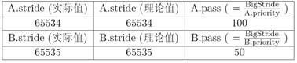
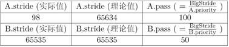

实验六: 调度器

 

**1****实验目的**

• 理解操作系统的调度管理机制

• 熟悉 ucore 的系统调度器框架，以及缺省的Round-Robin 调度算法

• 基于调度器框架实现一个(Stride Scheduling)调度算法来替换缺省的调度算法

 

**2****实验内容**

实验五完成了用户进程的管理，可在用户态运行多个进程。但到目前为止，采用的调度策略是很简单的FIFO调度策略。本次实验，主要是熟悉ucore的系统调度器框架，以及基于此框架的
Round-Robin（RR） 调度算法。然后参考RR调度算法的实现，完成Stride
Scheduling调度算法。

**2.1****练习**

**练习****0****：填写已有实验**

本实验依赖实验1/2/3/4/5。请把你做的实验2/3/4/5的代码填入本实验中代码中有“LAB1”/
“LAB2”/“LAB3”/“LAB4”/“LAB5”的注释相应部分。并确保编译通过。注意：为了能够正确执行lab6的测试应用程序，可能需对已完成的实验1/2/3/4/5的代码进行进一步改进。

** **

**练习****1****使用****Round Robin****调度算法（不需要编码）**

完成练习0后，建议大家比较一下（可用kdiff3等文件比较软件）个人完成的lab5和练习0完成后的刚修改的lab6之间的区别，分析了解lab6采用RR调度算法后的执行过程。执行make
grade，大部分测试用例应该通过。但执行priority.c应该过不去。

 

**练习****2****实现****Stride Scheduling****调度算法（需要编码）**

首先需要换掉RR调度器的实现，即用default\_sched\_stride\_c覆盖default\_sched.c。然后根据此文件和后续文档对Stride度器的相关描述，完成Stride调度算法的实现。

后面的实验文档部分给出了Stride调度算法的大体描述。这里给出Stride调度算法的一些相关的资料（目前网上中文的资料比较欠缺）。

•
[http://wwwagss.informatik.uni-kl.de/Projekte/Squirrel/stride/node3.html](http://wwwagss.informatik.uni-kl.de/Projekte/Squirrel/stride/node3.html)

•
[http://citeseerx.ist.psu.edu/viewdoc/summary?doi=10.1.1.138.3502&rank=1](http://citeseerx.ist.psu.edu/viewdoc/summary?doi=10.1.1.138.3502&rank=1)

• 也可GOOGLE  “Stride  Scheduling” 来查找相关资料

  

执行：make grade
。如果所显示的应用程序检测都输出ok，则基本正确。如果只是priority.c过不去，可执行
make run-priority
命令来单独调试它。大致执行结果可看附录。（**使用的是qemu-1.0.1**）。

** **

**扩展练习****Challenge****：实现****Linux****的****CFS****调度算法**

在ucore
的调度器框架下实现下Linux的CFS调度算法。可阅读相关Linux内核书籍或查询网上资料，可了解CFS的细节，然后大致实现在ucore中。

**2.2****项目组成**

├── boot

├── kern

│   ├── debug

│   ├── driver

│   ├── fs

│   ├── init

│   ├── libs

│   ├── mm

│   ├── process

│   │   ├── .....

│   │   ├── proc.c

│   │   ├── proc.h

│   │   └── switch.S

│   ├── schedule

│   │   ├── default\_sched.c

│   │   ├── default\_sched.h

│   │   ├── default\_sched\_stride\_c

│   │   ├── sched.c

│   │   └── sched.h

│   ├── syscall

│   │   ├── syscall.c

│   │   └── syscall.h

…

相对与实验五，实验六主要增加的文件如上表红色部分所示，主要修改的文件如上表紫色部分所示。主要改动如下：

简单说明如下：

 

• libs/skew\_heap.h: 
提供了基本的优先队列数据结构，为本次实验提供了抽象数据结构方面的支持。

•
kern/process/proc.[ch]：proc.h中扩展了proc\_struct的域，用于RR和stride调度算法。proc.c中实现了lab6\_set\_priority，用于设置进程的优先级。

• kern/schedule/{sched.h,sched.c}:  定义了 ucore
的调度器框架，其中包括相关的数
据结构（包括调度器的接口和运行队列的结构），和具体的运行时机制。

• kern/schedule/{default\_sched.h,default\_sched.c}:   具体的
round-robin 算法，在本次实验中你需要了解其实现。

• kern/schedule/default\_sched\_stride\_c: Stride
Scheduling调度器的基本框架，在此次
实验中你需要填充其中的空白部分以实现一个完整的 Stride  调度器。

• kern/syscall/syscall.[ch]:
增加了sys\_gettime系统调用，便于用户进程获取当前时钟值；增加了sys\_lab6\_set\_priority系统调用，便于用户进程设置进程优先级（给priority.c用）

• user/{matrix.c,priority.c,. . . }: 
相关的一些测试用户程序，测试调度算法的正确性，user
目录下包含但不限于这些程序。在完成实验过程中，建议阅读这些测试程序，以了解这些程序的行为，便于进行调试。

 

**3  ****调度框架和调度算法设计与实现**

**3.1****实验执行流程概述**

在实验五，创建了用户进程，并让它们正确运行。这中间也实现了FIFO调度策略。可通过阅读实验五下的
kern/schedule/sched.c 的 schedule
函数的实现来了解其FIFO调度策略。与实验五相比，实验六专门需要针对处理器调度框架和各种算法进行设计与实现，为此对ucore的调度部分进行了适当的修改，使得kern/schedule/sched.c
只实现调度器框架，而不再涉及具体的调度算法实现。而调度算法在单独的文件（default\_sched.[ch]）中实现。

除此之外，实验中还涉及了idle进程的概念。当cpu没有进程可以执行的时候，系统应该如何工作？在实验五的scheduler实现中，ucore内核不断的遍历进程池，直到找到第一个runnable状态的
process，调用并执行它。也就是说，当系统没有进程可以执行的时候，它会把所有
cpu 时间用在搜索进程池，以实现
idle的目的。但是这样的设计不被大多数操作系统所采用，原因在于它将进程调度和
idle 进程两种不同的概念混在了一起，而且，当调度器比较复杂时，schedule
函数本身也会比较复杂，这样的设计结构很不清晰而且难免会出现错误。所以在此次实验中，ucore
建立了一个单独的进程(kern/process/proc.c 中的 idleproc)作为 cpu 空闲时的
idle 进程，这个程序是通常一个死循环。你需要了解这个程序的实现。

接下来可看看实验六的大致执行过程，在init.c中的kern\_init函数增加了对sched\_init函数的调用。sched\_init函数主要完成了对实现特定调度算法的调度类（sched\_class）的绑定，使得ucore在后续的执行中，能够通过调度框架找到实现特定调度算法的调度类并完成进程调度相关工作。为了更好地理解实验六整个运行过程，这里需要关注的重点问题包括：

1.   何时或何事件发生后需要调度？

2.   何时或何事件发生后需要调整实现调度算法所涉及的参数？

3.   如果基于调度框架设计具体的调度算法？

4.   如果灵活应用链表等数据结构管理进程调度？

大家可带着这些问题进一步阅读后续的内容。

 

**3.2****计时器的原理和实现**

 

在传统的操作系统中，计时器是其中一个基础而重要的功能.它提供了基于时间事件的调度机制。在
ucore 中，timer  中断(irq0) 给操作系统提供了有一定间隔的时间事件，
操作系统将其作为基本的调度和计时单位（我们记两次时间中断之间的时间间隔为一个
时间片，timer splice）。

基于此时间单位，操作系统得以向上提供基于时间点的事件，并实现基于时间长度的等待和唤醒机制。在每个时钟中断发生时，操作系统产生对应的时间事件。应用程序或者操作系统的其他组件可以以此来构建更复杂和高级的调度。

• sched.h,  sched.c 定义了有关timer的各种相关接口来使用 timer 
服务，其中主要包括:

• typedef struct {……} timer\_t:  定义了 timer\_t 的基本结构，其可以用
sched.h  中的timer\_init函数对其进行初始化。

• void timer\_init(timer t \*timer,  struct proc\_struct \*proc, int
expires):  对某计时器 进行初始化，让它在 expires 时间片之后唤醒 proc
进程。

• void add\_timer(timer t \*timer):  向系统添加某个初始化过的
timer\_t，该计时器在 指定时间后被激活，并将对应的进程唤醒至
runnable（如果当前进程处在等待状态）。

• void del\_timer(timer\_t \*time): 
向系统删除（或者说取消）某一个计时器。该计时
器在取消后不会被系统激活并唤醒进程。

• void run\_timer\_list(void): 
更新当前系统时间点，遍历当前所有处在系统管理内的
计时器，找出所有应该激活的计数器，并激活它们。该过程在且只在每次计时器中断时被调用。在
ucore 中，其还会调用调度器事件处理程序。

 

一个 timer\_t 在系统中的存活周期可以被描述如下：

1.  timer\_t 在某个位置被创建和初始化，并通过
add\_timer加入系统管理列表中

2.  系统时间被不断累加，直到 run\_timer\_list 发现该 timer\_t到期。

3.  run\_timer\_list
更改对应的进程状态，并从系统管理列表中移除该timer\_t。
尽管本次实验并不需要填充计时器相关的代码，但是作为系统重要的组件（同时计时器也是调度器的一个部分），你应该了解其相关机制和在
ucore
中的实现方法。接下来的实验描述将会在一定程度上忽略计时器对调度带来的影响，即不考虑基于固定时间点的调度。

 

**3.3****进程状态**

 

在此次实验中，进程的状态之间的转换需要有一个更为清晰的表述，在 ucore
中，runnable的进程会被放在运行队列中。值得注意的是，在具体实现中，ucore定义的进程控制块struct
proc\_struct包含了域state,用于描述进程的运行状态，而running和runnable共享同一个状态(state)值(PROC\_RUNNABLE)。不同之处在于处于running态的进程不会放在运行队列中。进程的正常生命周期如下：

• 进程首先在 cpu 初始化或者 sys\_fork
的时候被创建，当为该进程分配了一个进程描 述符之后，该进程进入 uninit态(在
proc.c 中 alloc\_proc)。

• 当进程完全完成初始化之后，该进程转为runnable态。

• 当到达调度点时，由调度器 sched\_class
根据运行队列rq的内容来判断一个进程是否应该被运行，即把处于runnable态的进程转换成
running状态，从而占用CPU执行。

• running态的进程通过wait等系统调用被阻塞，进入sleeping态。

• sleeping态的进程被wakeup变成runnable态的进程。

• running态的进程主动 exit 变成
zombie态，然后由其父进程完成对其资源的最后释放，子进程的进程控制块成为unused。

•
所有从runnable态变成其他状态的进程都要出运行队列，反之，被放入某个运行队列中。

 

**3.4****进程调度实现**

 

**3.4.1****内核抢占点**

调度本质上体现了对CPU资源的抢占。对于用户进程而言，由于有中断的产生，可以随时打断用户进程的执行，转到操作系统内部，从而给了操作系统以调度控制权，让操作系统可以根据具体情况（比如用户进程时间片已经用完了）选择其他用户进程执行。这体现了用户进程的可抢占性（preemptive）。但如果把ucore操作系统也看成是一个特殊的内核进程或多个内核线程的集合，那ucore是否也是可抢占的呢？其实ucore
内核执行是不可抢占的（non-preemptive），即在执行“任意”内核代码时，CPU控制权可被强制剥夺。这里需要注意，不是在所有情况下ucore内核执行都是不可抢占的，有以下几种“固定”情况是例外：

1.   进行同步互斥操作，比如争抢一个信号量、锁（lab7中会详细分析）；

2.  
进行磁盘读写等耗时的异步操作，由于等待完成的耗时太长，ucore会调用shcedule让其他就绪进程执行。

这几种情况其实都是由于当前进程所需的某个资源（也可称为事件）无法得到满足，无法继续执行下去，从而不得不主动放弃对CPU的控制权。如果参照用户进程任何位置都可被内核打断并放弃CPU控制权的情况，这些在内核中放弃CPU控制权的执行地点是“固定”而不是“任意”的，不能体现内核任意位置都可抢占性的特点。我们搜寻一下实验五的代码，可发现在如下几处地方调用了shedule函数：

 

表一：调用进程调度函数schedule的位置和原因

编号

位置

原因

1

proc.c::do\_exit

用户线程执行结束，主动放弃CPU控制权。

2

proc.c::do\_wait

用户线程等待子进程结束，主动放弃CPU控制权。

3

proc.c::init\_main

1. 
initproc内核线程等待所有用户进程结束，如果没有结束，就主动放弃CPU控制权;

2. 
initproc内核线程在所有用户进程结束后，让kswapd内核线程执行10次，用于回收空闲内存资源

4

proc.c::cpu\_idle

idleproc内核线程的工作就是等待有处于就绪态的进程或线程，如果有就调用schedule函数

5

sync.h::lock

在获取锁的过程中，如果无法得到锁，则主动放弃CPU控制权

6

trap.c::trap

如果在当前进程在用户态被打断去，且当前进程控制块的成员变量need\_resched设置为1，则当前线程会放弃CPU控制权

仔细分析上述位置，第1、2、5处的执行位置体现了由于获取某种资源一时等不到满足、进程要退出、进程要睡眠等原因而不得不主动放弃CPU。第3、4处的执行位置比较特殊，initproc内核线程等待用户进程结束而执行schedule函数；idle内核线程在没有进程处于就绪态时才执行，一旦有了就绪态的进程，它将执行schedule函数完成进程调度。这里只有第6处的位置比较特殊：

       **if** **(!**in\_kernel**)** **{**\
             ……

           **if** **(**current**-\>**need\_resched**)** **{**\
                 schedule**();**\
             **}**\
         **}**

这里表明了只有当进程在用户态执行到“任意”某处用户代码位置时发生了中断，且当前进程控制块成员变量need\_resched为1（表示需要调度了）时，才会执行shedule函数。这实际上体现了对用户进程的可抢占性。如果没有第一行的if语句，那么就可以体现对内核代码的可抢占性。但如果要把这一行if语句去掉，我们就不得不实现对ucore中的所有全局变量的互斥访问操作，以防止所谓的race
condition现象，这样ucore的实现复杂度会增加不少。

**3.4.2****进程切换过程**

进程调度函数schedule选择了下一个将占用CPU执行的进程后，将调用进程切换，从而让新的进程得以执行。通过实验四和实验五的理解，应该已经对进程调度和上下文切换有了初步的认识。在实验五中，结合调度器框架的设计，可对
ucore
中的进程切换以及堆栈的维护和使用等有更加深刻的认识。假定有两个用户进程，在二者进行进程切换的过程中，具体的步骤如下：

首先在执行某进程A的用户代码时，出现了一个 trap 
(例如是一个外设产生的中断)，这
个时候就会从进程A的用户态切换到内核态(过程(1))，并且保存好进程A的trapframe；
当内核态处理中断时发现需要进行进程切换时，ucore要通过schedule函数选择下一个将占用CPU执行的进程（即进程B），然后会调用proc\_run函数，proc\_run函数进一步调用switch\_to函数，切换到进程B的内核态(过程(2))，继续进程B上一次在内核态的操作，并通过iret指令，最终将执行权转交给进程B的用户空间(过程(3))。

当进程B由于某种原因发生中断之后(过程(4))，会从进程B的用户态切换到内核态，并且保存好进程B的trapframe；当内核态处理中断时发现需要进行进程切换时，即需要切换到进程A，ucore再次切换到进程A(过程(5))，会执行进程A上一次在内核调用
schedule (具体还要跟踪到 switch\_to 函数)
函数返回后的下一行代码，这行代码当然还是在进程A的上一次中断处理流程中。最后当进程
A的中断处理完毕的时候，执行权又会反交给进程A的用户代码(过程(6))。这就是在只有两个进程的情况下，进程切换间的大体流程。

几点需要强调的是：

​a)
需要透彻理解在进程切换以后，程序是从哪里开始执行的？需要注意到虽然指令还是同一个cpu上执行，但是此时已经是另外一个进程在执行了，且使用的资源已经完全不同了。

b) 
内核在第一个程序运行的时候，需要进行哪些操作？有了实验四和实验五的经验，可以确定，内核启动第一个用户进程的过程，实际上是从进程启动时的内核状态切换到该用户进程的内核状态的过程，而且该用户进程在用户态的起始入口应该是forkret。

**3.5****调度框架和调度算法**

**3.5.1****设计思路**

实行一个进程调度策略，到底需要实现哪些基本功能对应的数据结构？首先考虑到一个无论哪种调度算法都需要选择一个就绪进程来占用CPU运行。为此我们可把就绪进程组织起来，可用队列（双向链表）、二叉树、红黑树、数组…等不同的组织方式。

在操作方面，如果需要选择一个就绪进程，就可以从基于某种组织方式的就绪进程集合中选择出一个进程执行。需要注意，这里“选择”和“出”是两个操作，选择是在集合中挑选一个“合适”的进程，“出”意味着离开就绪进程集合。另外考虑到一个处于运行态的进程还会由于某种原因（比如时间片用完了）回到就绪态而不能继续占用CPU执行，这就会重新进入到就绪进程集合中。这两种情况就形成了调度器相关的三个基本操作：在就绪进程集合中选择、进入就绪进程集合和离开就绪进程集合。这三个操作属于调度器的基本操作。

在进程的执行过程中，就绪进程的等待时间和执行进程的执行时间是影响调度选择的重要因素，这两个因素随着时间的流逝和各种事件的发生在不停地变化，比如处于就绪态的进程等待调度的时间在增长，处于运行态的进程所消耗的时间片在减少等。这些进程状态变化的情况需要及时让进程调度器知道，便于选择更合适的进程执行。所以这种进程变化的情况就形成了调度器相关的一个变化感知操作：
timer时间事件感知操作。这样在进程运行或等待的过程中，调度器可以调整进程控制块中与进程调度相关的属性值（比如消耗的时间片、进程优先级等），并可能导致对进程组织形式的调整（比如以时间片大小的顺序来重排双向链表等），并最终可能导致调选择新的进程占用CPU运行。这个操作属于调度器的进程调度属性调整操作。

**3.5.2****数据结构**

在理解框架之前，需要先了解一下调度器框架所需要的数据结构。

• 通常的操作系统中，进程池是很大的（虽然在 ucore 中，MAX\_PROCESS 很小）。
在 ucore 中，调度器引入 run-queue（简称rq,
即运行队列）的概念，通过链表结构管理进程。

• 由于目前 ucore 设计运行在单
CPU上，其内部只有一个全局的运行队列，用来管理系统内全部的进程。

• 运行队列通过链表的形式进行组织。链表的每一个节点是一个list\_entry\_t,
每个list\_entry\_t 又对应到了 struct proc\_struct \*,
这其间的转换是通过宏 le2proc 来完成 的。具体来说，我们知道在 struct
proc\_struct 中有一个叫 run\_link 的 list\_entry\_t，
因此可以通过偏移量逆向找到对因某个 run\_list的 struct proc\_struct。即
进程结构指针 proc = le2proc(链表节点指针, run\_link)。

• 为了保证调度器接口的通用性，ucore
调度框架定义了如下接口，该接口中，几乎全部成员变量均为函数指针。具体的功能会在后面的框架说明中介绍。

 

1    struct sched\_class {

2    // 调度器的名字

3    const char \*name;

4    // 初始化运行队列

5    void (\*init) (struct run\_queue \*rq);

6    // 将进程 p 插入队列 rq

7    void (\*enqueue) (struct run\_queue \*rq, struct proc\_struct \*p);

8    // 将进程 p 从队列 rq 中删除

9    void (\*dequeue) (struct run\_queue \*rq, struct proc\_struct \*p);

10   // 返回 运行队列 中下一个可执行的进程

11   struct proc\_struct\* (\*pick\_next) (struct run\_queue \*rq);

12   // timetick 处理函数

13   void (\*proc\_tick)(struct  run\_queue\* rq, struct proc\_struct\*
p);

14   };

 

• 此外，proc.h 中的 struct proc\_struct 中也记录了一些调度相关的信息：

1    struct proc\_struct {

2    // . . .

3    // 该进程是否需要调度，只对当前进程有效

4    volatile bool need\_resched;

5    // 该进程的调度链表结构，该结构内部的连接组成了 运行队列 列表

6    list\_entry\_t run\_link;

7    // 该进程剩余的时间片，只对当前进程有效

8    int time\_slice;

9    // round-robin 调度器并不会用到以下成员

10   // 该进程在优先队列中的节点，仅在 LAB6 使用

11   skew\_heap\_entry\_t  lab6\_run\_pool;

12   // 该进程的调度优先级，仅在 LAB6 使用

13   uint32\_t lab6\_priority;

14   // 该进程的调度步进值，仅在 LAB6 使用

15   uint32\_t lab6\_stride;

16   };

 

在此次实验中，你需要了解 default\_sched.c
中的实现RR调度算法的函数。在该文件中，你可以看到ucore 已经为 RR
调度算法创建好了一个名为 RR\_sched\_class 的调度策略类。

通过数据结构 struct run\_queue 来描述完整的
run\_queue（运行队列）。它的主要结构如下：

1   struct run\_queue {

2   //其运行队列的哨兵结构，可以看作是队列头和尾

3   list\_entry\_t run\_list;

4   //优先队列形式的进程容器，只在 LAB6 中使用

5   skew\_heap\_entry\_t  \*lab6\_run\_pool;

6   //表示其内部的进程总数

7   unsigned int proc\_num;

8   //每个进程一轮占用的最多时间片

9   int max\_time\_slice;

10 };

 

在 ucore 框架中，运行队列存储的是当前可以调度的进程，所以，只有状态为
runnable的进程才能够进入运行队列。当前正在运行的进程并不会在运行队列中，这一点需要注意。

**3.5.3****调度点的相关关键函数**

虽然进程各种状态变化的原因和导致的调度处理各异，但其实仔细观察各个流程的共性部分，会发现其中只涉及了三个关键调度相关函数：wakup\_proc、shedule、run\_timer\_list。如果我们能够让这三个调度相关函数的实现与具体调度算法无关，那么就可以认为ucore实现了一个与调度算法无关的调度框架。

wakeup\_proc函数其实完成了把一个就绪进程放入到就绪进程队列中的工作，为此还调用了一个调度类接口函数sched\_class\_enqueue，这使得wakeup\_proc的实现与具体调度算法无关。schedule函数完成了与调度框架和调度算法相关三件事情:把当前继续占用CPU执行的运行进程放放入到就绪进程队列中，从就绪进程队列中选择一个“合适”就绪进程，把这个“合适”的就绪进程从就绪进程队列中摘除。通过调用三个调度类接口函数sched\_class\_enqueue、sched\_class\_pick\_next、sched\_class\_enqueue来使得完成这三件事情与具体的调度算法无关。run\_timer\_list函数在每次timer中断处理过程中被调用，从而可用来调用调度算法所需的timer时间事件感知操作，调整相关进程的进程调度相关的属性值。通过调用调度类接口函数sched\_class\_proc\_tick使得此操作与具体调度算法无关。

这里涉及了一系列调度类接口函数：

l  sched\_class\_enqueue

l  sched\_class\_dequeue

l  sched\_class\_pick\_next

l  sched\_class\_proc\_tick

这4个函数的实现其实就是调用某基于sched\_class数据结构的特定调度算法实现的4个指针函数。采用这样的调度类框架后，如果我们需要实现一个新的调度算法，则我们需要定义一个针对此算法的调度类的实例，一个就绪进程队列的组织结构描述就行了，其他的事情都可交给调度类框架来完成。

**3.5.4 RR****调度算法实现**

RR调度算法的调度思想 是让所有
runnable态的进程分时轮流使用CPU时间。RR调度器维护当前runnable进程的有序运行队列。当前进程的时间片用完之后，调度器将当前进程放置到运行队列的尾部，再从其头部取出进程进行调度。RR调度算法的就绪队列在组织结构上也是一个双向链表，只是增加了一个成员变量，表明在此就绪进程队列中的最大执行时间片。而且在进程控制块proc\_struct中增加了一个成员变量time\_slice，用来记录进程当前的可运行时间片段。这是由于RR调度算法需要考虑执行进程的运行时间不能太长。在每个timer到时的时候，操作系统会递减当前执行进程的time\_slice，当time\_slice为0时，就意味着这个进程运行了一段时间（这个时间片段称为进程的时间片），需要把CPU让给其他进程执行，于是操作系统就需要让此进程重新回到rq的队列尾，且重置此进程的时间片为就绪队列的成员变量最大时间片max\_time\_slice值，然后再从rq的队列头取出一个新的进程执行。下面来分析一下其调度算法的实现。

RR\_enqueue的函数实现如下表所示。即把某进程的进程控制块指针放入到rq队列末尾，且如果进程控制块的时间片为0，则需要把它重置为rq成员变量max\_time\_slice。这表示如果进程在当前的执行时间片已经用完，需要等到下一次有机会运行时，才能再执行一段时间。

**static** **void**\

RR\_enqueue**(struct** run\_queue **\***rq**,** **struct** proc\_struct **\***proc**)** **{**\
     assert**(**list\_empty**(&(**proc**-\>**run\_link**)));**\

    list\_add\_before**(&(**rq**-\>**run\_list**),** **&(**proc**-\>**run\_link**));**\

    **if** **(**proc**-\>**time\_slice **==** 0 **||** proc**-\>**time\_slice **\>** rq**-\>**max\_time\_slice**)** **{**\
         proc**-\>**time\_slice **=** rq**-\>**max\_time\_slice**;**\
     **}**\
     proc**-\>**rq **=** rq**;**\
     rq**-\>**proc\_num **++;**\
 **}**

 

RR\_pick\_next的函数实现如下表所示。即选取就绪进程队列rq中的队头队列元素，并把队列元素转换成进程控制块指针。

**static** **struct** proc\_struct **\***\
 FCFS\_pick\_next**(struct** run\_queue **\***rq**)** **{**\

    list\_entry\_t **\***le **=** list\_next**(&(**rq**-\>**run\_list**));**\
     **if** **(**le **!=** **&(**rq**-\>**run\_list**))** **{**\
         **return** le2proc**(**le**,** run\_link**);**\
     **}**\
     **return** NULL**;**\
 **}**

 

RR\_dequeue的函数实现如下表所示。即把就绪进程队列rq的进程控制块指针的队列元素删除，并把表示就绪进程个数的proc\_num减一。

**static** **void**\

FCFS\_dequeue**(struct** run\_queue **\***rq**,** **struct** proc\_struct **\***proc**)** **{**\

    assert**(!**list\_empty**(&(**proc**-\>**run\_link**))** **&&** proc**-\>**rq **==** rq**);**\
     list\_del\_init**(&(**proc**-\>**run\_link**));**\
     rq**-\>**proc\_num **--;**\
 **}**

 

RR\_proc\_tick的函数实现如下表所示。即每次timer到时后，trap函数将会间接调用此函数来把当前执行进程的时间片time\_slice减一。如果time\_slice降到零，则设置此进程成员变量need\_resched标识为1，这样在下一次中断来后执行trap函数时，会由于当前进程程成员变量need\_resched标识为1而执行schedule函数，从而把当前执行进程放回就绪队列末尾，而从就绪队列头取出在就绪队列上等待时间最久的那个就绪进程执行。

**static** **void**\

RR\_proc\_tick**(struct** run\_queue **\***rq**,** **struct** proc\_struct **\***proc**)** **{**\
     **if** **(**proc**-\>**time\_slice **\>** 0**)** **{**\
         proc**-\>**time\_slice **--;**\
     **}**\
     **if** **(**proc**-\>**time\_slice **==** 0**)** **{**\
         proc**-\>**need\_resched **=** 1**;**\
     **}**\
 **}**

 

**3.6 Stride Scheduling**

**3.6.1****基本思路**

**【提示】请先看练习2中提到的论文。理解后在看下面的内容。**

考察 round-robin 调度器，在假设所有进程都充分使用了其拥有的 CPU
时间资源的情况下，所有进程得到的 CPU
时间应该是相等的。但是有时候我们希望调度器能够更智能地为每个进程分配合理的
CPU
资源。假设我们为不同的进程分配不同的优先级，则我们有可能希望每个进程得到的时间资源与他们的优先级成正比关系。Stride调度是基于这种想法的一个较为典型和简单的算法。除了简单易于实现以外，它还有如下的特点：

• 可控性：如我们之前所希望的，可以证明 Stride  Scheduling
对进程的调度次数正比于其优先级。

• 确定性：在不考虑计时器事件的情况下，整个调度机制都是可预知和重现的。
该算法的基本思想可以考虑如下：

1.  为每个runnable的进程设置一个当前状态
stride，表示该进程当前的调度权。另外定义其对应的pass
值，表示对应进程在调度后，stride 需要进行的累加值。

2.  每次需要调度时，从当前 runnable 态的进程中选择 stride 
最小的进程调度。

3.  对于获得调度的进程P，将对应的stride加上其对应的步长
pass（只与进程的优先权有关系）。

4.  在一段固定的时间之后，回到 2.步骤，重新调度当前stride最小的进程。
可以证明，如果令

P.pass =BigStride / P.priority

其中 P.priority 表示进程的优先权（大于 1），而 BigStride
表示一个预先定义的大常数，则该调度方案为每个进程分配的时间将与其优先级成正比。证明过程我们在这里略去，有兴趣的同学可以在网上查找相关资料。将该调度器应用到
ucore 的调度器框架中来，则需要将调度器接口实现如下：

• init:

–  初始化调度器类的信息（如果有的话）。

–  初始化当前的运行队列为一个空的容器结构。（比如和RR调度算法一样，初始化为一个有序列表）

• enqueue

–  初始化刚进入运行队列的进程 proc的stride属性。

–  将 proc插入放入运行队列中去（注意：这里并不要求放置在队列头部）。

• dequeue

–  从运行队列中删除相应的元素。

• pick next

–  扫描整个运行队列，返回其中stride值最小的对应进程。

–  更新对应进程的stride值，即

pass = BIG\_STRIDE / P-\>priority; P-\>stride += pass。

• proc tick:

–  检测当前进程是否已用完分配的时间片。如果时间片用完，应该正确设置进程
结构的相关标记来引起进程切换。

–  一个 process 最多可以连续运行 rq.max\_time\_slice个时间片。

在具体实现时，有一个需要注意的地方：stride属性的溢出问题，在之前的实现里面
我们并没有考虑 stride  的数值范围，而这个值在理论上是不断增加的，在
stride溢出以后，基于
stride的比较可能会出现错误。比如假设当前存在两个进程A和B，stride属性采用16位无符号整数进行存储。当前队列中元素如下（假设当前运行的进程已经被重新放置进运行队列中）：

  -- ------------------------------
     
  -- ------------------------------

\

此时应该选择 A 作为调度的进程，而在一轮调度后，队列将如下：

  -- ------------------------------
     
  -- ------------------------------

\

可以看到由于溢出的出现，进程间stride的理论比较和实际比较结果出现了偏差。我们首先在理论上分析这个问题：令PASS\_MAX为当前所有进程里最大的步进值。则我们可以证明如下结论：对每次
Stride
调度器的调度步骤中，有其最大的步进值STRIDE\_MAX和最小的步进值STRIDE\_MIN
之差：

STRIDE\_MAX – STRIDE\_MIN \<= PASS\_MAX

提问 1：如何证明该结论？ 有了该结论，在加上之前对优先级有Priority \> 1
限制，我们有

STRIDE\_MAX – STRIDE\_MIN \<= BIG\_STRIDE

于是我们只要将BigStride取在某个范围之内，即可保证对于任意两个 Stride
之差都会在机器整数表示的范围之内。而我们可以通过其与0的比较结构，来得到两个
Stride的大小关系。在上例中，虽然在直接的数值表示上 98 \< 65535，但是 98 -
65535 的结果用带符号的 16位整数表示的结果为99,
与理论值之差相等。所以在这个意义下 98 \> 65535。
基于这种特殊考虑的比较方法，即便
Stride有可能溢出，我们仍能够得到理论上的当前最小Stride，并做出正确的调度决定。

提问 2：在 ucore 中，目前
Stride是采用无符号的32位整数表示。则BigStride应该取多少，才能保证比较的正确性？

 

**3.6.2 ****使用优先队列实现****Stride Scheduling**

 

在上述的实现描述中，对于每一次pick\_next函数，我们都需要完整地扫描来获得当前最小的stride及其进程。这在进程非常多的时候是非常耗时和低效的，有兴趣的同学可以在实
现了基于列表扫描的Stride调度器之后比较一下priority程序在Round-Robin及Stride调度器下各自的运行时间。考虑到其调度选择于优先队列的抽象逻辑一致，我们考虑使用优化的优先队列数据结构实现该调度。

优先队列是这样一种数据结构：使用者可以快速的插入和删除队列中的元素，并且在预先指定的顺序下快速取得当前在队列中的最小（或者最大）值及其对应元素。可以看到，这样的数据结构非常符合
Stride  调度器的实现。

本次实验提供了libs/skew\_heap.h 
作为优先队列的一个实现，该实现定义相关的结构和接口，其中主要包括：

1    // 优先队列节点的结构

2    typedef struct skew\_heap\_entry  skew\_heap\_entry\_t;

3    // 初始化一个队列节点

4    void skew\_heap\_init(skew\_heap\_entry\_t \*a);

5    // 将节点 b 插入至以节点 a 为队列头的队列中去，返回插入后的队列

6    skew\_heap\_entry\_t  \*skew\_heap\_insert(skew\_heap\_entry\_t 
\*a,

7                                         skew\_heap\_entry\_t  \*b,

8                                         compare\_f comp);

9    // 将节点 b 插入从以节点 a 为队列头的队列中去，返回删除后的队列

10      skew\_heap\_entry\_t  \*skew\_heap\_remove(skew\_heap\_entry\_t 
\*a,

11                                           skew\_heap\_entry\_t  \*b,

12                                           compare\_f comp);

 

其中优先队列的顺序是由比较函数comp决定的，sched\_stride.c中提供了proc\_stride\_comp\_f比较器用来比较两个stride的大小，你可以直接使用它。当使用优先队列作为Stride调度器的实现方式之后，运行队列结构也需要作相关改变，其中包括：

• struct
run\_queue中的lab6\_run\_pool指针，在使用优先队列的实现中表示当前优先队列
的头元素，如果优先队列为空，则其指向空指针（NULL）。

• struct
proc\_struct中的lab6\_run\_pool结构，表示当前进程对应的优先队列节点。
本次实验已经修改了系统相关部分的代码，使得其能够很好地适应LAB6
新加入的数据结构和接口。而在实验中我们需要做的是用优先队列实现一个正确和高效的Stride调度器，如果用较简略的伪代码描述，则有：

 

• init(rq):

 

–  Initialize rq-\>run\_list

–  Set rq-\>lab6\_run\_pool to NULL

–  Set rq-\>proc\_num to 0

 

• enqueue(rq, proc)

 

–  Initialize proc-\>time\_slice

–  Insert proc-\>lab6\_run\_pool into rq-\>lab6\_run\_pool

–  rq-\>proc\_num ++

 

• dequeue(rq, proc)

 

–  Remove proc-\>lab6\_run\_pool from rq-\>lab6\_run\_pool

–  rq-\>proc\_num --

 

• pick\_next(rq)

 

–  If rq-\>lab6\_run\_pool == NULL, return NULL

–  Find the proc corresponding to the pointer rq-\>lab6\_run\_pool

–  proc-\>lab6\_stride += BIG\_STRIDE / proc-\>lab6\_priority

–  Return proc

 

• proc\_tick(rq, proc):

 

–  If proc-\>time\_slice \> 0, proc-\>time\_slice --

–  If proc-\>time\_slice == 0, set the flag proc-\>need\_resched

 

**4****实验报告要求**

从网站上下载lab6.zip后，解压得到本文档和代码目录
lab6，完成实验中的各个练习。完成代码编写并检查无误后，在对应目录下执行
make handin 任务，即会自动生成
lab6-handin.tar.gz。最后请一定提前或按时提交到网络学堂上。

注意有“LAB6”的注释，主要是修改default\_sched\_swide\_c中的内容。代码中所有需要完成的地方（challenge除外）都有“LAB6”和“YOUR
CODE”的注释，请在提交时特别注意保持注释，并将“YOUR
CODE”替换为自己的学号，并且将所有标有对应注释的部分填上正确的代码。

 

**附录：执行priority大致的显示输出**

\$ make run-priority

......

check\_swap() succeeded!

++ setup timer interrupts

kernel\_execve: pid = 2, name = "priority".

main: fork ok,now need to wait pids.

child pid 7, acc 2492000, time 2001

child pid 6, acc 1944000, time 2001

child pid 4, acc 960000, time 2002

child pid 5, acc 1488000, time 2003

child pid 3, acc 540000, time 2004

main: pid 3, acc 540000, time 2004

main: pid 4, acc 960000, time 2004

main: pid 5, acc 1488000, time 2004

main: pid 6, acc 1944000, time 2004

main: pid 7, acc 2492000, time 2004

main: wait pids over

stride sched correct result: 1 2 3 4 5

all user-mode processes have quit.

init check memory pass.

kernel panic at kern/process/proc.c:426:

    initproc exit.

 

Welcome to the kernel debug monitor!!

Type 'help' for a list of commands.

K\>

 
