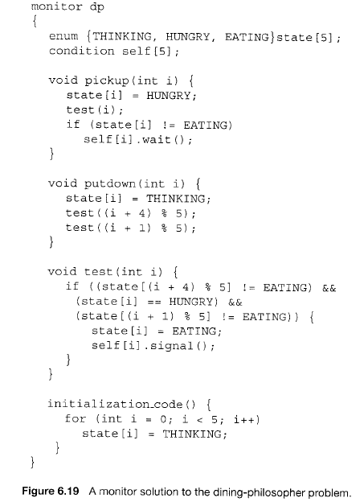

                 
实验七：同步互斥
===============

**1.****实验目的**

●   熟悉ucore中的进程同步机制，了解操作系统为进程同步提供的底层支持；

●   在ucore中理解信号量（semaphore）机制的具体实现；

●   理解管程机制，在ucore内核中增加基于管程（monitor）的条件变量（condition
variable）的支持；

●   了解经典进程同步问题，并能使用同步机制解决进程同步问题。

**2****实验内容**

实验六完成了用户进程的调度框架和具体的调度算法，可调度运行多个进程。如果多个进程需要协同操作或访问共享资源，则存在如何同步和有序竞争的问题。本次实验，主要是熟悉ucore的进程同步机制—信号量（semaphore）机制，以及基于信号量的哲学家就餐问题解决方案。然后掌握管程的概念和原理，并参考信号量机制，实现基于管程的条件变量机制和基于条件变量来解决哲学家就餐问题。

**2.1****练习**

**练习****0****：填写已有实验**

本实验依赖实验1/2/3/4/5/6。请把你做的实验1/2/3/4/5/6的代码填入本实验中代码中有“LAB1”/“LAB2”/“LAB3”/“LAB4”/“LAB5”/“LAB6”的注释相应部分。并确保编译通过。注意：为了能够正确执行lab7的测试应用程序，可能需对已完成的实验1/2/3/4/5/6的代码进行进一步改进。

**练习****1****理解内核级信号量的实现和基于内核级信号量的哲学家就餐问题（不需要编码）**

完成练习0后，建议大家比较一下（可用kdiff3等文件比较软件）个人完成的lab6和练习0完成后的刚修改的lab7之间的区别，分析了解lab7采用信号量的执行过程。执行make
grade，大部分测试用例应该通过。

**练习****2****完成内核级条件变量和基于内核级条件变量的哲学家就餐问题（需要编码）**

首先掌握管程机制，然后基于信号量实现完成条件变量实现，然后用管程机制实现哲学家就餐问题的解决方案（基于条件变量）。

执行：make grade
。如果所显示的应用程序检测都输出ok，则基本正确。如果只是某程序过不去，比如matrix.c，则可执行
make run-matrix
命令来单独调试它。大致执行结果可看附录。（**使用的是****qemu-1.0.1**）。

**扩展练习****Challenge****：实现****Linux****的****RCU**

在ucore
下实现下Linux的RCU同步互斥机制。可阅读相关Linux内核书籍或查询网上资料，可了解RCU的细节，然后大致实现在ucore中。下面是一些参考资料：

●  
[http://www.ibm.com/developerworks/cn/linux/l-rcu/](http://www.ibm.com/developerworks/cn/linux/l-rcu/)

●  
[http://www.diybl.com/course/6\_system/linux/Linuxjs/20081117/151814.html](http://www.diybl.com/course/6_system/linux/Linuxjs/20081117/151814.html)

**2.2****项目组成**

此次实验中，主要有如下一些需要关注的文件：

.

├── boot

├── kern

│   ├── driver

│   ├── fs

│   ├── init

│   ├── libs

│   ├── mm

│   │   ├── ......

│   │   ├── vmm.c

│   │   └── vmm.h

│   ├── process

│   │   ├── proc.c

│   │   ├── proc.h

│   │   └──......

│   ├── schedule

│   ├── sync

│   │   ├── check\_sync.c

│   │   ├── monitor.c

│   │   ├── monitor.h

│   │   ├── sem.c

│   │   ├── sem.h

│   │   ├── sync.h

│   │   ├── wait.c

│   │   └── wait.h

│   ├── syscall

│   │   ├── syscall.c

│   │   └──......

│   └── trap

├── libs

└── user

    ├── forktree.c

    ├── libs

    │   ├── syscall.c

    │   ├── syscall.h

    │   ├── ulib.c

    │   ├── ulib.h

    │   └── ......

    ├── priority.c

    ├── sleep.c

    ├── sleepkill.c

    ├── softint.c

    ├── spin.c

    └── ......

 

简单说明如下：

●   kern/sync/sync.h: 去除了lock实现（这对于不抢占内核没用）。

●   kern/sync/wait.[ch]:
定了为wait结构和waitqueue结构以及在此之上的函数，这是ucore中的信号量semophore机制和条件变量机制的基础，在本次实验中你需要了解其实现。

●  
kern/sync/sem.[ch]:定义并实现了ucore中内核级信号量相关的数据结构和函数，本次试验中你需要了解其中的实现，并基于此完成内核级条件变量的设计与实现。

●   user/ libs/ {syscall.[ch],ulib.[ch]
}与kern/sync/syscall.c：实现了进程sleep相关的系统调用的参数传递和调用关系。

●   user/{ sleep.c,sleepkill.c}: 进程睡眠相关的一些测试用户程序。

●   kern/sync/monitor.[ch]:
基于管程的条件变量的实现程序，在本次实验中是练习的一部分，要求完成。

●  
kern/sync/check\_sync.c：实现了基于管程的哲学家就餐问题，在本次实验中是练习的一部分，要求完成基于管程的哲学家就餐问题。

●  
kern/mm/vmm.[ch]：用信号量mm\_sem取代mm\_struct中原有的mm\_lock。（本次实验不用管）

** **

**3  ****同步互斥的设计与实现**

**3.1****实验执行流程概述**

互斥是指某一资源同时只允许一个进程对其进行访问，具有唯一性和排它性，但互斥不用限制进程对资源的访问顺序，即访问可以是无序的。同步是指在进程间的执行必须严格按照规定的某种先后次序来运行，即访问是有序的，这种先后次序取决于要系统完成的任务需求。在进程写资源情况下，进程间要求满足互斥条件。在进程读资源情况下，可允许多个进程同时访问资源。

实验七提供了多种同步互斥手段，包括中断控制、等待队列、信号量、管程机制（包含条件变量设计）等，并基于信号量实现了哲学家问题的执行过程。而练习是要求用管程机制实现哲学家问题的执行过程。在实现信号量机制和管程机制时，需要让无法进入临界区的进程睡眠，为此在ucore中设计了等待队列。当进程无法进入临界区（即无法获得信号量）时，可让进程进入等待队列，这时的进程处于等待状态（也可称为阻塞状态），从而会让实验六中的调度器选择一个处于就绪状态（即RUNNABLE
STATE）的进程，进行进程切换，让新进程有机会占用CPU执行，从而让整个系统的运行更加高效。

在实验七中的ucore初始化过程，开始的执行流程都与实验六相同，直到执行到创建第二个内核线程init\_main时，修改了init\_main的具体执行内容，即增加了check\_sync函数的调用，而位于lab7/kern/sync/check\_sync.c中的check\_sync函数可以理解为是实验七的起始执行点，是实验七的总控函数。进一步分析此函数，可以看到这个函数主要分为了两个部分，第一部分是实现基于信号量的哲学家问题，第二部分是实现基于管程的哲学家问题。

对于check\_sync函数的第一部分，首先实现初始化了一个信号量，然后创建了5个内核线程代表5个哲学家，每个内核线程完成了基于信号量的哲学家吃饭睡觉思考行为实现。这部分是给学生作为练习参考用的。学生可以看看信号量是如何实现的，已经如何利用信号量完成哲学家问题。

对于check\_sync函数的第一部分，首先初始化了管程，然后又创建了5个内核线程代表5个哲学家，每个内核线程完成了基于信号量的哲学家吃饭睡觉思考行为实现。这部分是给学生作为练习参考用的。学生可以看看信号量是如何实现的，已经如何利用信号量完成哲学家问题。

 

**3.2****同步互斥的底层支撑**

**开关中断**

根据操作系统原理的知识，我们知道如果没有在硬件级保证读内存-修改值-写回内存的原子性，我们只能通过复杂的软件来实现同步互斥操作。但由于有开关中断和test\_and\_set\_bit等原子操作机器指令的存在，使得我们在实现同步互斥原语上可以大大简化。在atomic.c文件中实现的test\_and\_set\_bit等原子操作。

在ucore中提供的底层机制包括中断开关控制和test\_and\_set相关原子操作机器指令。kern/sync.c中实现的开关中断的控制函数local\_intr\_save(x)和local\_intr\_restore(x)，它们是基于kern/driver文件下的intr\_enable()、intr\_disable()函数实现的。具体调用关系为：

 

关中断：local\_intr\_save --\> \_\_intr\_save --\> intr\_disable --\> cli

开中断：local\_intr\_restore--\> \_\_intr\_restore --\> intr\_enable --\>
sti

 

最终的cli和sti是x86的机器指令，最终实现了关中断和开中断，即设置了eflags寄存器中与中断相关的位。通过关闭中断，可以防止对当前执行的控制流被其他中断事件处理所打断。既然不能中断，那也就意味着在内核运行的当前进程无法被打断或被从新调度，即实现了对临界区的互斥操作。所以在单处理器情况下，可以通过开关中断实现对临界区的互斥保护，需要互斥的临界区代码的一般写法为：

local\_intr\_save**(**intr\_flag**);**\
 **{**\
   临界区代码

**}**\
 local\_intr\_restore**(**intr\_flag**);**

……

由于目前ucore只实现了对单处理器的支持，所以通过这种方式，就可简单地支撑互斥操作了。在多处理器情况下，这种方法是无法实现互斥的，因为屏蔽了一个CPU的中断，只能阻止本CPU上的进程不会被中断或调度，并不意味着其他CPU上执行的进程不能执行临界区的代码。所以，开关中断只对单处理器下的互斥操作起作用。在本实验中，开关中断机制是实现信号量等高层同步互斥原语的底层支撑基础之一。

 

**等待队列**

到目前为止，我们的实验中，用户进程或内核线程还没有睡眠的支持机制。在课程中提到用户进程或内核线程可以转入休眠状态以等待某个特定事件，当该事件发生时这些进程能够被再次唤醒。内核实现这一功能的一个底层支撑机制就是等待队列（wait
queue），等待队列和每一个事件（睡眠结束、时钟到达、任务完成、资源可用等）联系起来。需要等待事件的进程在转入休眠状态后插入到等待队列中。当事件发生之后，内核遍历相应等待队列，唤醒休眠的用户进程或内核线程，并设置其状态为就绪状态（runnable
state），并将该进程从等待队列中清除。ucore在kern/sync/{ wait.h, wait.c
}中实现了wait结构和wait
queue结构以及相关函数），这是实现ucore中的信号量机制和条件变量机制的基础，进入wait
queue的进程会被设为睡眠状态，直到他们被唤醒。

typedef  struct {

    struct proc\_struct \*proc;  //等待进程的指针

    uint32\_t wakeup\_flags;             //进程被放入等待队列的原因标记

    wait\_queue\_t \*wait\_queue; //指向此wait结构所属于的wait\_queue

    list\_entry\_t wait\_link;       
//用来组织wait\_queue中wait节点的连接

} wait\_t;

typedef struct {

    list\_entry\_t wait\_head;       //wait\_queue的队头

} wait\_queue\_t;

le2wait(le, member)                      
//实现wait\_t中成员的指针向wait\_t 指针的转化

 

与wait和wait queue相关的函数主要分为两层，底层函数是对wait
queue的初始化、插入、删除和查找操作，相关函数如下：

void wait\_init(wait\_t \*wait, struct proc\_struct \*proc);   
//初始化wait结构

bool wait\_in\_queue(wait\_t \*wait);                         
//wait是否在wait queue中

void wait\_queue\_init(wait\_queue\_t \*queue);                
//初始化wait\_queue结构

void wait\_queue\_add(wait\_queue\_t \*queue, wait\_t \*wait);   
//把wait前插到wait queue中

void wait\_queue\_del(wait\_queue\_t \*queue, wait\_t \*wait);   
//从wait queue中删除wait

wait\_t \*wait\_queue\_next(wait\_queue\_t \*queue, wait\_t
\*wait);//取得wait的后一个链接指针

wait\_t \*wait\_queue\_prev(wait\_queue\_t \*queue, wait\_t
\*wait);//取得wait的前一个链接指针

wait\_t \*wait\_queue\_first(wait\_queue\_t \*queue);            
//取得wait queue的第一个wait

wait\_t \*wait\_queue\_last(wait\_queue\_t \*queue);             
//取得wait queue的最后一个wait

bool wait\_queue\_empty(wait\_queue\_t \*queue);                //wait
queue是否为空

 

高层函数基于底层函数实现了让进程进入等待队列，以及从等待队列中唤醒进程，相关函数如下：

//让wait与进程关联，且让当前进程关联的wait进入等待队列queue，当前进程睡眠

void wait\_current\_set(wait\_queue\_t \*queue, wait\_t \*wait,
uint32\_t wait\_state);

//把与当前进程关联的wait从等待队列queue中删除

wait\_current\_del(queue, wait);

//唤醒与wait关联的进程

void wakeup\_wait(wait\_queue\_t \*queue, wait\_t \*wait, uint32\_t
wakeup\_flags, bool del);

//唤醒等待队列上挂着的第一个wait所关联的进程

void wakeup\_first(wait\_queue\_t \*queue, uint32\_t wakeup\_flags, bool
del);

//唤醒等待队列上所有的等待的进程

void wakeup\_queue(wait\_queue\_t \*queue, uint32\_t wakeup\_flags, bool
del);

** **

**3.3****信号量**

信号量是一种同步互斥机制的实现，普遍存在于现在的各种操作系统内核里。相对于spinlock
的应用对象，信号量的应用对象是在临界区中运行的时间较长的进程。等待信号量的进程需要睡眠来减少占用
CPU 的开销。参考教科书“Operating Systems Internals and Design
Principles”第五章“同步互斥”中对信号量实现的原理性描述：

struct semaphore {

int count;

queueType queue;

};

void semWait(semaphore s)

{

s.count--;

if (s.count \< 0) {

/\* place this process in s.queue \*/;

/\* block this process \*/;

}

}

void semSignal(semaphore s)

{

s.count++;

if (s.count\<= 0) {

/\* remove a process P from s.queue \*/;

/\* place process P on ready list \*/;

}

}

 

基于上诉信号量实现可以认为，当多个（\>1）进程可以进行互斥或同步合作时，一个进程会由于无法满足信号量设置的某条件而在某一位置停止，直到它接收到一个特定的信号（表明条件满足了）。为了发信号，需要使用一个称作信号量的特殊变量。为通过信号量s传送信号，信号量的V操作采用进程可执行原语semSignal(s)
；为通过信号量s接收信号，信号量的P操作采用进程可执行原语semWait(s )
；如果相应的信号仍然没有发送，则进程被阻塞或睡眠，直到发送完为止。

ucore中信号量参照上述原理描述，建立在开关中断机制和wait
queue的基础上进行了具体实现。信号量的数据结构定义如下：

typedef struct {

    int value;                          //信号量的当前值

    wait\_queue\_t wait\_queue;   //信号量对应的等待队列

} semaphore\_t;

 

semaphore\_t是最基本的记录型信号量（record
semaphore)结构，包含了用于计数的整数值value，和一个进程等待队列wait\_queue，一个等待的进程会挂在此等待队列上。

在ucore中最重要的信号量操作是P操作函数down(semaphore\_t
\*sem)和V操作函数 up(semaphore\_t
\*sem)。但这两个函数的具体实现是\_\_down(semaphore\_t \*sem, uint32\_t
wait\_state) 函数和\_\_up(semaphore\_t \*sem, uint32\_t
wait\_state)函数，二者的具体实现描述如下：

●   \_\_down(semaphore\_t \*sem, uint32\_t wait\_state, timer\_t
\*timer)：具体实现信号量的P操作，首先关掉中断，然后判断当前信号量的value是否大于0。如果是\>0，则表明可以获得信号量，故让value减一，并打开中断返回即可；如果不是\>0，则表明无法获得信号量，故需要将当前的进程加入到等待队列中，并打开中断，然后运行调度器选择另外一个进程执行。如果被V操作唤醒，则把自身关联的wait从等待队列中删除（此过程需要先关中断，完成后开中断）。具体实现如下所示：

**static** \_\_noinline uint32\_t \_\_down**(**semaphore\_t **\***sem**,** uint32\_t wait\_state**)** **{**\
     bool intr\_flag**;**\
     local\_intr\_save**(**intr\_flag**);**\
     **if** **(**sem**-\>**value **\>** 0**)** **{**\
         sem**-\>**value **--;**\
         local\_intr\_restore**(**intr\_flag**);**\
         **return** 0**;**\
     **}**\
     wait\_t \_\_wait**,** **\***wait **=** **&**\_\_wait**;**\

    wait\_current\_set**(&(**sem**-\>**wait\_queue**),** wait**,** wait\_state**);**\
     local\_intr\_restore**(**intr\_flag**);**\
 \
     schedule**();**\
 \
     local\_intr\_save**(**intr\_flag**);**\
     wait\_current\_del**(&(**sem**-\>**wait\_queue**),** wait**);**\
     local\_intr\_restore**(**intr\_flag**);**\
 \
     **if** **(**wait**-\>**wakeup\_flags **!=** wait\_state**)** **{**\
         **return** wait**-\>**wakeup\_flags**;**\
     **}**\
     **return** 0**;**\
 **}**

●    

 

 

●   \_\_up(semaphore\_t \*sem, uint32\_t
wait\_state)：具体实现信号量的V操作，首先关中断，如果信号量对应的wait
queue中没有进程在等待，直接把信号量的value加一，然后开中断返回；如果有进程在等待且进程等待的原因是semophore设置的，则调用wakeup\_wait函数将waitqueue中等待的第一个wait删除，且把此wait关联的进程唤醒，最后开中断返回。具体实现如下所示：

**static** \_\_noinline **void** \_\_up**(**semaphore\_t **\***sem**,** uint32\_t wait\_state**)** **{**\
     bool intr\_flag**;**\
     local\_intr\_save**(**intr\_flag**);**\
     **{**\
         wait\_t **\***wait**;**\

        **if** **((**wait **=** wait\_queue\_first**(&(**sem**-\>**wait\_queue**)))** **==** NULL**)** **{**\
             sem**-\>**value **++;**\
         **}**\
         **else** **{**\

            wakeup\_wait**(&(**sem**-\>**wait\_queue**),** wait**,** wait\_state**,** 1**);**\
         **}**\
     **}**\
     local\_intr\_restore**(**intr\_flag**);**\
 **}**

 

对照信号量的原理性描述和具体实现，可以发现二者在流程上基本一致，只是具体实现采用了关中断的方式保证了对共享资源的互斥访问，通过等待队列让无法获得信号量的进程睡眠等待。另外，我们可以看出信号量的计数器value具有有如下性质：

●   value\>0，表示共享资源的空闲数

●   vlaue\<0，表示该信号量的等待队列里的进程数

●   value=0，表示等待队列为空

 

**3.4****管程和条件变量**

引入了管程是为了将对共享资源的所有访问及其所需要的同步操作集中并封装起来。Hansan为管程所下的定义：“一个管程定义了一个数据结构和能为并发进程所执行（在该数据结构上）的一组操作，这组操作能同步进程和改变管程中的数据”。有上述定义可知，管程由四部分组成：

●   管程内部的共享变量；

●   管程内部的条件变量；

●   管程内部并发执行的进程；

●   对局部于管程内部的共享数据设置初始值的语句。

局限在管程中的数据结构，只能被局限在管程的操作过程所访问，任何管程之外的操作过程都不能访问它；另一方面，局限在管程中的操作过程也主要访问管程内的数据结构。由此可见，管程相当于一个隔离区，它把共享变量和对它进行操作的若干个过程围了起来，所有进程要访问临界资源时，都必须经过管程才能进入，而管程每次只允许一个进程进入管程，从而需要确保进程之间互斥。

但在管程中仅仅有互斥操作是不够用的。进程可能需要等待某个条件C为真才能继续执行。如果采用[忙等](http://zh.wikipedia.org/w/index.php?title=%E5%BF%99%E7%AD%89%E5%BE%85&action=edit&redlink=1 "忙等待（页面不存在）")(busy
waiting)方式：

   while not( C ) do {}

在单处理器情况下，将会导致所有其它进程都无法进入[临界区](http://zh.wikipedia.org/wiki/%E4%B8%B4%E7%95%8C%E5%8C%BA "临界区")使得该条件C为真，该管程的执行将会发生[死锁](http://zh.wikipedia.org/wiki/%E6%AD%BB%E9%94%81 "死锁")。为此，可引入条件变量（Condition
Variables，简称CV）。一个条件变量CV可理解为一个进程的等待队列，队列中的进程正等待某个条件C变为真。每个条件变量关联着一个[断言](http://zh.wikipedia.org/wiki/%E6%96%B7%E8%A8%80_(%E7%A8%8B%E5%BC%8F) "断言 (程序)")Pc。当一个进程等待一个条件变量，该进程不算作占用了该管程，因而其它进程可以进入该管程执行，改变管程的状态，通知条件变量CV其关联的断言Pc在当前状态下为真。因此对条件变量CV有两种主要操作：

l  wait\_cv： 被一个进程调用，以等待断言Pc被满足后该进程可恢复执行.
进程挂在该条件变量上等待时，不被认为是占用了管程。

l 
signal\_cv：被一个进程调用，以指出断言Pc现在为真，从而可以唤醒等待断言Pc被满足的进程继续执行。

有了互斥和信号量支持的管程就可用用了解决各种同步互斥问题。比如参考《OS
Concept》一书中的6.7.2小节“用管程解决哲学家就餐问题”就给出了这样的事例：

l  

 

虽然大部分教科书上说明管程适合在语言级实现比如java等高级语言，没有提及在采用C语言的OS中如何实现。下面我们将要尝试在ucore中用C语言实现采用基于互斥和条件变量机制的管程基本原理。

ucore中的管程机制是基于信号量和条件变量来实现的。ucore中的管程的数据结构monitor\_t定义如下：

 

**typedef** **struct** monitor{

    semaphore\_t mutex;      // the mutex lock for going into the
routines in monitor, should be initialized to 1

semaphore\_t next;       // the next semaphore is used to down the
signaling proc itself, and the other OR wakeuped

//waiting proc should wake up the sleeped signaling proc.

    **int** next\_count;         // the number of of sleeped signaling
proc

    condvar\_t \*cv;          // the condvars in monitor

} monitor\_t;

 

管程中的成员变量mutex是一个二值信号量，是实现每次只允许一个进程进入管程的关键元素，确保了[互斥](http://zh.wikipedia.org/wiki/%E4%BA%92%E6%96%A5 "互斥")访问性质。管程中的条件变量cv通过执行wait\_cv，会使得等待某个条件C为真的进程能够离开管程并睡眠，且让其他进程进入管程继续执行；而进入管程的某进程设置条件C为真并执行signal\_cv时，能够让等待某个条件C为真的睡眠进程被唤醒，从而继续进入管程中执行。管程中的成员变量信号量next和整形变量next\_count是配合进程对条件变量cv的操作而设置的，这是由于发出signal\_cv的进程A会唤醒睡眠进程B，进程B执行会导致进程A睡眠，直到进程B离开管程，进程A才能继续执行，这个同步过程是通过信号量next完成的；而next\_count表示了由于发出singal\_cv而睡眠的进程个数。

管程中的条件变量的数据结构condvar\_t定义如下：

 

**typedef** **struct** condvar{

    semaphore\_t sem; // the sem semaphore is used to down the waiting
proc, and the signaling proc should up the waiting proc

    **int** count;       // the number of waiters on condvar

    monitor\_t \* owner; // the owner(monitor) of this condvar

} condvar\_t;

 

条件变量的定义中也包含了一系列的成员变量，信号量sem用于让发出wait\_cv操作的等待某个条件C为真的进程睡眠，而让发出signal\_cv操作的进程通过这个sem来唤醒睡眠的进程。count表示等在这个条件变量上的睡眠进程的个数。owner表示此条件变量的宿主是哪个管程。

理解了数据结构的含义后，我们就可以开始管程的实现了。ucore设计实现了条件变量wait\_cv操作和signal\_cv操作对应的具体函数，即cond\_wait函数和cond\_signal函数，此外还有cond\_init初始化函数（可直接看源码）。函数cond\_wait(condvar\_t
\*cvp, semaphore\_t \*mp)和cond\_signal (condvar\_t
\*cvp)的实现原理可参考《OS
Concept》一书中的6.7.3小节“用信号量实现管程”的内容：

 

**cond\_wait****的原理描述**

 

cv.count++;

if(monitor.next\_count \> 0)

   sem\_signal(monitor.next);

else

   sem\_signal(monitor.mutex);

sem\_wait(cv.sem);

cv.count -- ;

**ond\_signal****的原理描述**

 

if( cv.count \> 0) {

   monitor.next\_count ++;

   sem\_signal(cv.sem);

   sem\_wait(monitor.next);

   monitor.next\_count -- ;

}

 

 

 

 

 

 

 

 

 

 

 

 
简单分析一下cond\_wait函数的实现。可以看出如果进程A执行了cond\_wait函数，表示此进程等待某个条件C不为真，需要睡眠。因此表示等待此条件的睡眠进程个数cv.count要加一。接下来会出现两种情况。

情况一：如果monitor.next\_count如果大于0，表示有大于等于1个进程执行cond\_signal函数且睡着了，就睡在了monitor.next信号量上。假定这些进程形成S进程链表。因此需要唤醒S进程链表中的一个进程B。然后进程A睡在cv.sem上，如果睡醒了，则让cv.count减一，表示等待此条件的睡眠进程个数少了一个，可继续执行了！这里隐含这一个现象，即某进程A在时间顺序上先执行了signal\_cv，而另一个进程B后执行了wait\_cv，这会导致进程A没有起到唤醒进程B的作用。这里还隐藏这一个问题，在cond\_wait有sem\_signal(mutex)，但没有看到哪里有sem\_wait(mutex)，这好像没有成对出现，是否是错误的？其实在管程中的每一个函数的入口处会有wait(mutex)，这样二者就配好对了。

情况二：如果monitor.next\_count如果小于等于0，表示目前没有进程执行cond\_signal函数且睡着了，那需要唤醒的是由于互斥条件限制而无法进入管程的进程，所以要唤醒睡在monitor.mutex上的进程。然后进程A睡在cv.sem上，如果睡醒了，则让cv.count减一，表示等待此条件的睡眠进程个数少了一个，可继续执行了！

对照着再来看cond\_signal的实现。首先进程B判断cv.count，如果不大于0，则表示当前没有执行cond\_wait而睡眠的进程，因此就没有被唤醒的对象了，直接函数返回即可；如果大于0，这表示当前有执行cond\_wait而睡眠的进程A，因此需要唤醒等待在cv.sem上睡眠的进程A。由于只允许一个进程在管程中执行，所以一旦进程B唤醒了别人（进程A），那么自己就需要睡眠。故让monitor.next\_count加一，且让自己（进程B）睡在信号量monitor.next上。如果睡醒了，这让monitor.next\_count减一。

为了让整个管程正常运行，还需在管程中的每个函数的入口和出口增加相关操作，即：

function （…）

{

sem.wait(monitor.mutex);

 

  the real body of function;

 

  if(monitor.next\_count \> 0)

     sem\_signal(monitor.next);

  else

     sem\_signal(monitor.mutex);

}

 

这样带来的作用有两个，（1）只有一个进程在执行管程中的函数。（2）避免由于执行了cond\_signal函数而睡眠的进程无法被唤醒。对于第二点，如果进程A由于执行了cond\_signal函数而睡眠（这会让monitor.next\_count大于0，且执行sem\_wait(monitor.next)），则其他进程在执行管程中的函数的出口，会判断monitor.next\_count是否大于0，如果大于0，则执行sem\_signal(monitor.next)，从而执行了cond\_signal函数而睡眠的进程被唤醒。上诉措施将使得管程正常执行。

需要注意的是，上述只是原理描述，与具体描述相比，还有一定的差距。需要大家在完成练习时仔细设计和实现。

**3.5****测试用例**

在本次实验中，在kern/sync/check\_sync.c中提供了一个基于信号量的哲学家就餐问题解法。同时还需完成练习，自己实现基于管程（主要是灵活运用条件变量）的哲学家就餐问题解法。哲学家就餐问题描述如下：有五个哲学家，他们的生活方式是交替地进行思考和进餐。哲学家们公用一张圆桌，周围放有五把椅子，每人坐一把。在圆桌上有五个碗和五根筷子，当一个哲学家思考时，他不与其他人交谈，饥饿时便试图取用其左、右最靠近他的筷子，但他可能一根都拿不到。只有在他拿到两根筷子时，方能进餐，进餐完后，放下筷子又继续思考。需要注意，对于基于信号量的原理参考，请看课程的ppt和本实验的源码；对于基于管程的原理参考，请

**4****实验报告要求**

从网站上下载lab7.zip后，解压得到本文档和代码目录
lab7，完成实验中的各个练习。完成代码编写并检查无误后，在对应目录下执行
make handin 任务，即会自动生成
lab7-handin.tar.gz。最后请一定提前或按时提交到网络学堂上。

注意有“LAB7”的注释，主要是修改condvar.c和check\_sync.c中的内容。代码中所有需要完成的地方challenge除外）都有“LAB7”和“YOUR
CODE”的注释，请在提交时特别注意保持注释，并将“YOUR
CODE”替换为自己的学号，并且将所有标有对应注释的部分填上正确的代码。

 

**附录：执行****”make run-matrix”****的大致的显示输出**

(THU.CST) os is loading ...

……

check\_alloc\_page() succeeded!

……

check\_swap() succeeded!

++ setup timer interrupts

I am No.4 philosopher\_condvar

Iter 1, No.4 philosopher\_condvar is thinking

I am No.3 philosopher\_condvar

……

I am No.1 philosopher\_sema

Iter 1, No.1 philosopher\_sema is thinking

I am No.0 philosopher\_sema

Iter 1, No.0 philosopher\_sema is thinking

kernel\_execve: pid = 2, name = “matrix”.

pid 14 is running (1000 times)!.

pid 13 is running (1000 times)!.

phi\_test\_condvar: state\_condvar[4] will eating

phi\_test\_condvar: signal self\_cv[4]

Iter 1, No.4 philosopher\_condvar is eating

phi\_take\_forks\_condvar: 3 didn’t get fork and will wait

phi\_test\_condvar: state\_condvar[2] will eating

phi\_test\_condvar: signal self\_cv[2]

Iter 1, No.2 philosopher\_condvar is eating

phi\_take\_forks\_condvar: 1 didn’t get fork and will wait

phi\_take\_forks\_condvar: 0 didn’t get fork and will wait

pid 14 done!.

pid 13 done!.

Iter 1, No.4 philosopher\_sema is eating

Iter 1, No.2 philosopher\_sema is eating

……

pid 18 done!.

pid 23 done!.

pid 22 done!.

pid 33 done!.

pid 27 done!.

pid 25 done!.

pid 32 done!.

pid 29 done!.

pid 20 done!.

matrix pass.

all user-mode processes have quit.

init check memory pass.

kernel panic at kern/process/proc.c:426:

    initproc exit.

 

Welcome to the kernel debug monitor!!

Type 'help' for a list of commands.

K\> qemu: terminating on signal 2

 

 
